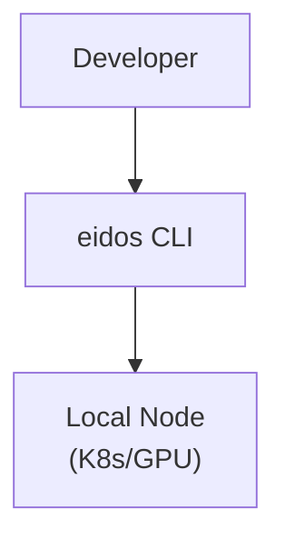
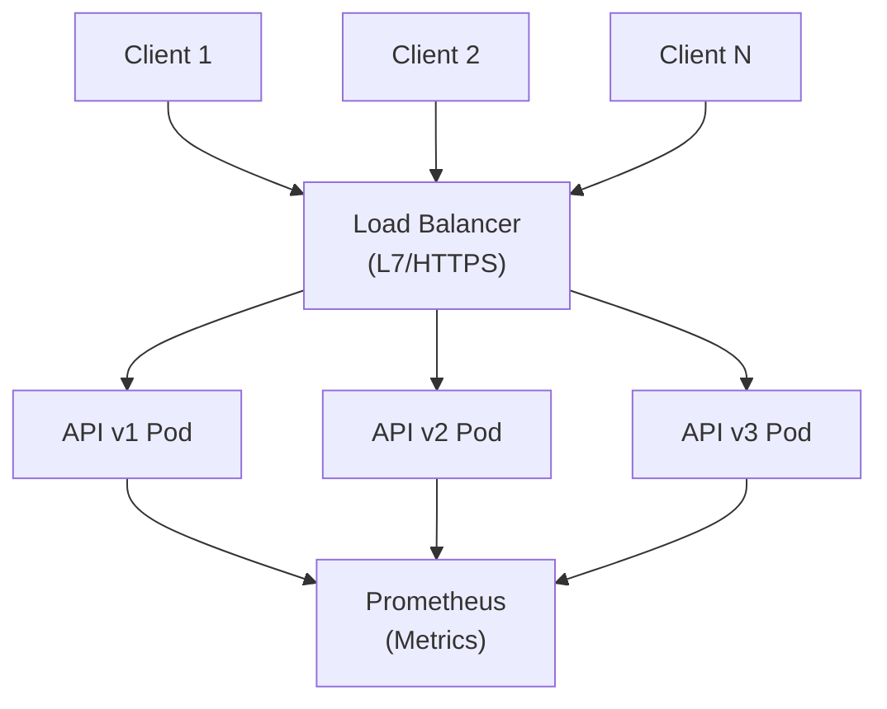
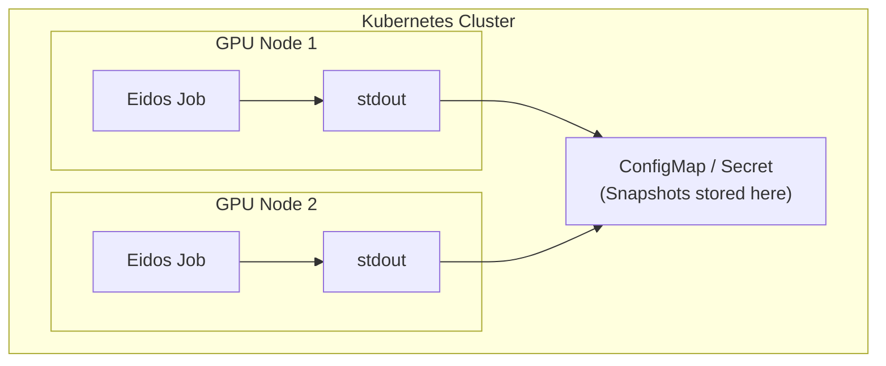
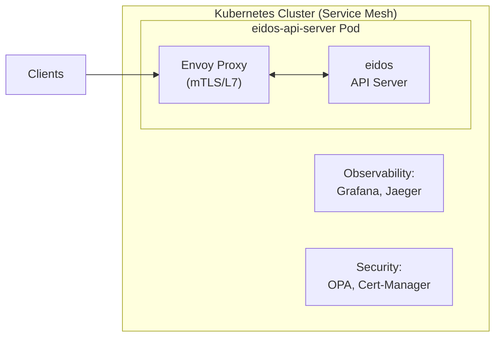
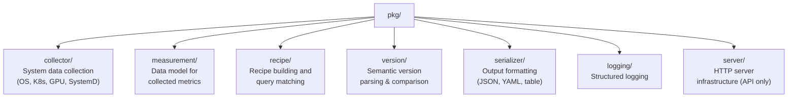
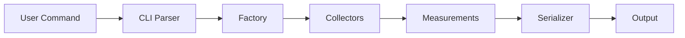
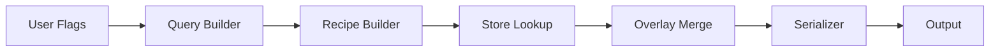
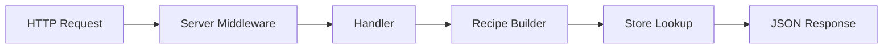

# Cloud Native Stack Architecture

This directory contains architecture documentation for the Cloud Native Stack (CNS) tooling.

## Components

- **[CLI Architecture](cli.md)** - Architecture of the `eidos` command-line tool for capturing system snapshots and generating configuration recipes
- **[API Server Architecture](api-server.md)** - Architecture of the HTTP API server for serving configuration recommendations

## Overview

Cloud Native Stack provides two complementary interfaces for system configuration management:

### CLI Tool (`eidos`)
A command-line interface for direct interaction with system configuration:
- **Snapshot Command**: Captures comprehensive system configuration
- **Recipe Command**: Generates optimized configuration recommendations

### API Server (`eidos-api-server`)
An HTTP REST API for programmatic access to configuration recommendations:
- **Recipe Endpoint**: Serves configuration recommendations via HTTP
- **Health/Metrics**: Kubernetes-ready observability endpoints

## Key Design Principles

### 1. Separation of Concerns
**Pattern**: Shared library with multiple entry points (CLI, API server)  
**Rationale**: Maximizes code reuse while maintaining deployment flexibility  
**Reference**: [Go Project Layout](https://go.dev/doc/modules/layout)

### 2. Concurrent Collection with Bounded Parallelism
**Pattern**: `errgroup.WithContext` for fail-fast concurrent operations  
**Rationale**: Parallel collection reduces latency; context propagation enables cancellation  
**Trade-offs**: Memory overhead vs latency gain; appropriate for I/O-bound operations  
**Reference**: [golang.org/x/sync/errgroup](https://pkg.go.dev/golang.org/x/sync/errgroup)

**Implementation**:
```go
g, ctx := errgroup.WithContext(parentCtx)
g.Go(func() error { return collectK8s(ctx) })
g.Go(func() error { return collectGPU(ctx) })
if err := g.Wait(); err != nil {
    // First error cancels all goroutines via context
    return fmt.Errorf("collection failed: %w", err)
}
```

### 3. Pluggable Collectors via Abstract Factory
**Pattern**: Factory interface with concrete implementations  
**Rationale**: Testability (mock collectors), extensibility (add new sources)  
**Trade-off**: Additional abstraction vs testing simplicity  
**Reference**: [Go Interfaces](https://go.dev/doc/effective_go#interfaces)

### 4. Format Flexibility through Strategy Pattern
**Pattern**: Serializer interface with format-specific implementations  
**Rationale**: Open/closed principle - add formats without modifying callers  
**Implementation**: JSON, YAML, Table writers behind common `Serialize` interface

### 5. Production-Ready HTTP Server
**Patterns Implemented**:
- **Rate Limiting**: Token bucket (`golang.org/x/time/rate`)  
- **Graceful Shutdown**: Signal handling with deadline-based cleanup  
- **Observability**: Prometheus metrics, structured logging, request tracing  
- **Resilience**: Panic recovery, timeout enforcement, circuit breaker patterns  

**References**:  
- [Graceful Shutdown](https://pkg.go.dev/net/http#Server.Shutdown)  
- [Rate Limiting](https://pkg.go.dev/golang.org/x/time/rate)  
- [Prometheus Best Practices](https://prometheus.io/docs/practices/naming/)

### 6. Semantic Versioning with Precision Control
**Pattern**: Version struct with Major.Minor.Patch components  
**Rationale**: Flexible matching (1.2 matches 1.2.x); reject negative components  
**Trade-off**: Complexity vs matching flexibility  
**Reference**: [Semantic Versioning 2.0.0](https://semver.org/)

### 7. Immutable Data Structures
**Pattern**: Read-only recipe store with deep cloning for modifications  
**Rationale**: Thread-safety without locks; functional programming style  
**Implementation**: `sync.Once` for initialization, cloning for per-request mutations

### 8. Context-Aware Request Handling
**Pattern**: Context propagation for cancellation and timeouts  
**Rationale**: Prevents resource leaks; enables graceful degradation  
**Reference**: [Go Context Package](https://pkg.go.dev/context)

## Deployment Topologies

### Topology 1: Standalone CLI
**Use Case**: Local development, CI/CD pipelines, troubleshooting  
**Architecture**: Single binary, no network dependencies  
**Scaling**: Run on each node/machine independently



### Topology 2: Centralized API with Load Balancer
**Use Case**: Production environments, multi-tenant platforms  
**Architecture**: Multiple stateless replicas behind L7 load balancer  
**Scaling**: Horizontal auto-scaling based on request rate/latency



### Topology 3: Kubernetes Job Agent
**Use Case**: Automated cluster auditing, scheduled configuration checks  
**Architecture**: Job running on GPU nodes with host access  
**Scaling**: One Job per node or node-group



### Topology 4: Service Mesh Integration
**Use Case**: Zero-trust environments, mTLS everywhere  
**Architecture**: API server with sidecar proxy (Istio, Linkerd)  
**Scaling**: Service mesh handles load balancing, circuit breaking, retries



## Shared Core Packages

Both components leverage shared functionality:



## Data Flow

### CLI Snapshot Flow


### CLI Recipe Flow


### API Recipe Flow


## Failure Modes and Recovery Strategies

### Collector Failures
**Failure**: Individual collector (K8s, GPU, SystemD) fails  
**Detection**: `errgroup` propagates first error  
**Recovery**: 
- **Fail-fast** (current): Entire snapshot fails if any collector fails  
- **Best-effort** (alternative): Continue with partial data, mark incomplete

**Trade-off Analysis**:  
- Fail-fast ensures data consistency but may be too strict  
- Best-effort improves availability but complicates downstream logic  
- **Recommendation**: Fail-fast for now; add best-effort mode behind feature flag

### Kubernetes API Server Unavailable
**Failure**: K8s API server unreachable or rate-limiting  
**Detection**: HTTP errors, context deadline exceeded  
**Recovery**:  
- Exponential backoff with jitter (2^n * 100ms + rand(0, 100ms))  
- Max retries: 3 with circuit breaker after 5 consecutive failures  
- Fallback: Cached data (if stale data acceptable)  

**Implementation Guidance**:  
```go
import "k8s.io/client-go/util/retry"

retry.OnError(retry.DefaultBackoff, func(err error) bool {
    return errors.Is(err, context.DeadlineExceeded)
}, func() error {
    return client.Get(ctx, key, obj)
})
```

**Reference**: [client-go Retry](https://pkg.go.dev/k8s.io/client-go/util/retry)

### GPU Driver/SMI Unavailable
**Failure**: nvidia-smi not found, driver not loaded  
**Detection**: Exec error, exit code != 0  
**Recovery**:  
- Graceful degradation: Return empty GPU measurements  
- Log warning with actionable message  
- Continue with other collectors

### Rate Limit Exceeded (API Server)
**Failure**: HTTP 429 Too Many Requests  
**Detection**: Response status code  
**Recovery**:  
- Read `Retry-After` header  
- Adaptive rate limiting: Reduce request rate dynamically  
- Circuit breaker: Open after N consecutive 429s  

**Implementation Pattern**:  
```go
if resp.StatusCode == http.StatusTooManyRequests {
    retryAfter := parseRetryAfter(resp.Header.Get("Retry-After"))
    select {
    case <-time.After(retryAfter):
        return retry()
    case <-ctx.Done():
        return ctx.Err()
    }
}
```

### Memory Exhaustion
**Failure**: Large cluster with 1000s of pods causing OOM  
**Detection**: Runtime memory stats, container limits  
**Prevention**:  
- Streaming JSON parsing for large responses  
- Pagination for list operations  
- Memory limits in Kubernetes Deployment  

**Monitoring**:  
```promql
process_resident_memory_bytes / container_spec_memory_limit_bytes > 0.9
```

### API Server Graceful Shutdown
**Scenario**: SIGTERM received during active requests  
**Behavior**:  
1. Stop accepting new connections  
2. Wait for in-flight requests (30s timeout)  
3. Force-close remaining connections  
4. Exit with code 0

**Implementation** (already in place):  
```go
ctx, stop := signal.NotifyContext(context.Background(), 
    os.Interrupt, syscall.SIGTERM)
defer stop()

g.Go(func() error {
    <-ctx.Done()
    shutdownCtx, cancel := context.WithTimeout(
        context.Background(), 30*time.Second)
    defer cancel()
    return server.Shutdown(shutdownCtx)
})
```

**Reference**: [Graceful Shutdown](https://pkg.go.dev/net/http#Server.Shutdown)

## Performance Considerations

### Latency Budget Breakdown

**Target**: p99 < 100ms for snapshot operations

| Component | Latency | Mitigation |
|-----------|---------|------------|
| K8s API List Pods | 10-50ms | Pagination, field selectors |
| SystemD DBus Calls | 5-20ms | Parallel collection |
| GPU nvidia-smi | 10-30ms | Cache results (5s TTL) |
| GRUB/Sysctl Read | 1-5ms | Buffered I/O |
| JSON Serialization | 1-10ms | Streaming encoder |
| **Total (parallel)** | **50-100ms** | **errgroup parallelism** |

### Memory Profile

| Component | Memory | Optimization |
|-----------|--------|-------------|
| Recipe Store | 5-10MB | Embed compressed YAML |
| K8s Client | 10-20MB | Shared informers |
| Snapshot Data | 1-5MB | Streaming serialization |
| Go Runtime | 5-10MB | GOGC tuning |
| **Total** | **21-45MB** | **Minimal footprint** |

### Concurrency Patterns

**CLI**: Bounded parallelism with errgroup (1 goroutine per collector)
```go
g, ctx := errgroup.WithContext(ctx)
g.SetLimit(5) // Max 5 concurrent collectors
```

**API Server**: Per-request goroutines (bounded by rate limiter)  
- Rate limiter prevents goroutine explosion  
- Each request handled in dedicated goroutine (Go's http.Server pattern)  
- No explicit goroutine pooling needed

**Reference**: [Go HTTP Server Concurrency](https://go.dev/blog/context)

## Security Architecture

### Threat Model

| Threat | Impact | Mitigation | Priority |
|--------|--------|------------|----------|
| **DoS via Rate Exhaustion** | High | Token bucket rate limiter | P0 |
| **Memory Exhaustion** | High | Request timeouts, memory limits | P0 |
| **Command Injection** | Critical | No shell exec; use syscall | P0 |
| **Path Traversal** | Medium | Validate file paths | P1 |
| **Information Disclosure** | Medium | Sanitize error messages | P1 |
| **MITM** | High | TLS enforcement (external proxy) | P1 |
| **Replay Attacks** | Low | Idempotent operations | P2 |

### Defense in Depth

**Layer 1: Network**  
- Kubernetes NetworkPolicy: Restrict ingress to API server  
- Service Mesh mTLS: Encrypt inter-service communication

**Layer 2: Application**  
- Input validation: Strict enum/version parsing  
- Rate limiting: Prevent resource exhaustion  
- Timeout enforcement: Kill long-running requests

**Layer 3: Runtime**  
- Least privilege: Run as non-root user (UID 1000)  
- Read-only root filesystem  
- Seccomp/AppArmor profiles

**Layer 4: Data**  
- No sensitive data in logs  
- Sanitize error messages (no stack traces to clients)

### Secure Defaults

```yaml
securityContext:
  runAsNonRoot: true
  runAsUser: 1000
  readOnlyRootFilesystem: true
  allowPrivilegeEscalation: false
  capabilities:
    drop: ["ALL"]
  seccompProfile:
    type: RuntimeDefault
```

## Observability Strategy

### Three Pillars

**1. Metrics** (Prometheus)  
- **RED Method**: Rate, Errors, Duration per endpoint  
- **USE Method**: Utilization, Saturation, Errors for resources  
- **Custom**: Recipe cache hit rate, collector success rate

**2. Logs** (Structured JSON via slog)  
- **Levels**: DEBUG, INFO, WARN, ERROR  
- **Context**: Request ID, user ID, trace ID  
- **Sampling**: 1/100 for DEBUG in production

**3. Traces** (OpenTelemetry - future)  
- **Spans**: HTTP request → Collectors → Serialization  
- **Baggage**: Request metadata propagation  
- **Sampling**: Probability-based (10% of requests)

### SLIs and SLOs

| SLI | SLO | Alert Threshold |
|-----|-----|----------------|
| Availability | 99.9% | < 99.5% over 5m |
| Latency (p99) | < 100ms | > 200ms over 5m |
| Error Rate | < 0.1% | > 1% over 5m |
| Rate Limit Rejects | < 5% | > 10% over 5m |

**Error Budget**: 43 minutes downtime per month (99.9% SLO)

## References and Further Reading

### Official Go Documentation
- [Effective Go](https://go.dev/doc/effective_go)  
- [Go Concurrency Patterns](https://go.dev/blog/pipelines)  
- [Context Package](https://pkg.go.dev/context)  
- [Error Handling](https://go.dev/blog/error-handling-and-go)

### Distributed Systems
- [Designing Data-Intensive Applications](https://dataintensive.net/) by Martin Kleppmann  
- [Site Reliability Engineering](https://sre.google/books/) by Google  
- [Building Microservices](https://www.oreilly.com/library/view/building-microservices-2nd/9781492034018/) by Sam Newman

### Kubernetes
- [Kubernetes Patterns](https://www.oreilly.com/library/view/kubernetes-patterns/9781492050278/)  
- [Programming Kubernetes](https://www.oreilly.com/library/view/programming-kubernetes/9781492047094/)  
- [client-go Documentation](https://github.com/kubernetes/client-go/tree/master/examples)

### Observability
- [Prometheus Best Practices](https://prometheus.io/docs/practices/)  
- [OpenTelemetry Go SDK](https://pkg.go.dev/go.opentelemetry.io/otel)  
- [Structured Logging](https://pkg.go.dev/log/slog)

See individual architecture documents for detailed diagrams and component interactions.
