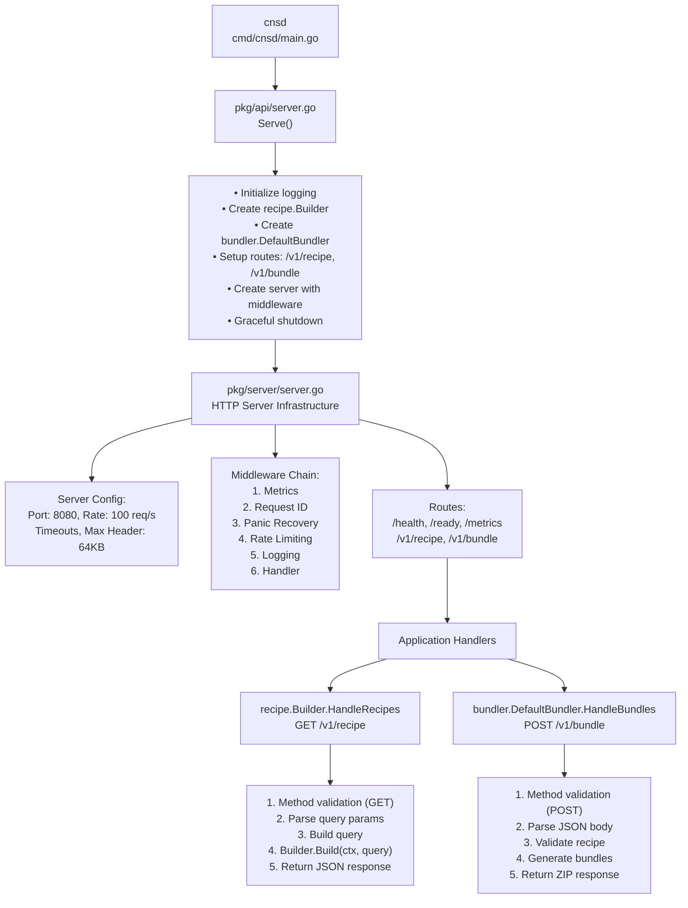
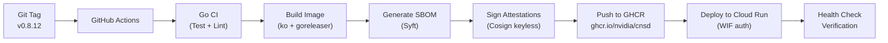

# API Server Architecture

The `cnsd` provides HTTP REST API access to Cloud Native Stack configuration recipe generation and bundle creation capabilities.

## Overview

The API server provides HTTP REST access to **Steps 2 and 4 of the Cloud Native Stack workflow** – recipe generation and bundle creation. It is a production-ready HTTP service built on Go's `net/http` with middleware for rate limiting, metrics, request tracking, and graceful shutdown.

### Four-Step Workflow Context

```
┌──────────────┐      ┌──────────────┐      ┌──────────────┐      ┌──────────────┐
│   Snapshot   │─────▶│    Recipe    │─────▶│   Validate   │─────▶│    Bundle    │
└──────────────┘      └──────────────┘      └──────────────┘      └──────────────┘
   CLI/Agent only       API Server           CLI only            API Server
```

**API Server Capabilities:**
- **Recipe generation** (Step 2) via `GET /v1/recipe` endpoint
- **Bundle creation** (Step 4) via `POST /v1/bundle` endpoint
- **Query mode only** – generates recipes from environment parameters
- Health and metrics endpoints for Kubernetes deployment
- Production-ready HTTP server with middleware stack
- Supply chain security with SLSA Build Level 3 attestations

**API Server Limitations:**
- **No snapshot capture** – Use CLI `cnsctl snapshot` or Kubernetes Agent
- **No snapshot mode** – Cannot analyze captured snapshots (query mode only)
- **No validation** – Use CLI `cnsctl validate` to check constraints against snapshots
- **No ConfigMap integration** – API server doesn't read/write ConfigMaps

**API Server Configuration:**
- **Criteria allowlists** – Restrict allowed values for accelerator, service, intent, and OS via environment variables
- **Value overrides** – Supported via `?set=bundler:path=value` query parameters on `/v1/bundle`
- **Node scheduling** – Supported via `?system-node-selector` and `?accelerated-node-selector` query parameters

**For complete workflow**, use the CLI which supports:
- All four steps: snapshot → recipe → validate → bundle
- ConfigMap I/O: `cm://namespace/name` URIs
- Agent deployment: Kubernetes Job with RBAC
- E2E testing: `tools/e2e` validation script

## Architecture Diagram



## Request Flow

### Complete Request Flow with Middleware

```mermaid
flowchart TD
    A["HTTP Client<br/>GET /v1/recipe?os=ubuntu&gpu=gb200"] --> M1
    
    M1["1. Metrics Middleware<br/>• Start timer<br/>• Increment in-flight counter<br/>• Wrap response writer<br/>• Record duration & count"] --> M2
    
    M2["2. Request ID Middleware<br/>• Extract X-Request-Id<br/>• Generate UUID if missing<br/>• Store in context<br/>• Add to response header"] --> M3
    
    M3["3. Panic Recovery<br/>• Wrap in defer/recover<br/>• Log errors<br/>• Return 500 on panic"] --> M4
    
    M4["4. Rate Limit Middleware<br/>• Check rateLimiter.Allow()<br/>• Return 429 if exceeded<br/>• Add rate limit headers"] --> M5
    
    M5["5. Logging Middleware<br/>• Log request start<br/>• Capture status<br/>• Log completion"] --> H
    
    H["6. Application Handler<br/>recipe.Builder.HandleRecipes"] --> H1

    H1["A. Method Validation<br/>(GET only)"] --> H2
    H2["B. Parse Query Parameters<br/>service, accelerator, intent, os, nodes"] --> H3
    H3["C. Format Validation<br/>• Validate enums<br/>• Parse values<br/>• Return 400 on error"] --> H3a
    H3a["D. Allowlist Validation<br/>• Check against configured allowlists<br/>• Return 400 if disallowed"] --> H4
    H4["E. Build Recipe<br/>• Builder.BuildFromCriteria(ctx, criteria)<br/>• Load store (cached)<br/>• Apply matching overlays"] --> H5
    H5["F. Respond<br/>• Set Cache-Control<br/>• Serialize to JSON<br/>• Return 200 OK"] --> Z
    
    Z[JSON Response]
```



## Component Details

### Entry Point: `cmd/cnsd/main.go`

Minimal entry point:

```go
package main

import (
    "log"
    "github.com/NVIDIA/cloud-native-stack/pkg/api"
)

func main() {
    if err := api.Serve(); err != nil {
        log.Fatal(err)
    }
}
```

### API Package: `pkg/api/server.go`

**Responsibilities:**
- Initialize structured logging
- Parse criteria allowlists from environment variables
- Create recipe builder with allowlist configuration
- Create bundle handler with allowlist configuration
- Setup HTTP routes
- Configure server with middleware
- Handle graceful shutdown

**Key Features:**
- Version info injection via ldflags: `version`, `commit`, `date`
- Routes: `/v1/recipe` → recipe handler, `/v1/bundle` → bundle handler
- Criteria allowlists parsed from `CNS_ALLOWED_*` environment variables
- Server configured with production defaults
- Graceful shutdown on SIGINT/SIGTERM

**Initialization Flow:**
```go
func Serve() error {
    // 1. Setup logging
    logging.SetDefaultStructuredLogger(name, version)

    // 2. Parse allowlists from environment
    allowLists, err := recipe.ParseAllowListsFromEnv()
    if err != nil {
        return fmt.Errorf("failed to parse allowlists: %w", err)
    }

    // 3. Create recipe handler with allowlists
    rb := recipe.NewBuilder(
        recipe.WithVersion(version),
        recipe.WithAllowLists(allowLists),
    )

    // 4. Create bundle handler with allowlists
    bb, err := bundler.New(
        bundler.WithAllowLists(allowLists),
    )

    // 5. Setup routes and start server
    // ...
}
```

### Server Infrastructure: `pkg/server/`

Production-ready HTTP server implementation with 10 files:

#### Core Components

**server.go** (217 lines)
- Server struct with config, HTTP server, rate limiter, ready state
- Functional options pattern for configuration
- Graceful shutdown using `signal.NotifyContext` and `errgroup`
- Default root handler listing available routes

**config.go** (72 lines)
- Configuration struct with sensible defaults
- Environment variable support (PORT)
- Timeout configuration (read, write, idle, shutdown)
- Rate limiting parameters

**middleware.go** (123 lines)
- Middleware chain builder
- Request ID middleware (UUID generation/validation)
- Rate limiting middleware (token bucket)
- Panic recovery middleware
- Logging middleware (structured logs)

**health.go** (60 lines)
- `/health` - Liveness probe (always returns 200)
- `/ready` - Readiness probe (returns 503 when not ready)
- JSON response with status and timestamp

**errors.go** (49 lines)
- Standardized error response structure
- Error codes (RATE_LIMIT_EXCEEDED, INTERNAL_ERROR, etc.)
- WriteError helper with request ID tracking

**metrics.go** (90 lines)
- Prometheus metrics:
  - `cns_http_requests_total` - Counter by method, path, status
  - `cns_http_request_duration_seconds` - Histogram by method, path
  - `cns_http_requests_in_flight` - Gauge
  - `cns_rate_limit_rejects_total` - Counter
  - `cns_panic_recoveries_total` - Counter

**context.go** (8 lines)
- Context key type for request ID storage

**doc.go** (200 lines)
- Comprehensive package documentation
- Usage examples
- API endpoint descriptions
- Error handling documentation
- Deployment examples

#### Request Processing Pipeline


### Recipe Handler: `pkg/recipe/handler.go`

HTTP handler for recipe generation endpoint. Supports both GET (query parameters) and POST (criteria body) methods.

#### Handler Flow

```go
func (b *Builder) HandleRecipes(w http.ResponseWriter, r *http.Request) {
    var criteria *Criteria
    var err error

    // 1. Route based on HTTP method
    switch r.Method {
    case http.MethodGet:
        // 2a. Parse query parameters for GET
        criteria, err = ParseCriteriaFromRequest(r)
    case http.MethodPost:
        // 2b. Parse request body for POST (JSON or YAML)
        criteria, err = ParseCriteriaFromBody(r.Body, r.Header.Get("Content-Type"))
        defer r.Body.Close()
    default:
        // Reject other methods
        w.Header().Set("Allow", "GET, POST")
        return 405
    }

    // 3. Validate criteria format
    if err := criteria.Validate(); err != nil {
        return 400 with error details
    }

    // 4. Validate against allowlists (if configured)
    if b.AllowLists != nil {
        if err := b.AllowLists.ValidateCriteria(criteria); err != nil {
            return 400 with allowed values in error details
        }
    }

    // 5. Build recipe
    recipe, err := b.BuildFromCriteria(r.Context(), criteria)
    if err != nil {
        return 500
    }

    // 6. Set cache headers
    w.Header().Set("Cache-Control", "public, max-age=600")

    // 7. Respond with JSON
    serializer.RespondJSON(w, http.StatusOK, recipe)
}
```

#### POST Request Body Format

POST requests accept a `RecipeCriteria` resource (Kubernetes-style):

```yaml
kind: recipeCriteria
apiVersion: cns.nvidia.com/v1alpha1
metadata:
  name: my-criteria
spec:
  service: eks
  accelerator: gb200
  os: ubuntu
  intent: training
```

Supported content types:
- `application/json` - JSON format
- `application/x-yaml` - YAML format
```

#### Query Parameter Parsing

| Parameter | Type | Validation | Example |
|-----------|------|------------|--------|
| `service` | ServiceType | Enum: eks, gke, aks, oke, any | `service=eks` |
| `accelerator` | AcceleratorType | Enum: h100, gb200, a100, l40, any | `accelerator=h100` |
| `gpu` | AcceleratorType | Alias for accelerator | `gpu=h100` |
| `intent` | IntentType | Enum: training, inference, any | `intent=training` |
| `os` | OSType | Enum: ubuntu, rhel, cos, amazonlinux, any | `os=ubuntu` |
| `nodes` | int | >= 0 | `nodes=8` |

### Recipe Builder: `pkg/recipe/builder.go`

Shared with CLI - same logic as described in CLI architecture.

## API Endpoints

### Recipe Generation

**Endpoints**:
- `GET /v1/recipe` - Generate recipe from query parameters
- `POST /v1/recipe` - Generate recipe from criteria body

#### GET Method

**Query Parameters**:
- `service` - Kubernetes service type (eks, gke, aks, oke)
- `accelerator` - GPU/accelerator type (h100, gb200, a100, l40)
- `gpu` - Alias for accelerator (backwards compatibility)
- `intent` - Workload intent (training, inference)
- `os` - Operating system family (ubuntu, rhel, cos, amazonlinux)
- `nodes` - Number of GPU nodes (0 = any/unspecified)

#### POST Method

**Content Types**: `application/json`, `application/x-yaml`

**Request Body**: `RecipeCriteria` resource with kind, apiVersion, metadata, and spec fields.

```yaml
kind: recipeCriteria
apiVersion: cns.nvidia.com/v1alpha1
metadata:
  name: my-criteria
spec:
  service: eks
  accelerator: h100
  intent: training
```

**Response**: 200 OK

```json
{
  "apiVersion": "cns.nvidia.com/v1alpha1",
  "kind": "Recipe",
  "metadata": {
    "version": "v1.0.0",
    "created": "2025-12-25T12:00:00Z",
    "appliedOverlays": [
      "base",
      "eks",
      "eks-training",
      "gb200-eks-training"
    ]
  },
  "criteria": {
    "service": "eks",
    "accelerator": "gb200",
    "intent": "training",
    "os": "any"
  },
  "componentRefs": [
    {
      "name": "gpu-operator",
      "version": "v25.3.3",
      "order": 1
    }
  ],
  "constraints": {
    "driver": {
      "version": "580.82.07"
    }
  }
}
```

**Error Response**: 400 Bad Request

```json
{
  "code": "INVALID_REQUEST",
  "message": "invalid gpu type: must be one of h100, gb200, a100, l40, ALL",
  "requestId": "550e8400-e29b-41d4-a716-446655440000",
  "timestamp": "2025-12-25T12:00:00Z",
  "retryable": false
}
```

**Rate Limited**: 429 Too Many Requests

```json
{
  "code": "RATE_LIMIT_EXCEEDED",
  "message": "Rate limit exceeded",
  "details": {
    "limit": 100,
    "burst": 200
  },
  "requestId": "550e8400-e29b-41d4-a716-446655440000",
  "timestamp": "2025-12-25T12:00:00Z",
  "retryable": true
}
```

**Headers**:
- `X-Request-Id` - Unique request identifier
- `X-RateLimit-Limit` - Total requests allowed per second
- `X-RateLimit-Remaining` - Requests remaining in current window
- `X-RateLimit-Reset` - Unix timestamp when window resets
- `Cache-Control` - Caching policy (public, max-age=300)

### Health Check

**Endpoint**: `GET /health`

**Response**: 200 OK

```json
{
  "status": "healthy",
  "timestamp": "2025-12-25T12:00:00Z"
}
```

### Readiness Check

**Endpoint**: `GET /ready`

**Response**: 200 OK (ready) or 503 Service Unavailable (not ready)

```json
{
  "status": "ready",
  "timestamp": "2025-12-25T12:00:00Z"
}
```

### Metrics

**Endpoint**: `GET /metrics`

**Response**: Prometheus text format

```
# HELP cns_http_requests_total Total number of HTTP requests
# TYPE cns_http_requests_total counter
cns_http_requests_total{method="GET",path="/v1/recipe",status="200"} 1234

# HELP cns_http_request_duration_seconds HTTP request latency in seconds
# TYPE cns_http_request_duration_seconds histogram
cns_http_request_duration_seconds_bucket{method="GET",path="/v1/recipe",le="0.005"} 1000
cns_http_request_duration_seconds_sum{method="GET",path="/v1/recipe"} 12.34
cns_http_request_duration_seconds_count{method="GET",path="/v1/recipe"} 1234

# HELP cns_http_requests_in_flight Current number of HTTP requests being processed
# TYPE cns_http_requests_in_flight gauge
cns_http_requests_in_flight 5

# HELP cns_rate_limit_rejects_total Total number of requests rejected due to rate limiting
# TYPE cns_rate_limit_rejects_total counter
cns_rate_limit_rejects_total 42

# HELP cns_panic_recoveries_total Total number of panics recovered in HTTP handlers
# TYPE cns_panic_recoveries_total counter
cns_panic_recoveries_total 0
```

### Root

**Endpoint**: `GET /`

**Response**: 200 OK

```json
{
  "service": "cnsd",
  "version": "v1.0.0",
  "routes": [
    "/v1/recipe"
  ]
}
```

## Usage Examples

### cURL Examples

```bash
# Basic recipe request
curl "http://localhost:8080/v1/recipe?os=ubuntu&gpu=h100"

# Full specification
curl "http://localhost:8080/v1/recipe?os=ubuntu&service=eks&accelerator=gb200&intent=training&nodes=8"

# With request ID
curl -H "X-Request-Id: 550e8400-e29b-41d4-a716-446655440000" \
  "http://localhost:8080/v1/recipe?os=ubuntu&gpu=h100"

# Health check
curl http://localhost:8080/health

# Readiness check
curl http://localhost:8080/ready

# Metrics
curl http://localhost:8080/metrics
```

## Production Deployment

### Google Cloud Run Deployment

The API server is deployed to Google Cloud Run with the following configuration:

**Live Service:**
- **URL**: http://localhost:8080
- **Platform**: Google Cloud Run (fully managed serverless)
- **Authentication**: Public access
- **Auto-scaling**: 0-100 instances based on load
- **Region**: Multi-region for high availability

**CI/CD Pipeline** (`on-tag.yaml`):


**Supply Chain Security:**
- **SLSA Build Level 3** compliance
- **Signed SBOMs** in SPDX format
- **Attestations** logged in Rekor transparency log  
- **Verification**: `gh attestation verify oci://ghcr.io/nvidia/cnsd:TAG --owner nvidia`

**Monitoring:**
- Health endpoint: `/health`
- Readiness endpoint: `/ready`
- Prometheus metrics: `/metrics`
- Request tracing with `X-Request-Id` headers
- Cloud Monitoring integration

**Scaling Behavior:**
- **Min instances**: 0 (scales to zero when idle)
- **Max instances**: 100 (automatic scaling)
- **Cold start**: 2-3 seconds
- **Request timeout**: 30 seconds
- **Concurrency**: 80 requests per instance

**Benefits:**
- Zero operational overhead
- Automatic HTTPS with managed certificates
- Built-in DDoS protection
- Pay-per-use pricing (scales to zero)
- Global load balancing

### Client Libraries

**Go Client**:

```go
import (
    "encoding/json"
    "fmt"
    "net/http"
    "net/url"
)

func getRecipe(os, gpu string) (*Recipe, error) {
    baseURL := "http://localhost:8080/v1/recipe"
    params := url.Values{}
    params.Add("os", os)
    params.Add("gpu", gpu)
    
    resp, err := http.Get(baseURL + "?" + params.Encode())
    if err != nil {
        return nil, err
    }
    defer resp.Body.Close()
    
    if resp.StatusCode != http.StatusOK {
        return nil, fmt.Errorf("unexpected status: %d", resp.StatusCode)
    }
    
    var recipe Recipe
    if err := json.NewDecoder(resp.Body).Decode(&recipe); err != nil {
        return nil, err
    }
    
    return &recipe, nil
}
```

**Python Client**:

```python
import requests

def get_recipe(os, gpu):
    url = "http://localhost:8080/v1/recipe"
    params = {"os": os, "gpu": gpu}
    
    response = requests.get(url, params=params)
    response.raise_for_status()
    
    return response.json()

# Usage
recipe = get_recipe("ubuntu", "h100")
print(f"Matched {len(recipe['matchedRuleId'])} rules")
```

## Kubernetes Deployment

### Deployment Manifest

```yaml
apiVersion: apps/v1
kind: Deployment
metadata:
  name: cnsd
  namespace: cns-system
spec:
  replicas: 3
  selector:
    matchLabels:
      app: cnsd
  template:
    metadata:
      labels:
        app: cnsd
    spec:
      containers:
      - name: server
        image: ghcr.io/nvidia/cnsd:v1.0.0
        ports:
        - containerPort: 8080
          name: http
        env:
        - name: PORT
          value: "8080"
        resources:
          requests:
            cpu: 100m
            memory: 128Mi
          limits:
            cpu: 500m
            memory: 512Mi
        livenessProbe:
          httpGet:
            path: /health
            port: http
          initialDelaySeconds: 10
          periodSeconds: 10
        readinessProbe:
          httpGet:
            path: /ready
            port: http
          initialDelaySeconds: 5
          periodSeconds: 5
---
apiVersion: v1
kind: Service
metadata:
  name: cnsd
  namespace: cns-system
spec:
  selector:
    app: cnsd
  ports:
  - port: 80
    targetPort: http
  type: ClusterIP
---
apiVersion: v1
kind: ServiceMonitor
metadata:
  name: cnsd
  namespace: cns-system
spec:
  selector:
    matchLabels:
      app: cnsd
  endpoints:
  - port: http
    path: /metrics
    interval: 30s
```

### Ingress with TLS

```yaml
apiVersion: networking.k8s.io/v1
kind: Ingress
metadata:
  name: cnsd
  namespace: cns-system
  annotations:
    cert-manager.io/cluster-issuer: letsencrypt-prod
spec:
  tls:
  - hosts:
    - api.cns.nvidia.com
    secretName: cns-api-tls
  rules:
  - host: api.cns.nvidia.com
    http:
      paths:
      - path: /
        pathType: Prefix
        backend:
          service:
            name: cnsd
            port:
              number: 80
```

### HorizontalPodAutoscaler

```yaml
apiVersion: autoscaling/v2
kind: HorizontalPodAutoscaler
metadata:
  name: cnsd
  namespace: cns-system
spec:
  scaleTargetRef:
    apiVersion: apps/v1
    kind: Deployment
    name: cnsd
  minReplicas: 3
  maxReplicas: 10
  metrics:
  - type: Resource
    resource:
      name: cpu
      target:
        type: Utilization
        averageUtilization: 70
  - type: Pods
    pods:
      metric:
        name: cns_http_requests_in_flight
      target:
        type: AverageValue
        averageValue: "50"
```

## Performance Characteristics

### Throughput
- **Rate Limit**: 100 requests/second per instance (configurable)
- **Burst**: 200 requests (configurable)
- **Target Latency**: p50 <10ms, p99 <50ms
- **Max Concurrent**: Limited by rate limiter

### Resource Usage
- **CPU**: ~50m idle, ~200m at 100 req/s
- **Memory**: ~100MB baseline, ~200MB at peak
- **Disk**: None (stateless, embedded recipe data)

### Scalability
- **Horizontal**: Fully stateless, linear scaling
- **Vertical**: Recipe store cached in memory (sync.Once)
- **Load Balancing**: Round-robin or least-connections

### Caching Strategy
- **Recipe Store**: Loaded once per process, cached globally
- **Client-Side**: 5-minute cache via Cache-Control header
- **CDN**: Recommended for public-facing deployments

## Error Handling

### Error Response Format

All errors follow a consistent JSON structure:

```json
{
  "code": "ERROR_CODE",
  "message": "Human-readable error message",
  "details": {"key": "value"},
  "requestId": "uuid",
  "timestamp": "2025-12-25T12:00:00Z",
  "retryable": true/false
}
```

### Error Codes

| Code | HTTP Status | Description | Retryable |
|------|-------------|-------------|-----------|
| `RATE_LIMIT_EXCEEDED` | 429 | Too many requests | Yes |
| `INVALID_REQUEST` | 400 | Invalid parameters or disallowed criteria value | No |
| `METHOD_NOT_ALLOWED` | 405 | Wrong HTTP method | No |
| `INTERNAL_ERROR` | 500 | Server error | Yes |
| `SERVICE_UNAVAILABLE` | 503 | Not ready | Yes |

**Allowlist Validation Error Example:**

When a request uses a criteria value not in the configured allowlist:

```json
{
  "code": "INVALID_REQUEST",
  "message": "accelerator type not allowed",
  "details": {
    "requested": "gb200",
    "allowed": ["h100", "l40"]
  },
  "requestId": "550e8400-e29b-41d4-a716-446655440000",
  "timestamp": "2026-01-27T12:00:00Z",
  "retryable": false
}
```

### Error Handling Strategy

1. **Validation Errors**: Return 400 with specific error message
2. **Rate Limiting**: Return 429 with Retry-After header
3. **Panics**: Recover, log, return 500
4. **Context Cancellation**: Return early, cleanup resources
5. **Resource Exhaustion**: Rate limiting prevents this

## Security

### Attack Mitigation

**Rate Limiting**:
- Token bucket algorithm prevents abuse
- Per-instance limit (shared across all clients)
- Configurable limits and burst

**Header Attacks**:
- 64KB header size limit
- 5-second header read timeout
- Prevents slowloris attacks

**Resource Exhaustion**:
- Request timeouts (read, write, idle)
- In-flight request limits
- Graceful shutdown prevents connection drops

**Input Validation**:
- Strict enum validation
- Version string parsing with bounds
- UUID validation for request IDs

### Production Considerations

**TLS**:
- Use reverse proxy (nginx, Envoy) for TLS termination
- Or add TLS support to server (future enhancement)

**Authentication**:
- Add API key middleware (future enhancement)
- Or use service mesh mTLS (Istio, Linkerd)

**Authorization**:
- Currently none (public API)
- Could add rate limits per API key

**Monitoring**:
- Prometheus metrics for observability
- Request ID tracking for distributed tracing
- Structured logging for debugging

## Monitoring & Observability

### Prometheus Metrics

**Request Metrics**:
- `cns_http_requests_total` - Total requests by method, path, status
- `cns_http_request_duration_seconds` - Request latency histogram
- `cns_http_requests_in_flight` - Current active requests

**Error Metrics**:
- `cns_rate_limit_rejects_total` - Rate limit rejections
- `cns_panic_recoveries_total` - Panic recoveries

### Grafana Dashboard

Example queries:

```promql
# Request rate
rate(cns_http_requests_total[5m])

# Error rate
rate(cns_http_requests_total{status=~"5.."}[5m])

# Latency percentiles
histogram_quantile(0.99, rate(cns_http_request_duration_seconds_bucket[5m]))

# Rate limit rejections
rate(cns_rate_limit_rejects_total[5m])
```

### Alerting Rules

```yaml
groups:
- name: cnsd
  rules:
  - alert: HighErrorRate
    expr: rate(cns_http_requests_total{status=~"5.."}[5m]) > 0.05
    for: 5m
    annotations:
      summary: High error rate on cnsd
  
  - alert: HighLatency
    expr: histogram_quantile(0.99, rate(cns_http_request_duration_seconds_bucket[5m])) > 0.1
    for: 5m
    annotations:
      summary: High latency on cnsd
  
  - alert: HighRateLimitRejects
    expr: rate(cns_rate_limit_rejects_total[5m]) > 10
    for: 5m
    annotations:
      summary: High rate limit rejections
```

### Distributed Tracing

Request ID tracking enables correlation:

1. Client sends request with `X-Request-Id` header
2. Server logs all operations with request ID
3. Response includes same `X-Request-Id`
4. Client can correlate logs across services

Future: OpenTelemetry integration for full tracing

## Testing Strategy

### Unit Tests
- Handler validation logic
- Middleware functionality
- Error response formatting
- Query parsing

### Integration Tests
- Full HTTP request/response cycle
- Rate limiting behavior
- Graceful shutdown
- Health/ready endpoints

### Load Tests
- Sustained load at rate limit
- Burst handling
- Latency under load
- Memory stability

### Example Test

```go
func TestRecipeHandler(t *testing.T) {
    // Create test server
    builder := recipe.NewBuilder()
    handler := builder.HandleRecipes
    
    // Create test request
    req := httptest.NewRequest(
        "GET",
        "/v1/recipe?os=ubuntu&gpu=h100",
        nil,
    )
    w := httptest.NewRecorder()
    
    // Execute handler
    handler(w, req)
    
    // Verify response
    assert.Equal(t, http.StatusOK, w.Code)
    
    var resp recipe.Recipe
    err := json.Unmarshal(w.Body.Bytes(), &resp)
    assert.NoError(t, err)
    assert.Equal(t, "ubuntu", resp.Request.Os)
}
```

## Dependencies

### External Libraries
- `net/http` - Standard HTTP server
- `golang.org/x/time/rate` - Rate limiting
- `golang.org/x/sync/errgroup` - Concurrent error handling
- `github.com/prometheus/client_golang` - Prometheus metrics
- `github.com/google/uuid` - UUID generation
- `gopkg.in/yaml.v3` - Recipe store parsing
- `log/slog` - Structured logging

### Internal Packages
- `pkg/recipe` - Recipe building logic
- `pkg/measurement` - Data model
- `pkg/version` - Semantic versioning
- `pkg/serializer` - JSON response formatting
- `pkg/logging` - Logging configuration

## Build & Deployment

### Automated CI/CD Pipeline

**Production builds** are automated through GitHub Actions workflows. When a semantic version tag is pushed (e.g., `v0.8.12`), the `on-tag.yaml` workflow:

1. **Validates** code with Go CI (tests + linting)
2. **Builds** multi-platform binaries and container images with GoReleaser and ko
3. **Generates** SBOMs (SPDX for binaries and for containers)
4. **Attests** images with SLSA v1.0 provenance and SBOM attestations
5. **Deploys** to Google Cloud Run with Workload Identity Federation

**Supply Chain Security**:
- SLSA Build Level 3 compliance
- Cosign keyless signing with Fulcio + Rekor
- GitHub Attestation API for provenance
- Multi-platform builds: darwin/linux × amd64/arm64

**Verify Release Artifacts**:
```bash
# Get latest release tag
export TAG=$(curl -s https://api.github.com/repos/NVIDIA/cloud-native-stack/releases/latest | jq -r '.tag_name')

# Verify attestations
gh attestation verify oci://ghcr.io/nvidia/cnsd:${TAG} --owner nvidia
```

For detailed CI/CD architecture, see [../CONTRIBUTING.md#github-actions--cicd](../../CONTRIBUTING.md#github-actions--cicd) and [README.md](README.md#cicd-architecture).

### Local Build Configuration

For local development and testing:

```makefile
VERSION ?= $(shell git describe --tags --always --dirty)
COMMIT ?= $(shell git rev-parse --short HEAD)
DATE ?= $(shell date -u +%Y-%m-%dT%H:%M:%SZ)

LDFLAGS := -X github.com/NVIDIA/cloud-native-stack/pkg/api.version=$(VERSION)
LDFLAGS += -X github.com/NVIDIA/cloud-native-stack/pkg/api.commit=$(COMMIT)
LDFLAGS += -X github.com/NVIDIA/cloud-native-stack/pkg/api.date=$(DATE)

go build -ldflags="$(LDFLAGS)" -o bin/cnsd ./cmd/cnsd
```

### Container Image

Production images are built with ko (automated in CI/CD). For local development:

```dockerfile
FROM golang:1.25-alpine AS builder
WORKDIR /app
COPY . .
RUN go build -ldflags="-X github.com/NVIDIA/cloud-native-stack/pkg/api.version=v1.0.0" \
    -o /bin/cnsd ./cmd/cnsd

FROM alpine:3.19
RUN apk --no-cache add ca-certificates
COPY --from=builder /bin/cnsd /usr/local/bin/
EXPOSE 8080
ENTRYPOINT ["cnsd"]
```

**Note**: Production images use distroless base (gcr.io/distroless/static) for minimal attack surface.

### Environment Variables

| Variable | Default | Description |
|----------|---------|-------------|
| `PORT` | `8080` | Server port |
| `CNS_ALLOWED_ACCELERATORS` | (none) | Comma-separated list of allowed GPU types (e.g., `h100,l40`). If not set, all types allowed. |
| `CNS_ALLOWED_SERVICES` | (none) | Comma-separated list of allowed K8s services (e.g., `eks,gke`). If not set, all services allowed. |
| `CNS_ALLOWED_INTENTS` | (none) | Comma-separated list of allowed intents (e.g., `training`). If not set, all intents allowed. |
| `CNS_ALLOWED_OS` | (none) | Comma-separated list of allowed OS types (e.g., `ubuntu,rhel`). If not set, all OS types allowed. |

**Criteria Allowlists:**

When allowlist environment variables are configured, the API server validates incoming requests against the allowed values. This enables operators to restrict the API to specific configurations.

```bash
# Start server with restricted accelerators
export CNS_ALLOWED_ACCELERATORS=h100,l40
export CNS_ALLOWED_SERVICES=eks,gke
./cnsd

# Server logs on startup:
# INFO criteria allowlists configured accelerators=2 services=2 intents=0 os_types=0
# DEBUG criteria allowlists loaded accelerators=["h100","l40"] services=["eks","gke"] intents=[] os_types=[]
```

**Validation behavior:**
- Requests with disallowed values return HTTP 400 with error details
- The `any` value is always allowed regardless of allowlist
- Both `/v1/recipe` and `/v1/bundle` endpoints enforce allowlists
- CLI (`cnsctl`) is not affected by allowlists

## Future Enhancements

### Short-Term (< 3 months)

1. **Authentication & Authorization**  
   **Rationale**: Protect API from unauthorized access, enable usage tracking  
   **Implementation**: API key middleware with HMAC-SHA256 verification  
   **Example**:
   ```go
   func APIKeyMiddleware(validKeys map[string]string) func(http.Handler) http.Handler {
       return func(next http.Handler) http.Handler {
           return http.HandlerFunc(func(w http.ResponseWriter, r *http.Request) {
               key := r.Header.Get("X-API-Key")
               if _, ok := validKeys[key]; !ok {
                   http.Error(w, "Invalid API key", http.StatusUnauthorized)
                   return
               }
               next.ServeHTTP(w, r)
           })
       }
   }
   ```
   **Reference**: [HTTP Authentication](https://developer.mozilla.org/en-US/docs/Web/HTTP/Authentication)

2. **CORS Support**  
   **Use Case**: Enable browser-based clients (web dashboards)  
   **Implementation**: `rs/cors` middleware with configurable origins  
   **Configuration**:
   ```go
   c := cors.New(cors.Options{
       AllowedOrigins:   []string{"https://dashboard.example.com"},
       AllowedMethods:   []string{"GET", "POST", "OPTIONS"},
       AllowedHeaders:   []string{"Content-Type", "X-API-Key"},
       AllowCredentials: true,
       MaxAge:           86400, // 24 hours
   })
   handler := c.Handler(mux)
   ```
   **Reference**: [CORS Specification](https://developer.mozilla.org/en-US/docs/Web/HTTP/CORS)

3. **Response Compression**  
   **Benefit**: Reduce bandwidth by 70-80% for JSON responses  
   **Implementation**: `gziphandler` middleware with quality threshold  
   ```go
   import "github.com/NYTimes/gziphandler"
   
   handler := gziphandler.GzipHandler(mux)
   // Only compresses responses > 1KB
   ```
   **Trade-off**: CPU usage (+5-10%) vs bandwidth savings  
   **Reference**: [gziphandler](https://github.com/NYTimes/gziphandler)

4. **Native TLS Support**  
   **Rationale**: Eliminate need for reverse proxy in simple deployments  
   **Implementation**: `http.ListenAndServeTLS` with Let's Encrypt integration  
   ```go
   import "golang.org/x/crypto/acme/autocert"
   
   m := &autocert.Manager{
       Prompt:      autocert.AcceptTOS,
       Cache:       autocert.DirCache("/var/cache/cns"),
       HostPolicy:  autocert.HostWhitelist("api.example.com"),
   }
   
   srv := &http.Server{
       Addr:      ":https",
       TLSConfig: m.TLSConfig(),
       Handler:   handler,
   }
   srv.ListenAndServeTLS("", "")
   ```
   **Reference**: [autocert Package](https://pkg.go.dev/golang.org/x/crypto/acme/autocert)

5. **API Versioning**  
   **Use Case**: Support /v2 API with breaking changes while maintaining /v1  
   **Pattern**: URL-based versioning with version-specific handlers  
   ```go
   v1 := http.NewServeMux()
   v1.HandleFunc("/recipe", handleRecipeV1)
   
   v2 := http.NewServeMux()
   v2.HandleFunc("/recipe", handleRecipeV2)
   
   mux := http.NewServeMux()
   mux.Handle("/v1/", http.StripPrefix("/v1", v1))
   mux.Handle("/v2/", http.StripPrefix("/v2", v2))
   ```
   **Reference**: [API Versioning Best Practices](https://cloud.google.com/apis/design/versioning)

### Mid-Term (3-6 months)

6. **OpenTelemetry Integration**  
   **Use Case**: Distributed tracing across services  
   **Implementation**: OTLP exporter with automatic instrumentation  
   ```go
   import (
       "go.opentelemetry.io/otel"
       "go.opentelemetry.io/otel/exporters/otlp/otlptrace/otlptracehttp"
       "go.opentelemetry.io/otel/sdk/trace"
   )
   
   func initTracer() (*trace.TracerProvider, error) {
       exporter, err := otlptracehttp.New(context.Background(),
           otlptracehttp.WithEndpoint("otel-collector:4318"),
           otlptracehttp.WithInsecure(),
       )
       if err != nil {
           return nil, err
       }
       
       tp := trace.NewTracerProvider(
           trace.WithBatcher(exporter),
           trace.WithResource(/* service name */),
       )
       otel.SetTracerProvider(tp)
       return tp, nil
   }
   ```
   **Reference**: [OpenTelemetry Go](https://opentelemetry.io/docs/languages/go/)

7. **Recipe Caching**  
   **Benefit**: 95%+ cache hit rate for repeated queries  
   **Implementation**: Redis with TTL, fallback to recipe builder  
   ```go
   import "github.com/redis/go-redis/v9"
   
   func getRecipe(ctx context.Context, key string) (*recipe.Recipe, error) {
       // Try cache first
       cached, err := rdb.Get(ctx, key).Result()
       if err == nil {
           var r recipe.Recipe
           json.Unmarshal([]byte(cached), &r)
           return &r, nil
       }
       
       // Cache miss - build recipe
       r, err := builder.BuildRecipe(ctx, params)
       if err != nil {
           return nil, err
       }
       
       // Cache with 1 hour TTL
       json, _ := json.Marshal(r)
       rdb.Set(ctx, key, json, time.Hour)
       
       return r, nil
   }
   ```
   **Reference**: [go-redis](https://redis.uptrace.dev/)

8. **GraphQL API**  
   **Rationale**: Enable clients to request only needed fields  
   **Implementation**: `graphql-go` with recipe schema  
   ```graphql
   type Query {
     recipe(
       os: String!
       osVersion: String
       gpu: String!
       service: String
     ): Recipe
   }
   
   type Recipe {
     request: RequestInfo!
     measurements: [Measurement!]!
     context: RecipeContext
   }
   ```
   **Trade-off**: Added complexity vs flexible querying  
   **Reference**: [GraphQL Go](https://graphql.org/code/#go)

### Long-Term (6-12 months)

9. **gRPC Support**  
   **Benefit**: 5-10x better performance, smaller payloads  
   **Implementation**: Protobuf definition with streaming support  
   ```protobuf
   service RecipeService {
     rpc GetRecipe(RecipeRequest) returns (Recipe);
     rpc StreamRecipes(stream RecipeRequest) returns (stream Recipe);
     rpc GetSnapshot(SnapshotRequest) returns (Snapshot);
   }
   
   message RecipeRequest {
     string os = 1;
     string os_version = 2;
     string gpu = 3;
     string service = 4;
   }
   ```
   **Deployment**: Run HTTP/2 and gRPC on same port with `cmux`  
   **Reference**: [gRPC Go](https://grpc.io/docs/languages/go/quickstart/)

10. **Multi-Tenancy**  
    **Use Case**: SaaS deployment with per-customer isolation  
    **Implementation**: Tenant ID from API key, separate rate limits  
    ```go
    type TenantRateLimiter struct {
        limiters map[string]*rate.Limiter
        mu       sync.RWMutex
    }
    
    func (t *TenantRateLimiter) Allow(tenantID string) bool {
        t.mu.RLock()
        limiter, exists := t.limiters[tenantID]
        t.mu.RUnlock()
        
        if !exists {
            t.mu.Lock()
            limiter = rate.NewLimiter(rate.Limit(100), 200) // Per-tenant
            t.limiters[tenantID] = limiter
            t.mu.Unlock()
        }
        
        return limiter.Allow()
    }
    ```
    **Database**: Separate recipe stores per tenant

11. **Admin API**  
    **Use Case**: Runtime configuration updates without restart  
    **Endpoints**:
    - `POST /admin/config/rate-limit` - Update rate limits
    - `POST /admin/config/log-level` - Change log verbosity
    - `GET /admin/debug/pprof` - CPU/memory profiling
    - `POST /admin/cache/flush` - Clear recipe cache
    **Security**: Separate admin API key with IP allowlist

12. **Feature Flags**  
    **Rationale**: A/B testing, gradual rollouts, instant rollback  
    **Implementation**: LaunchDarkly or custom flag service  
    ```go
    import "github.com/launchdarkly/go-server-sdk/v7"
    
    func handleRecipe(w http.ResponseWriter, r *http.Request) {
        user := ldclient.NewUser(getUserID(r))
        
        // Check feature flag
        if client.BoolVariation("use-optimized-builder", user, false) {
            // Use new optimized recipe builder
            recipe = optimizedBuilder.Build(params)
        } else {
            // Fall back to stable builder
            recipe = stableBuilder.Build(params)
        }
    }
    ```
    **Reference**: [LaunchDarkly Go SDK](https://docs.launchdarkly.com/sdk/server-side/go)

## Production Deployment Patterns

### Pattern 1: Kubernetes with Horizontal Pod Autoscaler

**Use Case**: Auto-scale API servers based on request rate

**Deployment Manifest**:
```yaml
apiVersion: apps/v1
kind: Deployment
metadata:
  name: cnsd
  namespace: cns
spec:
  replicas: 3  # Initial replicas
  selector:
    matchLabels:
      app: cnsd
  template:
    metadata:
      labels:
        app: cnsd
      annotations:
        prometheus.io/scrape: "true"
        prometheus.io/port: "8080"
        prometheus.io/path: "/metrics"
    spec:
      serviceAccountName: cnsd
      securityContext:
        runAsNonRoot: true
        runAsUser: 1000
        fsGroup: 1000
      containers:
      - name: api-server
        image: ghcr.io/nvidia/cnsd:latest  # Or use specific tag like v0.8.12
        ports:
        - name: http
          containerPort: 8080
          protocol: TCP
        - name: metrics
          containerPort: 9090
          protocol: TCP
        env:
        - name: PORT
          value: "8080"
        - name: LOG_LEVEL
          value: "info"
        # Criteria allowlists (optional - omit to allow all values)
        - name: CNS_ALLOWED_ACCELERATORS
          value: "h100,l40,a100"
        - name: CNS_ALLOWED_SERVICES
          value: "eks,gke,aks"
        resources:
          requests:
            cpu: 100m
            memory: 128Mi
          limits:
            cpu: 500m
            memory: 512Mi
        livenessProbe:
          httpGet:
            path: /health
            port: http
          initialDelaySeconds: 10
          periodSeconds: 30
          timeoutSeconds: 5
          failureThreshold: 3
        readinessProbe:
          httpGet:
            path: /ready
            port: http
          initialDelaySeconds: 5
          periodSeconds: 10
          timeoutSeconds: 3
          failureThreshold: 2
        securityContext:
          allowPrivilegeEscalation: false
          readOnlyRootFilesystem: true
          capabilities:
            drop:
            - ALL
        volumeMounts:
        - name: recipes
          mountPath: /etc/cns/recipes
          readOnly: true
        - name: tmp
          mountPath: /tmp
      volumes:
      - name: recipes
        configMap:
          name: cns-recipes
      - name: tmp
        emptyDir: {}
---
apiVersion: v1
kind: Service
metadata:
  name: cnsd
  namespace: cns
spec:
  type: ClusterIP
  ports:
  - name: http
    port: 80
    targetPort: http
    protocol: TCP
  selector:
    app: cnsd
---
apiVersion: autoscaling/v2
kind: HorizontalPodAutoscaler
metadata:
  name: cnsd-hpa
  namespace: cns
spec:
  scaleTargetRef:
    apiVersion: apps/v1
    kind: Deployment
    name: cnsd
  minReplicas: 3
  maxReplicas: 20
  metrics:
  - type: Resource
    resource:
      name: cpu
      target:
        type: Utilization
        averageUtilization: 70
  - type: Pods
    pods:
      metric:
        name: http_requests_per_second
      target:
        type: AverageValue
        averageValue: "100"
  behavior:
    scaleUp:
      stabilizationWindowSeconds: 60
      policies:
      - type: Percent
        value: 100  # Double pods
        periodSeconds: 60
      - type: Pods
        value: 4  # Add 4 pods
        periodSeconds: 60
      selectPolicy: Max
    scaleDown:
      stabilizationWindowSeconds: 300  # 5 min cooldown
      policies:
      - type: Percent
        value: 50  # Remove 50% of pods
        periodSeconds: 60
```

**Ingress with TLS**:
```yaml
apiVersion: networking.k8s.io/v1
kind: Ingress
metadata:
  name: cnsd
  namespace: cns
  annotations:
    cert-manager.io/cluster-issuer: "letsencrypt-prod"
    nginx.ingress.kubernetes.io/rate-limit: "100"
    nginx.ingress.kubernetes.io/limit-rps: "20"
    nginx.ingress.kubernetes.io/ssl-redirect: "true"
spec:
  ingressClassName: nginx
  tls:
  - hosts:
    - api.cns.example.com
    secretName: cns-api-tls
  rules:
  - host: api.cns.example.com
    http:
      paths:
      - path: /
        pathType: Prefix
        backend:
          service:
            name: cnsd
            port:
              name: http
```

### Pattern 2: Service Mesh with mTLS

**Use Case**: Zero-trust security with automatic mTLS encryption

**Istio VirtualService**:
```yaml
apiVersion: networking.istio.io/v1beta1
kind: VirtualService
metadata:
  name: cnsd
  namespace: cns
spec:
  hosts:
  - cnsd.cns.svc.cluster.local
  - api.cns.example.com
  gateways:
  - cns-gateway
  http:
  - match:
    - uri:
        prefix: /v1/recipe
    route:
    - destination:
        host: cnsd
        port:
          number: 80
    timeout: 10s
    retries:
      attempts: 3
      perTryTimeout: 3s
      retryOn: 5xx,reset,connect-failure
    headers:
      response:
        add:
          X-Content-Type-Options: nosniff
          X-Frame-Options: DENY
          Strict-Transport-Security: max-age=31536000
---
apiVersion: networking.istio.io/v1beta1
kind: DestinationRule
metadata:
  name: cnsd
  namespace: cns
spec:
  host: cnsd
  trafficPolicy:
    tls:
      mode: ISTIO_MUTUAL  # mTLS between services
    connectionPool:
      tcp:
        maxConnections: 100
      http:
        http1MaxPendingRequests: 50
        http2MaxRequests: 100
        maxRequestsPerConnection: 2
    outlierDetection:
      consecutiveErrors: 5
      interval: 30s
      baseEjectionTime: 30s
      maxEjectionPercent: 50
---
apiVersion: security.istio.io/v1beta1
kind: PeerAuthentication
metadata:
  name: cnsd
  namespace: cns
spec:
  selector:
    matchLabels:
      app: cnsd
  mtls:
    mode: STRICT  # Require mTLS
---
apiVersion: security.istio.io/v1beta1
kind: AuthorizationPolicy
metadata:
  name: cnsd
  namespace: cns
spec:
  selector:
    matchLabels:
      app: cnsd
  action: ALLOW
  rules:
  - from:
    - source:
        namespaces: ["cns", "monitoring"]
    to:
    - operation:
        methods: ["GET", "POST"]
        paths: ["/v1/*", "/health", "/metrics"]
```

### Pattern 3: Load Balancer with Health Checks

**Use Case**: Bare-metal deployment with HAProxy

**HAProxy Configuration**:
```cfg
global
    log /dev/log local0
    maxconn 4096
    user haproxy
    group haproxy
    daemon

defaults
    log     global
    mode    http
    option  httplog
    option  dontlognull
    timeout connect 5s
    timeout client  30s
    timeout server  30s
    retries 3
    option  redispatch

frontend cns_api_frontend
    bind *:443 ssl crt /etc/ssl/certs/cns-api.pem
    bind *:80
    redirect scheme https if !{ ssl_fc }
    
    # Rate limiting
    stick-table type ip size 100k expire 30s store http_req_rate(10s)
    http-request track-sc0 src
    http-request deny deny_status 429 if { sc_http_req_rate(0) gt 100 }
    
    # Security headers
    http-response set-header Strict-Transport-Security "max-age=31536000"
    http-response set-header X-Content-Type-Options "nosniff"
    
    default_backend cns_api_backend

backend cns_api_backend
    balance roundrobin
    option httpchk GET /health
    http-check expect status 200
    
    server api1 10.0.1.10:8080 check inter 10s fall 3 rise 2 maxconn 100
    server api2 10.0.1.11:8080 check inter 10s fall 3 rise 2 maxconn 100
    server api3 10.0.1.12:8080 check inter 10s fall 3 rise 2 maxconn 100
```

### Pattern 4: Blue-Green Deployment

**Use Case**: Zero-downtime updates with instant rollback

**Kubernetes Service Switching**:
```bash
#!/bin/bash
# Blue-green deployment script

set -euo pipefail

NAMESPACE=cns
APP=cnsd
NEW_VERSION=$1

# Deploy green version
kubectl apply -f - <<EOF
apiVersion: apps/v1
kind: Deployment
metadata:
  name: ${APP}-green
  namespace: ${NAMESPACE}
spec:
  replicas: 3
  selector:
    matchLabels:
      app: ${APP}
      version: green
  template:
    metadata:
      labels:
        app: ${APP}
        version: green
    spec:
      containers:
      - name: api-server
        image: ghcr.io/nvidia/${APP}:${NEW_VERSION}
        # ... same spec as blue ...
EOF

# Wait for green to be ready
kubectl rollout status deployment/${APP}-green -n ${NAMESPACE}

# Run smoke tests
GREEN_IP=$(kubectl get svc ${APP}-green -n ${NAMESPACE} -o jsonpath='{.spec.clusterIP}')
curl -f http://${GREEN_IP}/health || (echo "Health check failed" && exit 1)
curl -f "http://${GREEN_IP}/v1/recipe?os=ubuntu&gpu=h100" || (echo "Recipe test failed" && exit 1)

# Switch service to green
kubectl patch service ${APP} -n ${NAMESPACE} -p '{"spec":{"selector":{"version":"green"}}}'

echo "Switched to green (${NEW_VERSION})"
echo "Monitor for 10 minutes, then delete blue deployment"
echo "Rollback: kubectl patch service ${APP} -n ${NAMESPACE} -p '{\"spec\":{\"selector\":{\"version\":\"blue\"}}}'"

# Optional: Auto-delete blue after monitoring period
# sleep 600
# kubectl delete deployment ${APP}-blue -n ${NAMESPACE}
```

## Reliability Patterns

### Circuit Breaker

**Use Case**: Prevent cascading failures when recipe store is slow

**Implementation**:
```go
import "github.com/sony/gobreaker"

var (
    recipeStoreBreaker *gobreaker.CircuitBreaker
)

func init() {
    settings := gobreaker.Settings{
        Name:        "RecipeStore",
        MaxRequests: 3,  // Half-open state allows 3 requests
        Interval:    60 * time.Second,  // Reset counts every 60s
        Timeout:     30 * time.Second,  // Stay open for 30s
        ReadyToTrip: func(counts gobreaker.Counts) bool {
            failureRatio := float64(counts.TotalFailures) / float64(counts.Requests)
            return counts.Requests >= 10 && failureRatio >= 0.6
        },
        OnStateChange: func(name string, from gobreaker.State, to gobreaker.State) {
            log.Info("Circuit breaker state changed",
                "name", name,
                "from", from,
                "to", to,
            )
        },
    }
    
    recipeStoreBreaker = gobreaker.NewCircuitBreaker(settings)
}

func handleRecipe(w http.ResponseWriter, r *http.Request) {
    result, err := recipeStoreBreaker.Execute(func() (interface{}, error) {
        return buildRecipe(r.Context(), params)
    })
    
    if err != nil {
        if errors.Is(err, gobreaker.ErrOpenState) {
            http.Error(w, "Service temporarily unavailable", http.StatusServiceUnavailable)
            return
        }
        http.Error(w, err.Error(), http.StatusInternalServerError)
        return
    }
    
    recipe := result.(*recipe.Recipe)
    json.NewEncoder(w).Encode(recipe)
}
```

**Reference**: [gobreaker](https://github.com/sony/gobreaker)

### Bulkhead Pattern

**Use Case**: Isolate resources for different endpoints

**Implementation**:
```go
import "golang.org/x/sync/semaphore"

var (
    // Separate semaphores for different endpoints
    recipeSem   = semaphore.NewWeighted(100)  // 100 concurrent recipe requests
    snapshotSem = semaphore.NewWeighted(10)   // 10 concurrent snapshot requests
)

func handleRecipeWithBulkhead(w http.ResponseWriter, r *http.Request) {
    // Acquire from recipe bulkhead
    if !recipeSem.TryAcquire(1) {
        http.Error(w, "Too many requests", http.StatusTooManyRequests)
        return
    }
    defer recipeSem.Release(1)
    
    // Process request
    handleRecipe(w, r)
}

func handleSnapshotWithBulkhead(w http.ResponseWriter, r *http.Request) {
    // Acquire from snapshot bulkhead (more expensive operation)
    if !snapshotSem.TryAcquire(1) {
        http.Error(w, "Too many requests", http.StatusTooManyRequests)
        return
    }
    defer snapshotSem.Release(1)
    
    handleSnapshot(w, r)
}
```

**Benefit**: Recipe slowness doesn't affect snapshot endpoint

### Retry with Exponential Backoff

**Use Case**: Resilient calls to external APIs (recipe store, etc.)

**Implementation**:
```go
import "github.com/cenkalti/backoff/v4"

func fetchRecipeWithRetry(ctx context.Context, key string) (*recipe.Recipe, error) {
    var r *recipe.Recipe
    
    operation := func() error {
        var err error
        r, err = recipeStore.Get(ctx, key)
        
        // Don't retry on 404
        if errors.Is(err, ErrNotFound) {
            return backoff.Permanent(err)
        }
        
        return err
    }
    
    // Exponential backoff: 100ms, 200ms, 400ms, 800ms, 1.6s, 3.2s
    bo := backoff.NewExponentialBackOff()
    bo.InitialInterval = 100 * time.Millisecond
    bo.MaxInterval = 5 * time.Second
    bo.MaxElapsedTime = 30 * time.Second
    
    err := backoff.Retry(operation, backoff.WithContext(bo, ctx))
    return r, err
}
```

**Reference**: [backoff](https://github.com/cenkalti/backoff)

### Graceful Degradation

**Use Case**: Serve stale/cached data when primary source fails

**Implementation**:
```go
var (
    recipeCacheTTL = 1 * time.Hour
    recipeCache    = sync.Map{}
)

type cachedRecipe struct {
    recipe    *recipe.Recipe
    timestamp time.Time
}

func handleRecipeWithFallback(w http.ResponseWriter, r *http.Request) {
    key := buildCacheKey(r)
    
    // Try primary source
    recipe, err := buildRecipe(r.Context(), params)
    if err == nil {
        // Cache successful response
        recipeCache.Store(key, cachedRecipe{
            recipe:    recipe,
            timestamp: time.Now(),
        })
        
        json.NewEncoder(w).Encode(recipe)
        return
    }
    
    // Primary failed - try cache
    if cached, ok := recipeCache.Load(key); ok {
        cr := cached.(cachedRecipe)
        age := time.Since(cr.timestamp)
        
        log.Warn("Serving stale recipe",
            "key", key,
            "age", age,
            "error", err,
        )
        
        w.Header().Set("X-Cache", "stale")
        w.Header().Set("X-Cache-Age", age.String())
        json.NewEncoder(w).Encode(cr.recipe)
        return
    }
    
    // No cache available
    http.Error(w, "Service unavailable", http.StatusServiceUnavailable)
}
```

## Performance Optimization

### Connection Pooling

**HTTP Client with Keep-Alive**:
```go
var httpClient = &http.Client{
    Transport: &http.Transport{
        MaxIdleConns:        100,
        MaxIdleConnsPerHost: 10,
        IdleConnTimeout:     90 * time.Second,
        DisableCompression:  false,
        ForceAttemptHTTP2:   true,
    },
    Timeout: 10 * time.Second,
}

// Reuse client for all outbound requests
resp, err := httpClient.Get("https://recipe-store.example.com/recipes")
```

### Response Caching

**In-Memory Cache with TTL**:
```go
import "github.com/patrickmn/go-cache"

var (
    responseCache = cache.New(5*time.Minute, 10*time.Minute)
)

func handleRecipeWithCache(w http.ResponseWriter, r *http.Request) {
    key := buildCacheKey(r)
    
    // Check cache
    if cached, found := responseCache.Get(key); found {
        w.Header().Set("X-Cache", "hit")
        w.Header().Set("Content-Type", "application/json")
        w.Write(cached.([]byte))
        return
    }
    
    // Cache miss - build recipe
    recipe, err := buildRecipe(r.Context(), params)
    if err != nil {
        http.Error(w, err.Error(), http.StatusInternalServerError)
        return
    }
    
    // Serialize and cache
    data, _ := json.Marshal(recipe)
    responseCache.Set(key, data, cache.DefaultExpiration)
    
    w.Header().Set("X-Cache", "miss")
    w.Header().Set("Content-Type", "application/json")
    w.Write(data)
}
```

### Request Coalescing

**Deduplicate Concurrent Identical Requests**:
```go
import "golang.org/x/sync/singleflight"

var requestGroup singleflight.Group

func handleRecipeWithCoalescing(w http.ResponseWriter, r *http.Request) {
    key := buildCacheKey(r)
    
    // Deduplicate requests with same key
    result, err, shared := requestGroup.Do(key, func() (interface{}, error) {
        return buildRecipe(r.Context(), params)
    })
    
    if shared {
        w.Header().Set("X-Request-Coalesced", "true")
    }
    
    if err != nil {
        http.Error(w, err.Error(), http.StatusInternalServerError)
        return
    }
    
    json.NewEncoder(w).Encode(result)
}
```

**Benefit**: 10 concurrent identical requests = 1 recipe build

### Memory Profiling

```bash
# Enable pprof endpoint
import _ "net/http/pprof"

go func() {
    log.Println(http.ListenAndServe("localhost:6060", nil))
}()

# Capture heap profile
curl http://localhost:6060/debug/pprof/heap > heap.prof

# Analyze
go tool pprof heap.prof
(pprof) top10
(pprof) list buildRecipe

# Check for memory leaks
# Compare two profiles taken 5 minutes apart
go tool pprof -base heap1.prof heap2.prof
(pprof) top10  # Shows allocations between profiles
```

## Security Hardening

### Rate Limiting Per IP

```go
import "golang.org/x/time/rate"

type ipRateLimiter struct {
    limiters map[string]*rate.Limiter
    mu       sync.RWMutex
    rate     rate.Limit
    burst    int
}

func newIPRateLimiter(r rate.Limit, b int) *ipRateLimiter {
    return &ipRateLimiter{
        limiters: make(map[string]*rate.Limiter),
        rate:     r,
        burst:    b,
    }
}

func (i *ipRateLimiter) getLimiter(ip string) *rate.Limiter {
    i.mu.RLock()
    limiter, exists := i.limiters[ip]
    i.mu.RUnlock()
    
    if !exists {
        i.mu.Lock()
        limiter = rate.NewLimiter(i.rate, i.burst)
        i.limiters[ip] = limiter
        
        // Cleanup old limiters (simple implementation)
        if len(i.limiters) > 10000 {
            i.limiters = make(map[string]*rate.Limiter)
        }
        i.mu.Unlock()
    }
    
    return limiter
}

func (i *ipRateLimiter) middleware(next http.Handler) http.Handler {
    return http.HandlerFunc(func(w http.ResponseWriter, r *http.Request) {
        ip := getClientIP(r)
        limiter := i.getLimiter(ip)
        
        if !limiter.Allow() {
            http.Error(w, "Rate limit exceeded", http.StatusTooManyRequests)
            return
        }
        
        next.ServeHTTP(w, r)
    })
}

func getClientIP(r *http.Request) string {
    // Check X-Forwarded-For header (behind proxy)
    xff := r.Header.Get("X-Forwarded-For")
    if xff != "" {
        ips := strings.Split(xff, ",")
        return strings.TrimSpace(ips[0])
    }
    
    // Fall back to RemoteAddr
    ip, _, _ := net.SplitHostPort(r.RemoteAddr)
    return ip
}
```

### Input Validation

```go
import "github.com/go-playground/validator/v10"

var validate = validator.New()

type RecipeRequest struct {
    OS       string `validate:"required,oneof=ubuntu rhel cos"`
    OSVersion string `validate:"omitempty,semver"`
    GPU      string `validate:"required,oneof=h100 gb200 a100 l40"`
    Service  string `validate:"omitempty,oneof=eks gke aks self-managed"`
}

func handleRecipe(w http.ResponseWriter, r *http.Request) {
    req := RecipeRequest{
        OS:       r.URL.Query().Get("os"),
        OSVersion: r.URL.Query().Get("osv"),
        GPU:      r.URL.Query().Get("gpu"),
        Service:  r.URL.Query().Get("service"),
    }
    
    if err := validate.Struct(req); err != nil {
        validationErrors := err.(validator.ValidationErrors)
        http.Error(w, validationErrors.Error(), http.StatusBadRequest)
        return
    }
    
    // Proceed with validated input
}
```

### Security Headers Middleware

```go
func securityHeadersMiddleware(next http.Handler) http.Handler {
    return http.HandlerFunc(func(w http.ResponseWriter, r *http.Request) {
        // HSTS
        w.Header().Set("Strict-Transport-Security",
            "max-age=31536000; includeSubDomains; preload")
        
        // Prevent MIME sniffing
        w.Header().Set("X-Content-Type-Options", "nosniff")
        
        // Prevent clickjacking
        w.Header().Set("X-Frame-Options", "DENY")
        
        // XSS protection
        w.Header().Set("X-XSS-Protection", "1; mode=block")
        
        // CSP
        w.Header().Set("Content-Security-Policy",
            "default-src 'none'; script-src 'self'; connect-src 'self'; img-src 'self'; style-src 'self';")
        
        // Referrer policy
        w.Header().Set("Referrer-Policy", "strict-origin-when-cross-origin")
        
        next.ServeHTTP(w, r)
    })
}
```

## Observability

### Custom Metrics

```go
import "github.com/prometheus/client_golang/prometheus"

var (
    recipeBuildDuration = prometheus.NewHistogramVec(
        prometheus.HistogramOpts{
            Name:    "cns_recipe_build_duration_seconds",
            Help:    "Time to build recipe",
            Buckets: prometheus.ExponentialBuckets(0.001, 2, 12), // 1ms to 4s
        },
        []string{"os", "gpu", "service"},
    )
    
    recipeCacheHits = prometheus.NewCounterVec(
        prometheus.CounterOpts{
            Name: "cns_recipe_cache_hits_total",
            Help: "Number of recipe cache hits",
        },
        []string{"cache_type"},
    )
    
    activeConnections = prometheus.NewGauge(
        prometheus.GaugeOpts{
            Name: "cns_active_connections",
            Help: "Number of active HTTP connections",
        },
    )
)

func init() {
    prometheus.MustRegister(
        recipeBuildDuration,
        recipeCacheHits,
        activeConnections,
    )
}

func handleRecipe(w http.ResponseWriter, r *http.Request) {
    start := time.Now()
    defer func() {
        duration := time.Since(start).Seconds()
        recipeBuildDuration.WithLabelValues(
            params.OS,
            params.GPU,
            params.Service,
        ).Observe(duration)
    }()
    
    // Check cache
    if cached, found := cache.Get(key); found {
        recipeCacheHits.WithLabelValues("memory").Inc()
        // ...
    }
    
    // Build recipe
    // ...
}
```

### Structured Logging with Context

```go
import "log/slog"

func handleRecipe(w http.ResponseWriter, r *http.Request) {
    // Create logger with request context
    logger := slog.With(
        "request_id", r.Header.Get("X-Request-ID"),
        "remote_addr", r.RemoteAddr,
        "user_agent", r.UserAgent(),
    )
    
    logger.Info("Handling recipe request",
        "os", params.OS,
        "gpu", params.GPU,
    )
    
    recipe, err := buildRecipe(r.Context(), params)
    if err != nil {
        logger.Error("Failed to build recipe",
            "error", err,
            "params", params,
        )
        http.Error(w, err.Error(), http.StatusInternalServerError)
        return
    }
    
    logger.Info("Recipe built successfully",
        "measurement_count", len(recipe.Measurements),
        "duration_ms", time.Since(start).Milliseconds(),
    )
    
    json.NewEncoder(w).Encode(recipe)
}
```

### Distributed Tracing

```go
import (
    "go.opentelemetry.io/otel"
    "go.opentelemetry.io/otel/attribute"
    "go.opentelemetry.io/otel/trace"
)

func handleRecipe(w http.ResponseWriter, r *http.Request) {
    ctx := r.Context()
    tracer := otel.Tracer("cnsd")
    
    ctx, span := tracer.Start(ctx, "handleRecipe",
        trace.WithAttributes(
            attribute.String("os", params.OS),
            attribute.String("gpu", params.GPU),
        ),
    )
    defer span.End()
    
    // Propagate context to child operations
    recipe, err := buildRecipeWithTrace(ctx, params)
    if err != nil {
        span.RecordError(err)
        span.SetStatus(codes.Error, err.Error())
        http.Error(w, err.Error(), http.StatusInternalServerError)
        return
    }
    
    span.SetAttributes(
        attribute.Int("measurement_count", len(recipe.Measurements)),
    )
    
    json.NewEncoder(w).Encode(recipe)
}

func buildRecipeWithTrace(ctx context.Context, params Params) (*recipe.Recipe, error) {
    tracer := otel.Tracer("cnsd")
    ctx, span := tracer.Start(ctx, "buildRecipe")
    defer span.End()
    
    // Build recipe with traced context
    return builder.Build(ctx, params)
}
```

## References

### Official Documentation
- [net/http Package](https://pkg.go.dev/net/http) - Go standard HTTP library  
- [golang.org/x/time/rate](https://pkg.go.dev/golang.org/x/time/rate) - Token bucket rate limiter  
- [errgroup](https://pkg.go.dev/golang.org/x/sync/errgroup) - Concurrent error handling  
- [context Package](https://pkg.go.dev/context) - Request cancellation and deadlines  
- [slog Package](https://pkg.go.dev/log/slog) - Structured logging

### Production Patterns
- [Kubernetes Patterns](https://k8s.io/docs/concepts/) - Deployment, scaling, networking  
- [Twelve-Factor App](https://12factor.net/) - Cloud-native application principles  
- [Google SRE Book](https://sre.google/sre-book/table-of-contents/) - Site reliability engineering  
- [Release Engineering](https://sre.google/workbook/release-engineering/) - Deployment best practices

### HTTP & APIs
- [HTTP/2 in Go](https://go.dev/blog/h2push) - HTTP/2 server push  
- [RESTful API Design](https://cloud.google.com/apis/design) - Google Cloud API design guide  
- [OpenAPI Specification](https://swagger.io/specification/) - API documentation standard  
- [API Versioning](https://cloud.google.com/apis/design/versioning) - Version management strategies

### Observability
- [Prometheus Go Client](https://prometheus.io/docs/guides/go-application/) - Metrics collection  
- [OpenTelemetry Go](https://opentelemetry.io/docs/languages/go/) - Distributed tracing  
- [Grafana Dashboards](https://grafana.com/docs/grafana/latest/) - Metrics visualization  
- [Jaeger Tracing](https://www.jaegertracing.io/docs/) - Distributed tracing backend

### Security
- [OWASP API Security](https://owasp.org/www-project-api-security/) - API security risks  
- [HTTP Security Headers](https://owasp.org/www-project-secure-headers/) - Security header reference  
- [Rate Limiting Strategies](https://cloud.google.com/architecture/rate-limiting-strategies) - Google Cloud guide  
- [mTLS in Kubernetes](https://istio.io/latest/docs/concepts/security/) - Istio mutual TLS

### Performance
- [Go Performance Tips](https://github.com/golang/go/wiki/Performance) - Optimization techniques  
- [pprof Profiler](https://go.dev/blog/pprof) - CPU and memory profiling  
- [High Performance Go](https://dave.cheney.net/high-performance-go-workshop/dotgo-paris.html) - Dave Cheney's workshop  
- [Go Memory Model](https://go.dev/ref/mem) - Concurrency guarantees

### Reliability
- [Circuit Breaker Pattern](https://github.com/sony/gobreaker) - Failure isolation  
- [Retry with Backoff](https://github.com/cenkalti/backoff) - Resilient retries  
- [Chaos Engineering](https://principlesofchaos.org/) - Resilience testing principles  
- [SLOs and Error Budgets](https://sre.google/sre-book/service-level-objectives/) - Reliability targets
