# CLI Architecture

The `cnsctl` CLI provides command-line access to Cloud Native Stack configuration management capabilities.

## Overview

The CLI provides a four-step workflow for optimizing GPU infrastructure:

```
┌──────────────┐      ┌──────────────┐      ┌──────────────┐      ┌──────────────┐
│   Snapshot   │─────▶│    Recipe    │─────▶│   Validate   │─────▶│    Bundle    │
└──────────────┘      └──────────────┘      └──────────────┘      └──────────────┘
   Capture system      Generate optimized    Check cluster         Create deployment
   configuration        recommendations       compatibility         artifacts
```

### Step 1: Snapshot Command

Captures system configuration:

- Operating system: grub, kmod, sysctl, /etc/os-release
- SystemD services: containerd, docker, kubelet (service state and configuration)
- Kubernetes: API server version, container images, ClusterPolicy custom resource
- GPU hardware: driver version, CUDA libraries, MIG configuration, device properties

**Output destinations:**

- **File**: `--output system.yaml` (local filesystem)
- **Stdout**: Default (can be piped to other commands)
- **ConfigMap**: `--output cm://namespace/name` (Kubernetes ConfigMap using Kubernetes API)

**Agent deployment:**  

Kubernetes Job runs on GPU nodes. Writes snapshot to ConfigMap via Kubernetes API. Requires ServiceAccount with ConfigMap create/update permissions (Role in target namespace). Does not require PersistentVolume.

### Step 2: Recipe Command  
Generates optimized configuration recipes with two modes:
- **Query Mode**: Direct recipe generation from system parameters (OS, GPU, K8s, etc.)
- **Snapshot Mode**: Analyzes captured snapshots and generates tailored recipes based on workload intent (training/inference)

**Input Options:**
- **Query parameters**: `--os ubuntu --gpu gb200 --service eks` (direct recipe generation)
- **Snapshot file**: `--snapshot system.yaml` (analyze captured snapshot)
- **ConfigMap**: `--snapshot cm://namespace/name` (read from Kubernetes)

**Output Options:**
- **File**: `--output recipe.yaml` (write to file)
- **Stdout**: Default behavior (pipe to bundle command)
- **ConfigMap**: `--output cm://namespace/name` (store in Kubernetes)

### Step 3: Validate Command

Validates recipe constraints against actual system measurements from a snapshot.

**Input sources:**

- **Recipe file**: `--recipe recipe.yaml` (local filesystem)
- **Recipe URL**: `--recipe https://example.com/recipe.yaml` (HTTP/HTTPS)
- **Recipe ConfigMap**: `--recipe cm://namespace/name` (Kubernetes ConfigMap)
- **Snapshot file**: `--snapshot snapshot.yaml` (local filesystem)
- **Snapshot ConfigMap**: `--snapshot cm://namespace/name` (Kubernetes ConfigMap)

**Constraint format:**

Constraints use fully qualified measurement paths: `{Type}.{Subtype}.{Key}`
- `K8s.server.version` - Kubernetes server version
- `OS.release.ID` - Operating system identifier
- `OS.release.VERSION_ID` - OS version
- `OS.sysctl./proc/sys/kernel/osrelease` - Kernel version

**Supported operators:**

- `>= 1.30` - Greater than or equal (version comparison)
- `<= 1.33` - Less than or equal (version comparison)
- `> 1.30`, `< 2.0` - Strict comparison
- `== ubuntu`, `!= rhel` - Equality operators
- `ubuntu` - Exact string match (no operator)

**Output:**

- Validation result with summary (passed/failed/skipped counts)
- Individual constraint results with expected vs actual values
- Status: `pass`, `fail`, or `partial` (some skipped)

**CI/CD integration:**

By default, the command exits with non-zero status when constraints fail (ideal for CI/CD). To run in informational mode without failing:
```shell
cnsctl validate -r recipe.yaml -s cm://gpu-operator/cns-snapshot --fail-on-error=false
```

### Step 4: Bundle Command

Generates deployment artifacts from recipes:

- Helm values files (values.yaml)
- Kubernetes manifests (ClusterPolicy, NICClusterPolicy, etc.)
- SHA256 checksum file
- README documentation (generated at deployer level, not by component bundlers)

**Input sources:**

- **Recipe file**: `--recipe recipe.yaml` (local filesystem)
- **ConfigMap**: `--recipe cm://namespace/name` (Kubernetes ConfigMap)

**Output**: Local directory only. ConfigMap output is not supported for bundles.

**Current bundlers**:

- GPU Operator: Generates GPU Operator Helm values and ClusterPolicy manifest
- Network Operator: Generates Network Operator Helm values and NICClusterPolicy manifest
- Cert-Manager: Generates cert-manager Helm values for certificate management
- NVSentinel: Generates NVSentinel Helm values
- Skyhook: Generates Skyhook Operator Helm values and Skyhook CR manifest for node optimization

**Value overrides**:

The `--set` flag allows runtime customization of generated bundle values:
```shell
cnsctl bundle -r recipe.yaml -b gpu-operator \
  --set gpuoperator:gds.enabled=true \
  --set gpuoperator:driver.version=570.86.16
```

**Node scheduling options**:

The bundle command supports node selector and toleration flags for controlling workload placement:
```shell
# Schedule system components (operators, controllers) on specific nodes
cnsctl bundle -r recipe.yaml -b gpu-operator \
  --system-node-selector nodeGroup=system-pool \
  --system-node-toleration dedicated=system:NoSchedule

# Schedule GPU workloads (drivers, device plugins) on GPU nodes
cnsctl bundle -r recipe.yaml -b gpu-operator \
  --accelerated-node-selector nvidia.com/gpu.present=true \
  --accelerated-node-toleration nvidia.com/gpu=present:NoSchedule
```

Flags:
- `--system-node-selector key=value` – Node selector for system components (repeatable)
- `--system-node-toleration key=value:effect` – Toleration for system components (repeatable)
- `--accelerated-node-selector key=value` – Node selector for GPU nodes (repeatable)
- `--accelerated-node-toleration key=value:effect` – Toleration for GPU nodes (repeatable)

These flags apply selectors/tolerations to bundler-specific paths (e.g., GPU Operator uses `operator.nodeSelector` and `daemonsets.nodeSelector`).

**Execution model**:

- Bundlers run concurrently (parallel execution)
- If `--bundlers` flag is omitted, all registered bundlers execute
- Errors from any bundler cause immediate cancellation via context propagation

**Testing**: End-to-end workflow validated by `tools/e2e` script

## Architecture Diagram

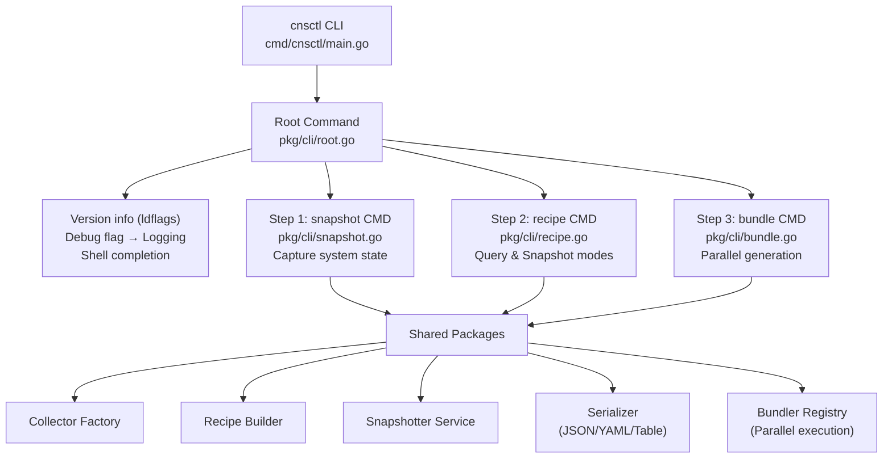

### ConfigMap Integration

The CLI supports Kubernetes-native ConfigMap storage using the `cm://namespace/name` URI scheme:

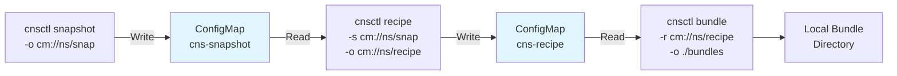

**Benefits:**
- **No file dependencies** - Direct Kubernetes API integration
- **Agent-friendly** - Jobs can write snapshots without volumes
- **Pipeline integration** - CI/CD can read/write ConfigMaps
- **Multi-cluster** - Share snapshots/recipes across clusters

**RBAC Requirements:**
- ConfigMap read/write permissions in target namespace
- ServiceAccount with appropriate Role/RoleBinding
- See [agent-deployment.md](../../user-guide/agent-deployment.md) for details

## Component Details

### Entry Point: `cmd/cnsctl/main.go`

Minimal entry point that delegates to the CLI package:

```go
package main

import "github.com/NVIDIA/cloud-native-stack/pkg/cli"

func main() {
    cli.Execute()
}
```

### Root Command: `pkg/cli/root.go`

**Responsibilities:**
- Command registration and routing
- Version information injection (via ldflags)
- Global flag handling (debug mode, log formatting)
- Logging mode selection and initialization

**Key Features:**
- Version info: `version`, `commit`, `date` (overridden at build time)
- Three logging modes:
  - **CLI Mode (default)**: Minimal output for users (`SetDefaultCLILogger`)
  - **Text Mode (`--debug`)**: Full metadata for debugging (`SetDefaultLoggerWithLevel`)
  - **JSON Mode (`--log-json`)**: Structured logs for automation (`SetDefaultStructuredLoggerWithLevel`)
- Logger selection logic:
  ```go
  switch {
  case c.Bool("log-json"):
      logging.SetDefaultStructuredLoggerWithLevel(name, version, logLevel)
  case isDebug:
      logging.SetDefaultLoggerWithLevel(name, version, logLevel)
  default:
      logging.SetDefaultCLILogger(logLevel)
  }
  ```
- Shell completion support
- Command listing for auto-completion

### Snapshot Command: `pkg/cli/snapshot.go`

Captures comprehensive system configuration snapshots.

#### Command Flow

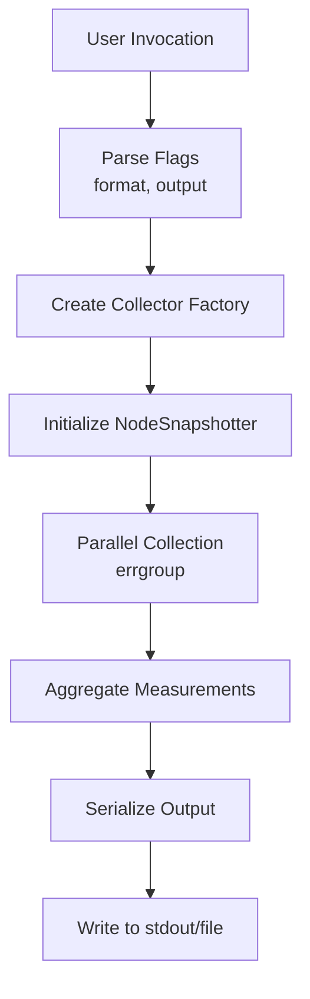

#### Detailed Data Flow

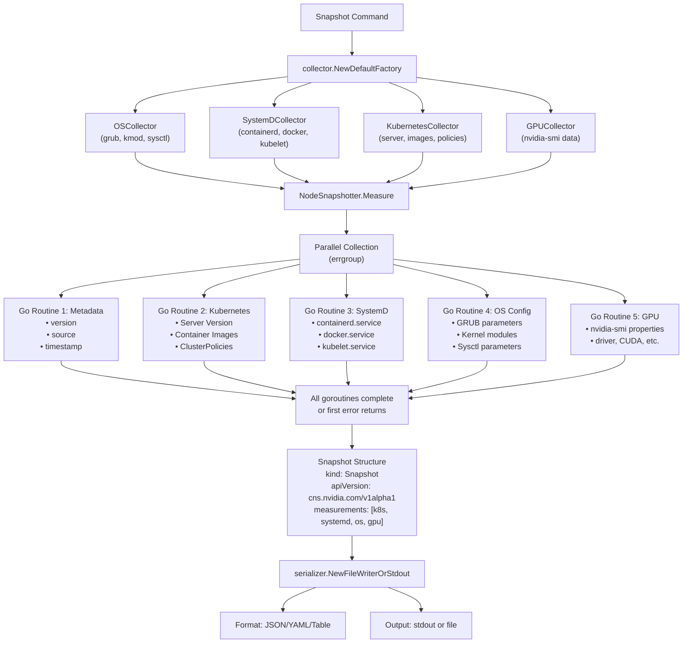

#### Usage Examples

```bash
# Output to stdout in JSON format
cnsctl snapshot

# Save to file in YAML format
cnsctl snapshot --output system.yaml --format yaml

# Human-readable table format
cnsctl snapshot --format table

# ConfigMap output (Kubernetes-native)
cnsctl snapshot --output cm://gpu-operator/cns-snapshot
```

### Agent Deployment Pattern

The snapshot command can be deployed as a Kubernetes Job for automated cluster auditing:

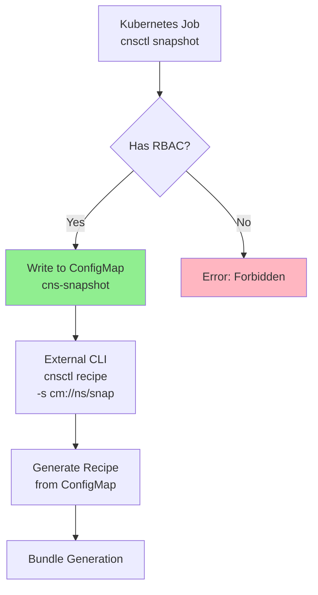

**Deployment:**
```yaml
apiVersion: batch/v1
kind: Job
metadata:
  name: cns
  namespace: gpu-operator
spec:
  template:
    spec:
      serviceAccountName: cns
      containers:
      - name: cns
        image: ghcr.io/nvidia/cns:latest
        command:
        - cnsctl
        - snapshot
        - --output
        - cm://gpu-operator/cns-snapshot
      restartPolicy: Never
```

**RBAC Requirements:**
```yaml
apiVersion: v1
kind: ServiceAccount
metadata:
  name: cns
  namespace: gpu-operator
---
apiVersion: rbac.authorization.k8s.io/v1
kind: Role
metadata:
  name: cns
  namespace: gpu-operator
rules:
- apiGroups: [""]
  resources: ["configmaps"]
  verbs: ["get", "list", "create", "update", "patch"]
---
apiVersion: rbac.authorization.k8s.io/v1
kind: RoleBinding
metadata:
  name: cns
  namespace: gpu-operator
roleRef:
  apiGroup: rbac.authorization.k8s.io
  kind: Role
  name: cns
subjects:
- kind: ServiceAccount
  name: cns
  namespace: gpu-operator  # Must match ServiceAccount namespace
```

**Key Points:**
- No volumes needed - writes directly via Kubernetes API
- RBAC RoleBinding must reference correct namespace
- ConfigMap automatically created if doesn't exist
- Supports update pattern (overwrite existing snapshots)
- For complete examples, see [deployments/cns-agent/](../../../deployments/cns-agent/)
```

### Recipe Command: `pkg/cli/recipe.go`

Generates optimized configuration recipes based on environment parameters.

#### Command Flow

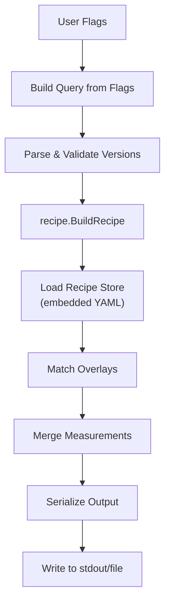

#### Detailed Data Flow

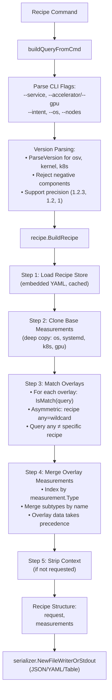

#### Recipe Matching Algorithm

The recipe matching uses an **asymmetric rule-based query system** where overlay criteria (rules) match against user queries (candidates):

```yaml
# Overlay file (eks.yaml)
spec:
  criteria:
    service: eks          # Rule: query must have service=eks
                         # Other fields empty = wildcards (match any query value)
```

**Asymmetric Matching Rules:**
1. **All** non-empty fields in the overlay criteria must be satisfied by the query
2. **Empty overlay field** → Wildcard (matches any query value)
3. **Query "any" field** → Only matches overlay "any" (does NOT match specific overlays)
4. Version fields use semantic version equality with precision awareness

This asymmetric behavior ensures generic queries (e.g., `--service eks --intent training`) don't match overly specific recipes (e.g., recipes requiring `accelerator: gb200`).

#### Usage Examples

```bash
# Basic recipe for Ubuntu with gb200 GPU
cnsctl recipe --os ubuntu --gpu gb200

# Full specification with all parameters
cnsctl recipe \
  --service eks \
  --accelerator gb200 \
  --intent training \
  --os ubuntu \
  --nodes 8 \
  --format yaml \
  --output recipe.yaml

# Inference workload on GKE  
cnsctl recipe --service gke --gpu gb200 --intent inference

# Snapshot mode - analyze captured snapshot for training
cnsctl recipe --snapshot system.yaml --intent training

# Snapshot mode - analyze for inference optimization
cnsctl recipe \
  --snapshot cluster-snapshot.yaml \
  --intent inference \
  --format yaml \
  --output recipe.yaml
```

### Recipe Command Modes

The recipe command supports two modes of operation:

#### Query Mode (Default)
Direct recipe generation from environment parameters:

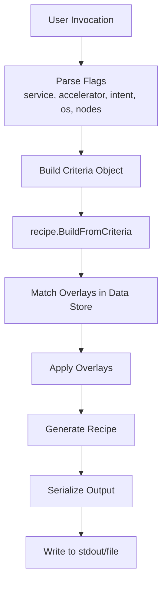

#### Snapshot Mode
Analyze captured snapshots and generate tailored recipes:

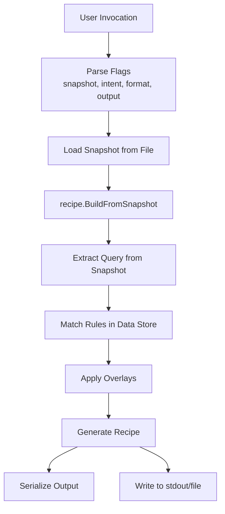

#### Query Extraction from Snapshot

When using snapshot mode, the recipe builder extracts environment parameters from the snapshot:

**From OS Measurements:**
- **release subtype** → OS family (ubuntu, rhel, cos, amazonlinux)

**From Kubernetes Measurements:**
- **server subtype** → K8s service provider (eks, gke, aks) inferred from images

**From GPU Measurements:**
- **Product Name** → GPU type detection (H100, GB200, A100, L40)
- Maps product names to normalized accelerator types for recipe matching

**Intent Types:**
- **training** – Optimize for high throughput, batch processing, multi-GPU orchestration
- **inference** – Optimize for low latency, single-request performance, efficient batching
- **any** – Provides general-purpose recommendations applicable to both workloads

#### External Data Directory

The `--data` flag enables extending embedded recipe data with external files:

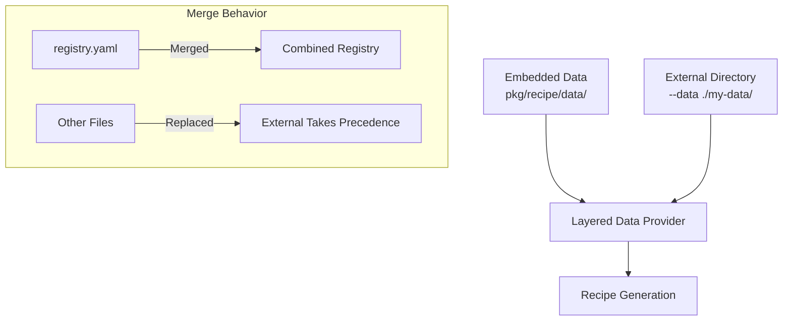

**Requirements:**
- External directory must contain `registry.yaml`
- No symlinks allowed (security)
- Max file size: 10MB per file

**Merge Rules:**
- `registry.yaml`: Components merged by name (external overrides embedded)
- All other files: External replaces embedded if path matches

#### Usage Examples

```bash
# Query mode - generate recipe from parameters
cnsctl recipe --os ubuntu --service eks --accelerator h100 --intent training

# Snapshot mode - analyze snapshot for training workloads
cnsctl recipe --snapshot system.yaml --intent training

# Snapshot mode with output file
cnsctl recipe -s system.yaml -i inference -o recipe.yaml

# Query mode with full specification
cnsctl recipe \
  --service eks \
  --accelerator gb200 \
  --intent training \
  --os ubuntu \
  --nodes 8 \
  --format yaml

# Use external data directory
cnsctl recipe --service eks --accelerator h100 --data ./my-custom-data

# Bundle with external data
cnsctl bundle --recipe recipe.yaml --data ./my-custom-data --output ./bundles
```

#### Recipe Output Structure

```yaml
apiVersion: cns.nvidia.com/v1alpha1
kind: Recipe
metadata:
  version: v1.0.0
  created: "2025-01-15T10:30:00Z"
  appliedOverlays:
    - base
    - eks
    - eks-training
    - gb200-eks-training
    - gb200-eks-ubuntu-training
criteria:
  service: eks
  accelerator: gb200
  intent: training
  os: ubuntu
  nodes: 8
componentRefs:
  - name: gpu-operator
    version: v25.3.3
    order: 1
    repository: https://helm.ngc.nvidia.com/nvidia
  - name: network-operator
    version: v25.4.0
    order: 2
    repository: https://helm.ngc.nvidia.com/nvidia
constraints:
  driver:
    version: "580.82.07"
    cudaVersion: "13.1"
```

#### Error Handling

- **Query Mode**:
  - Invalid parameter values: Returns error with supported options
  - Missing required parameters: Allows "any" as default fallback
  - No matching overlays: Returns recipe with base configuration

- **Snapshot Mode**:
  - Missing snapshot file: File not found error with path
  - Invalid snapshot format: Parse error with details
  - Invalid intent: Returns error with supported intent types (training, inference, any)
  - Extraction failures: Best-effort extraction with partial criteria

**Common Errors**:
- Unknown output format: Error with supported formats list (json, yaml)

### Bundle Command: `pkg/cli/bundle.go`

Generates deployment-ready bundles (Helm values, Kubernetes manifests, installation scripts) from recipes.

#### Command Flow

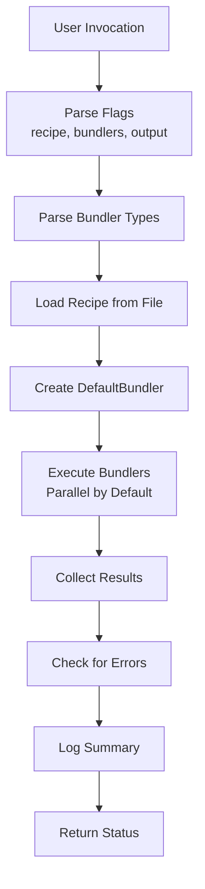

#### Detailed Data Flow

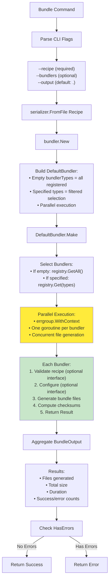

#### Bundler Data Flow

**Simplified Architecture (RecipeResult-to-Template):**
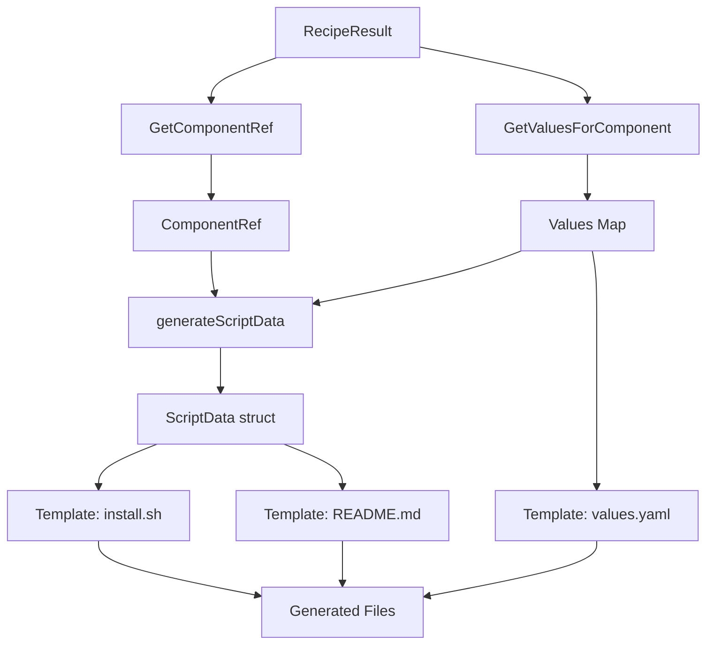

**Key Simplification**: Single RecipeResult path (no dual Recipe/RecipeResult routing)  
**Data Flow**: RecipeResult → Values Map + ScriptData → Templates  
**Templates**: Use `index .Values "key"` for config, `.Script.*` for metadata

#### Bundler Architecture

**BaseBundler Helper Pattern:**
```go
// Bundlers embed BaseBundler and override Make()
type Bundler struct {
    *bundler.BaseBundler  // Provides common functionality
}

func NewBundler() *Bundler {
    return &Bundler{
        BaseBundler: bundler.NewBaseBundler(bundlerType, templatesFS),
    }
}

// Self-register at init time using MustRegister
func init() {
    bundler.MustRegister("gpu-operator", NewBundler())
}
```

**RecipeResult-Based Data Access:**
```go
// Get component reference from RecipeResult
component := input.GetComponentRef(Name)
values := input.GetValuesForComponent(Name)

// Generate script metadata
scriptData := generateScriptData(component, values)

// Pass values map to templates (config values)
b.GenerateFileFromTemplate(ctx, GetTemplate, "values.yaml", path, values, 0644)

// Pass ScriptData to scripts (metadata)
b.GenerateFileFromTemplate(ctx, GetTemplate, "install.sh", path, scriptData, 0755)

// Pass combined data to README
readmeData := map[string]interface{}{"Values": values, "Script": scriptData}
b.GenerateFileFromTemplate(ctx, GetTemplate, "README.md", path, readmeData, 0644)
```

**Data Flow: RecipeResult → Values/ScriptData → Template**
```
RecipeResult → GetComponentRef(Name) → ComponentRef
             → GetValuesForComponent(Name) → values map
             → generateScriptData() → ScriptData struct
             → Template ({{ index .Values "key" }} or {{ .Script.Namespace }})
```

**Registry Pattern:**
```go
// Dynamic bundler discovery
bundlers := defaultRegistry.GetAll()  // Returns all registered bundlers
bundlers := defaultRegistry.Get(type) // Returns specific bundler

// MustRegister panics on duplicate types (fail-fast)
bundler.MustRegister("gpu-operator", NewBundler())
```

**DefaultBundler Options:**
- `WithBundlerTypes([]BundleType)` – Specify bundler types (empty = all registered)
- `WithFailFast(bool)` – Stop on first error (default: false/collect all)
- `WithConfig(*Config)` – Provide bundler configuration
- `WithRegistry(*Registry)` – Use custom bundler registry

**Execution:**
- **Parallel execution by default**: Uses `errgroup.WithContext` for concurrent execution
  - All bundlers run concurrently when no types specified
  - Faster for multiple bundlers
  - Context cancellation propagates to all bundlers
  - Bundlers are stateless (thread-safe by design)
  - BaseBundler provides thread-safe operations

**Architecture Benefits:**
- **75% less code** per bundler (BaseBundler eliminates boilerplate)
- **34% less test code** (TestHarness standardizes testing)
- **15+ internal helpers** for recipe parsing
- **Automatic registration** via init() functions
- **Fail-fast** on duplicate bundler types

#### Usage Examples

```bash
# Generate all registered bundlers (parallel by default)
cnsctl bundle --recipe recipe.yaml --output ./bundles

# Generate specific bundler
cnsctl bundle --recipe recipe.yaml --bundlers gpu-operator --output ./bundles

# Multiple bundlers
cnsctl bundle \
  --recipe recipe.yaml \
  --bundlers gpu-operator \
  --bundlers network-operator \
  --output ./bundles

# Use short flags
cnsctl bundle -r recipe.yaml -b gpu-operator -o ./bundles

# Override values at generation time
cnsctl bundle -r recipe.yaml -b gpu-operator \
  --set gpuoperator:gds.enabled=true \
  --set gpuoperator:driver.version=570.86.16 \
  -o ./bundles

# Multiple bundlers with overrides
cnsctl bundle -r recipe.yaml \
  -b gpu-operator \
  -b network-operator \
  --set gpuoperator:mig.strategy=mixed \
  --set networkoperator:rdma.enabled=true \
  -o ./bundles

# Schedule system components on system node pool
cnsctl bundle -r recipe.yaml -b gpu-operator \
  --system-node-selector nodeGroup=system-pool \
  --system-node-toleration dedicated=system:NoSchedule \
  -o ./bundles

# Schedule GPU workloads on labeled GPU nodes
cnsctl bundle -r recipe.yaml -b gpu-operator \
  --accelerated-node-selector nvidia.com/gpu.present=true \
  --accelerated-node-toleration nvidia.com/gpu=present:NoSchedule \
  -o ./bundles
```

#### Bundle Output Structure

```
./bundles/
├── gpu-operator/
│   ├── values.yaml              # Helm chart values
│   ├── manifests/
│   │   └── clusterpolicy.yaml  # ClusterPolicy CR
│   ├── scripts/
│   │   ├── install.sh          # Installation script
│   │   └── uninstall.sh        # Cleanup script
│   ├── README.md                # Deployment instructions
│   └── checksums.txt            # SHA256 verification
├── network-operator/
│   ├── values.yaml
│   ├── manifests/
│   │   └── nicclusterpolicy.yaml
│   ├── scripts/
│   ├── README.md
│   └── checksums.txt
├── cert-manager/
│   ├── values.yaml
│   ├── README.md
│   └── checksums.txt
├── nvsentinel/
│   ├── values.yaml
│   ├── README.md
│   └── checksums.txt
└── skyhook/
    ├── values.yaml
    ├── manifests/
    │   └── skyhook.yaml
    ├── README.md
    └── checksums.txt
```

#### Error Handling

**Validation Errors:**
- Missing recipe file: File not found error with path
- Invalid recipe format: Parse error with details
- Invalid bundler type: Error with list of supported types
- Empty measurements: Recipe validation failure

**Execution Errors:**
- **FailFast=false (default)**: Collects all errors, continues execution
  - Returns partial results with error list
  - Exit code indicates failure count
- **FailFast=true**: Stops on first bundler error
  - Returns immediately with error
  - Subsequent bundlers not executed

**Common Error Scenarios:**
```bash
# Missing recipe file
$ cnsctl bundle --output ./bundles
Error: required flag "recipe" not set

# Invalid bundler type
$ cnsctl bundle -r recipe.yaml -b invalid-type
Error: invalid bundler type 'invalid-type': unknown bundle type: invalid-type

# Bundler failures (FailFast=false)
$ cnsctl bundle -r recipe.yaml
Error: bundle generation completed with errors: 1/2 bundlers failed
```

#### CLI Integration

The bundle command integrates with the CLI through:

1. **Shared Serializer**: Uses same `serializer.FromFile` for recipe loading
2. **Structured Logging**: Consistent `slog` structured logging
3. **Context Propagation**: Respects context cancellation
4. **Error Patterns**: Uses same error handling conventions

**Log Output Example:**
```
INFO  generating bundle recipeFilePath=recipe.yaml outputDir=./bundles bundlerTypes=[gpu-operator]
INFO  starting bundle generation bundler_count=1 output_dir=./bundles
INFO  bundler completed bundler_type=gpu-operator files=5 size_bytes=12458 duration=45ms
INFO  bundle generation complete summary="Generated 5 files (12 KB) in 45ms. Success: 1/1 bundlers."
INFO  bundle generation completed success=1 errors=0 duration_sec=0.045 summary="Generated 5 files (12 KB) in 45ms. Success: 1/1 bundlers."
```

**Common Errors**:

## Shared Infrastructure

### Collector Factory Pattern

The CLI uses the **Factory Pattern** for collector instantiation, enabling:
- **Testability**: Inject mock collectors for unit tests
- **Flexibility**: Easy to add new collector types
- **Encapsulation**: Hide collector creation complexity

```go
type Factory interface {
    CreateSystemDCollector() Collector
    CreateOSCollector() Collector
    CreateKubernetesCollector() Collector
    CreateGPUCollector() Collector
}
```

### Serializer Abstraction

Output formatting is abstracted through the `serializer.Serializer` interface:

```go
type Serializer interface {
    Serialize(data interface{}) error
}
```

Implementations:
- **JSON**: `encoding/json` with 2-space indent
- **YAML**: `gopkg.in/yaml.v3` 
- **Table**: `text/tabwriter` for columnar display

### Measurement Data Model

All collected data uses a unified `measurement.Measurement` structure:

```go
type Measurement struct {
    Type     Type      // os, k8s, systemd, gpu
    Subtypes []Subtype // Named collections of readings
}

type Subtype struct {
    Name    string                // grub, kmod, sysctl, server, image, etc.
    Data    map[string]Reading    // Key-value readings
    Context map[string]string     // Human-readable descriptions
}

type Reading struct {
    Value interface{}  // Actual value (int, string, bool, float64)
}
```

## Error Handling

### CLI Error Strategy

1. **Flag Validation**: User-friendly error messages for invalid flags
2. **Version Parsing**: Specific error types (ErrNegativeComponent, etc.)
3. **Collector Failures**: Log errors, continue with partial data where possible
4. **Serialization Errors**: Fatal - abort and report
5. **Exit Codes**: Non-zero exit code on any failure

### Example Error Messages

```bash
# Invalid accelerator type
$ cnsctl recipe --accelerator invalid-gpu
Error: invalid accelerator type: must be one of h100, gb200, a100, l40, any

# Unknown output format
$ cnsctl snapshot --format xml
Error: unknown output format: "xml"

# Missing required parameters
$ cnsctl recipe
# Still succeeds - generates base recipe with no overlays
```

## Performance Characteristics

### Snapshot Command

- **Parallel Collection**: All collectors run concurrently via `errgroup`
- **Typical Duration**: 100-500ms depending on cluster size
- **Memory Usage**: ~10-50MB for typical workloads
- **Scalability**: O(n) with number of pods/nodes for K8s collector

### Recipe Command

- **Store Loading**: Once per process (cached via `sync.Once`)
- **Typical Duration**: <10ms after initial load
- **Memory Usage**: ~5-10MB (embedded YAML + parsed structure)
- **Scalability**: O(m) with number of overlays (typically <100)

## Build Configuration

### Version Injection via ldflags

Build-time version information injection:

```makefile
VERSION ?= $(shell git describe --tags --always --dirty)
COMMIT ?= $(shell git rev-parse --short HEAD)
DATE ?= $(shell date -u +%Y-%m-%dT%H:%M:%SZ)

LDFLAGS := -X github.com/NVIDIA/cloud-native-stack/pkg/cli.version=$(VERSION)
LDFLAGS += -X github.com/NVIDIA/cloud-native-stack/pkg/cli.commit=$(COMMIT)
LDFLAGS += -X github.com/NVIDIA/cloud-native-stack/pkg/cli.date=$(DATE)

go build -ldflags="$(LDFLAGS)" -o bin/cnsctl ./cmd/cnsctl
```

## Testing Strategy

### Unit Tests
- Flag parsing and validation
- Version parsing and error handling
- Query building from command flags
- Serializer format selection

### Integration Tests
- Mock collectors for deterministic output
- Full command execution with fake factory
- Output format validation

### Example Test Structure

```go
func TestSnapshotCommand(t *testing.T) {
    // Create mock factory
    mockFactory := &MockFactory{
        k8s:     mockK8sCollector,
        systemd: mockSystemDCollector,
        os:      mockOSCollector,
        gpu:     mockGPUCollector,
    }
    
    // Execute snapshot with mock
    snapshotter := NodeSnapshotter{
        Factory: mockFactory,
        Serializer: &bytes.Buffer{},
    }
    
    err := snapshotter.Measure(ctx)
    assert.NoError(t, err)
}
```

## Dependencies

### External Libraries
- `github.com/urfave/cli/v3` - CLI framework
- `golang.org/x/sync/errgroup` - Concurrent error handling
- `gopkg.in/yaml.v3` - YAML parsing
- `log/slog` - Structured logging

### Internal Packages
- `pkg/collector` - System data collection
- `pkg/measurement` - Data model
- `pkg/recipe` - Recipe building
- `pkg/version` - Semantic versioning
- `pkg/serializer` - Output formatting
- `pkg/logging` - Logging configuration
- `pkg/snapshotter` - Snapshot orchestration

## Future Enhancements

### Short-Term (< 3 months)

1. **Caching Layer**  
   **Rationale**: Reduce latency for repeated `cnsctl snapshot` calls in scripts  
   **Implementation**: `sync.Map` with TTL-based eviction using `time.AfterFunc`  
   **Trade-off**: Stale data risk vs 5-10x performance improvement  
   **Reference**: [sync.Map](https://pkg.go.dev/sync#Map)

2. **Differential Snapshots**  
   **Use Case**: CI/CD pipelines detecting configuration drift  
   **Implementation**: `github.com/google/go-cmp/cmp` for deep comparison  
   **Output**: JSON Patch (RFC 6902) format for machine consumption  
   **CLI**: `cnsctl diff baseline.yaml current.yaml --format patch`

3. **Measurement Filtering**  
   **Use Case**: Extract only GPU data without K8s overhead  
   **CLI**: `cnsctl snapshot --filter gpu,os --exclude k8s`  
   **Implementation**: Post-collection filtering before serialization  
   **Performance**: Saves 60-70% execution time when K8s excluded

4. **Batch Mode**  
   **Use Case**: Fleet-wide configuration auditing (100s of nodes)  
   **Implementation**: Worker pool with `errgroup.SetLimit()`  
   **CLI**: `cnsctl snapshot --nodes nodes.txt --workers 10 --output results/`  
   **Reference**: [errgroup Limits](https://pkg.go.dev/golang.org/x/sync/errgroup#Group.SetLimit)

### Mid-Term (3-6 months)

5. **Plugin System**  
   **Rationale**: Custom collectors without forking codebase  
   **Interface**: `type Collector interface { Collect(context.Context) (Measurement, error) }`  
   **Options**: Go plugins (unstable across versions) or WASM (safe, portable)  
   **Security**: Sandboxed execution with restricted syscalls  
   **Reference**: [WebAssembly System Interface](https://wasi.dev/)

6. **Configuration Files**  
   **Use Case**: Avoid repeating --os, --gpu flags  
   **Format**: YAML following XDG Base Directory spec  
   **Location**: `~/.config/cnsctl/config.yaml` (Linux/macOS), `%APPDATA%\cnsctl\config.yaml` (Windows)  
   **Example**:
   ```yaml
   defaults:
     os: ubuntu
     gpu: h100
     format: yaml
   server:
     url: https://recipe-api.example.com
   ```

7. **Watch Mode**  
   **Implementation**: Hybrid of `fsnotify` + periodic polling  
   **CLI**: `cnsctl snapshot --watch --interval 30s --on-change ./alert.sh`  
   **Output**: Stream of JSON diffs to stdout  
   **Use Case**: Real-time monitoring with alerting

8. **Schema Validation**  
   **Use Case**: Ensure snapshots conform to API version spec  
   **Implementation**: Embed JSON Schema in binary with `go:embed`  
   **Library**: `github.com/santhosh-tekuri/jsonschema/v5` (fastest Go validator)  
   **CLI**: `cnsctl validate --schema v1 snapshot.json`

### Long-Term (6-12 months)

9. **gRPC Mode**  
   **Rationale**: Better streaming, 3-5x smaller payloads than JSON  
   **Implementation**: Bi-directional streaming with protobuf  
   **Trade-off**: Added complexity (proto definitions) vs performance gains  
   **Reference**: [gRPC Go](https://grpc.io/docs/languages/go/)

10. **Distributed Tracing**  
    **Use Case**: Debug performance issues across collectors  
    **Implementation**: OpenTelemetry SDK with span per collector  
    **Exporter**: OTLP to Jaeger/Tempo  
    **CLI**: `cnsctl snapshot --trace --trace-endpoint localhost:4317`  
    **Reference**: [OpenTelemetry Go](https://opentelemetry.io/docs/languages/go/)

11. **Policy Enforcement**  
    **Use Case**: Block non-compliant configs in CI/CD  
    **Implementation**: Embed OPA (`github.com/open-policy-agent/opa`)  
    **CLI**: `cnsctl validate --policy policy.rego snapshot.yaml`  
    **Exit Code**: 0 = pass, 1 = policy violations  
    **Reference**: [OPA Go Integration](https://www.openpolicyagent.org/docs/latest/integration/)

12. **Cloud Storage Integration**  
    **Use Case**: Centralized storage for fleet management  
    **CLI**: `cnsctl snapshot --upload s3://bucket/snapshots/$(hostname).yaml`  
    **Implementation**: AWS SDK v2 with resumable uploads  
    **Authentication**: IAM roles, service accounts, credential chain  
    **Reference**: [AWS SDK for Go V2](https://aws.github.io/aws-sdk-go-v2/)

## Production Deployment Patterns

### Pattern 1: CI/CD Integration

**Use Case**: Automated configuration validation in build pipelines

**GitLab CI Example**:
```yaml
validate_gpu_config:
  stage: test
  image: ghcr.io/nvidia/cns:latest
  script:
    - cnsctl snapshot --format json > snapshot.json
    # Validate against known-good baseline
    - diff -u expected_snapshot.json snapshot.json
    # Or use OPA policy (future enhancement)
    # - cnsctl validate --policy policies/gpu_baseline.rego snapshot.json
  only:
    - merge_requests
  artifacts:
    when: on_failure
    paths:
      - snapshot.json
```

**GitHub Actions Example**:
```yaml
name: Validate GPU Configuration
on:
  pull_request:
    paths:
      - 'ansible/**'
      - 'terraform/**'

jobs:
  validate:
    runs-on: [self-hosted, gpu]
    steps:
      - uses: actions/checkout@v4
      
      - name: Install cnsctl
        run: |
          curl -sfL https://raw.githubusercontent.com/.../installer | bash -s --
          echo "$HOME/.local/bin" >> $GITHUB_PATH
      
      - name: Capture snapshot
        run: cnsctl snapshot --format yaml --output snapshot.yaml
      
      - name: Generate recipe
        run: cnsctl recipe --os ubuntu --gpu h100 > recipe.yaml
      
      - name: Compare configurations
        run: |
          yq eval '.measurements[] | select(.type=="GPU")' snapshot.yaml > actual_gpu.yaml
          yq eval '.measurements[] | select(.type=="GPU")' recipe.yaml > expected_gpu.yaml
          diff -u expected_gpu.yaml actual_gpu.yaml || \
            (echo "::error::GPU configuration drift detected" && exit 1)
      
      - name: Upload artifact
        if: failure()
        uses: actions/upload-artifact@v4
        with:
          name: configuration-drift
          path: |
            snapshot.yaml
            recipe.yaml
```

**Jenkins Pipeline**:
```groovy
pipeline {
    agent { label 'gpu-node' }
    
    stages {
        stage('Snapshot') {
            steps {
                sh 'cnsctl snapshot --format json > snapshot.json'
            }
        }
        
        stage('Validate') {
            steps {
                script {
                    def snapshot = readJSON file: 'snapshot.json'
                    def gpuDriver = snapshot.measurements
                        .find { it.type == 'GPU' }
                        .subtypes.find { it.subtype == 'smi' }
                        .data.'driver-version'
                    
                    if (gpuDriver != '570.158.01') {
                        error("Incorrect GPU driver: ${gpuDriver}")
                    }
                }
            }
        }
    }
    
    post {
        always {
            archiveArtifacts artifacts: 'snapshot.json', fingerprint: true
        }
    }
}
```

### Pattern 2: Scheduled Auditing

**Use Case**: Nightly configuration drift detection across fleet

**Kubernetes CronJob**:
```yaml
apiVersion: batch/v1
kind: CronJob
metadata:
  name: cns-audit
  namespace: monitoring
spec:
  schedule: "0 2 * * *"  # 2 AM daily
  concurrencyPolicy: Forbid  # Prevent overlapping runs
  successfulJobsHistoryLimit: 7
  failedJobsHistoryLimit: 3
  jobTemplate:
    spec:
      template:
        metadata:
          labels:
            app: cns-audit
        spec:
          serviceAccountName: cns
          nodeSelector:
            node-role.kubernetes.io/gpu: "true"
          tolerations:
          - key: nvidia.com/gpu
            operator: Exists
            effect: NoSchedule
          containers:
          - name: cns
            image: ghcr.io/nvidia/cns:v0.6.4
            command:
              - /bin/sh
              - -c
              - |
                set -e
                TIMESTAMP=$(date +%Y%m%d-%H%M%S)
                HOSTNAME=$(hostname)
                
                # Capture snapshot
                cnsctl snapshot --format yaml > /tmp/snapshot.yaml
                
                # Store as ConfigMap with retention
                kubectl create configmap \
                  "cns-snapshot-${HOSTNAME}-${TIMESTAMP}" \
                  --from-file=snapshot=/tmp/snapshot.yaml \
                  --dry-run=client -o yaml | \
                kubectl apply -f -
                
                # Cleanup old snapshots (keep last 30 days)
                kubectl get configmaps -l cns-snapshot=true \
                  --sort-by=.metadata.creationTimestamp | \
                head -n -30 | \
                xargs -r kubectl delete configmap
            resources:
              limits:
                memory: 256Mi
              requests:
                cpu: 100m
                memory: 128Mi
          restartPolicy: OnFailure
```

**Systemd Timer (Bare Metal)**:
```ini
# /etc/systemd/system/cns-audit.service
[Unit]
Description=CNS Configuration Audit
After=network.target

[Service]
Type=oneshot
ExecStart=/usr/local/bin/cnsctl snapshot --format json --output /var/log/cns/snapshot-%Y%m%d.json
User=cns
Group=cns

# Hardening
PrivateTmp=true
NoNewPrivileges=true
ReadOnlyPaths=/usr /etc
ReadWritePaths=/var/log/cns

[Install]
WantedBy=multi-user.target

# /etc/systemd/system/cns-audit.timer
[Unit]
Description=CNS Audit Timer

[Timer]
OnCalendar=daily
Persistent=true

[Install]
WantedBy=timers.target
```

Enable with:
```bash
sudo systemctl enable --now cns-audit.timer
sudo systemctl list-timers cns-audit.timer
```

### Pattern 3: Fleet Management

**Use Case**: Collect snapshots from 100s of GPU nodes in parallel

**Ansible Playbook**:
```yaml
---
- name: Collect CNS Snapshots from GPU Fleet
  hosts: gpu_nodes
  gather_facts: yes
  serial: 10  # Process 10 nodes at a time
  tasks:
    - name: Ensure cnsctl is installed
      stat:
        path: /usr/local/bin/cnsctl
      register: cns_binary
      failed_when: not cns_binary.stat.exists
    
    - name: Collect snapshot
      shell: cnsctl snapshot --format json
      register: snapshot
      changed_when: false
      failed_when: snapshot.rc != 0
    
    - name: Upload to S3
      aws_s3:
        bucket: fleet-snapshots
        object: "{{ inventory_hostname }}/{{ ansible_date_time.iso8601 }}.json"
        content: "{{ snapshot.stdout }}"
        mode: put
      delegate_to: localhost
      run_once: false
    
    - name: Validate against baseline
      shell: |
        echo '{{ snapshot.stdout }}' | \
        jq '.measurements[] | select(.type=="GPU") | .subtypes[] | 
            select(.subtype=="smi") | .data."driver-version"'
      register: driver_version
      failed_when: driver_version.stdout != '"570.158.01"'
      changed_when: false

- name: Generate Fleet Report
  hosts: localhost
  tasks:
    - name: Download all snapshots
      aws_s3:
        bucket: fleet-snapshots
        mode: list
      register: s3_objects
    
    - name: Aggregate results
      script: scripts/aggregate_snapshots.py
      args:
        snapshots: "{{ s3_objects.s3_keys }}"
```

**Terraform Provisioning**:
```hcl
resource "null_resource" "cns_snapshot" {
  count = length(var.gpu_instance_ids)
  
  provisioner "remote-exec" {
    inline = [
      "cnsctl snapshot --format json > /tmp/snapshot.json",
      "aws s3 cp /tmp/snapshot.json s3://fleet-snapshots/${self.id}/"
    ]
    
    connection {
      type        = "ssh"
      host        = element(var.gpu_instance_ips, count.index)
      user        = "ubuntu"
      private_key = file("~/.ssh/id_rsa")
    }
  }
  
  triggers = {
    instance_id = element(var.gpu_instance_ids, count.index)
    timestamp   = timestamp()
  }
}

data "aws_s3_objects" "snapshots" {
  bucket     = "fleet-snapshots"
  depends_on = [null_resource.cns_snapshot]
}

output "snapshot_count" {
  value = length(data.aws_s3_objects.snapshots.keys)
}
```

### Pattern 4: Real-Time Monitoring

**Use Case**: Continuous configuration monitoring with Prometheus alerting

**Prometheus Exporter** (future enhancement):
```go
package main

import (
    "context"
    "net/http"
    "time"
    
    "github.com/prometheus/client_golang/prometheus"
    "github.com/prometheus/client_golang/prometheus/promhttp"
    "github.com/NVIDIA/cloud-native-stack/pkg/snapshotter"
)

var (
    gpuDriverVersion = prometheus.NewGaugeVec(
        prometheus.GaugeOpts{
            Name: "cns_gpu_driver_version",
            Help: "NVIDIA driver version (encoded as float)",
        },
        []string{"node", "gpu_model"},
    )
    
    k8sVersion = prometheus.NewGaugeVec(
        prometheus.GaugeOpts{
            Name: "cns_k8s_version",
            Help: "Kubernetes version (encoded)",
        },
        []string{"node"},
    )
)

func init() {
    prometheus.MustRegister(gpuDriverVersion, k8sVersion)
}

func collectMetrics() {
    ticker := time.NewTicker(30 * time.Second)
    defer ticker.Stop()
    
    for range ticker.C {
        ctx, cancel := context.WithTimeout(context.Background(), 10*time.Second)
        snapshot, err := snapshotter.Measure(ctx)
        cancel()
        
        if err != nil {
            log.Printf("Snapshot failed: %v", err)
            continue
        }
        
        // Extract and export GPU driver version
        for _, m := range snapshot.Measurements {
            if m.Type == "GPU" {
                for _, st := range m.Subtypes {
                    if st.Subtype == "smi" {
                        version := st.Data["driver-version"]
                        encoded := encodeVersion(version)
                        gpuModel := st.Data["gpu-name"]
                        gpuDriverVersion.WithLabelValues(hostname, gpuModel).Set(encoded)
                    }
                }
            }
        }
    }
}

func main() {
    go collectMetrics()
    http.Handle("/metrics", promhttp.Handler())
    http.ListenAndServe(":9090", nil)
}
```

**Prometheus Alerting Rules**:
```yaml
groups:
- name: cns_configuration
  interval: 60s
  rules:
  - alert: GPUDriverVersionMismatch
    expr: |
      count(count by (cns_gpu_driver_version) (cns_gpu_driver_version)) > 1
    for: 5m
    labels:
      severity: warning
    annotations:
      summary: "Multiple GPU driver versions detected in cluster"
      description: "{{ $value }} different driver versions found"
  
  - alert: KubernetesVersionSkew
    expr: |
      abs(cns_k8s_version - scalar(avg(cns_k8s_version))) > 0.01
    for: 10m
    labels:
      severity: critical
    annotations:
      summary: "Kubernetes version skew detected on {{ $labels.node }}"
      description: "Node version differs from cluster average"
```

## Advanced Usage Patterns

### Snapshot Diffing with jq

```bash
#!/bin/bash
# Capture baseline before changes
cnsctl snapshot --format json > baseline.json

# Apply configuration changes (Ansible, Terraform, etc.)
# ...

# Capture new snapshot
cnsctl snapshot --format json > current.json

# Diff specific sections
echo "=== GPU Configuration Changes ==="
diff -u \
  <(jq -S '.measurements[] | select(.type=="GPU")' baseline.json) \
  <(jq -S '.measurements[] | select(.type=="GPU")' current.json)

echo "=== Kernel Parameter Changes ==="
diff -u \
  <(jq -S '.measurements[] | select(.type=="os") | .subtypes[] | 
           select(.subtype=="sysctl")' baseline.json) \
  <(jq -S '.measurements[] | select(.type=="os") | .subtypes[] | 
           select(.subtype=="sysctl")' current.json)

# Count total changes
changes=$(diff <(jq -S . baseline.json) <(jq -S . current.json) | grep -c '^[<>]')
echo "Total configuration changes: $changes"
```

### Recipe Generation Pipeline

```bash
#!/bin/bash
# Generate recipes for all supported configurations

set -euo pipefail

OUTPUT_DIR="recipes"
mkdir -p "$OUTPUT_DIR"

# GPU types from NVIDIA product line
GPU_TYPES=("h100" "gb200" "a100" "l40" "l4")

# Kubernetes services
K8S_SERVICES=("eks" "gke" "aks" "self-managed")

# OS distributions
OS_TYPES=("ubuntu" "rhel" "cos")

total=0
for gpu in "${GPU_TYPES[@]}"; do
  for service in "${K8S_SERVICES[@]}"; do
    for os in "${OS_TYPES[@]}"; do
      output="${OUTPUT_DIR}/${os}-${service}-${gpu}.yaml"
      
      # Generate recipe
      if cnsctl recipe --os "$os" --service "$service" --gpu "$gpu" \
           --format yaml > "$output" 2>/dev/null; then
        echo "✓ Generated $output"
        ((total++))
      else
        echo "✗ Failed: $os $service $gpu"
      fi
    done
  done
done

echo "Generated $total recipes"

# Validate all recipes
echo "Validating recipes..."
find "$OUTPUT_DIR" -name '*.yaml' -exec yq eval '.' {} \; > /dev/null
echo "All recipes valid"

# Create index
cat > "$OUTPUT_DIR/README.md" <<EOF
# Configuration Recipes

Generated on $(date -Iseconds)

Total recipes: $total

## Available Configurations

| OS | Service | GPU | File |
|----|---------|-----|------|
EOF

find "$OUTPUT_DIR" -name '*.yaml' -type f | sort | while read -r file; do
  base=$(basename "$file" .yaml)
  IFS='-' read -ra parts <<< "$base"
  echo "| ${parts[0]} | ${parts[1]} | ${parts[2]} | $file |" >> "$OUTPUT_DIR/README.md"
done
```

### Automated Remediation

```bash
#!/bin/bash
# Apply recommended configuration from recipe
# WARNING: Modifies system configuration - use with caution

set -euo pipefail

# Capture current state
current=$(cnsctl snapshot --format json)

# Generate recommended recipe
recipe=$(cnsctl recipe --os ubuntu --gpu h100 --format json)

# Extract recommended GRUB parameters
recommended_grub=$(echo "$recipe" | jq -r '
  .measurements[] | 
  select(.type=="os") | 
  .subtypes[] | 
  select(.subtype=="grub") | 
  .data | 
  to_entries[] | 
  "\(.key)=\(.value)"' | tr '\n' ' ')

# Extract current GRUB parameters
current_grub=$(echo "$current" | jq -r '
  .measurements[] | 
  select(.type=="os") | 
  .subtypes[] | 
  select(.subtype=="grub") | 
  .data | 
  to_entries[] | 
  "\(.key)=\(.value)"' | tr '\n' ' ')

# Show diff
echo "Current GRUB parameters:"
echo "$current_grub"
echo ""
echo "Recommended GRUB parameters:"
echo "$recommended_grub"
echo ""

# Prompt for confirmation
read -p "Apply changes? (yes/no): " confirm
if [[ "$confirm" != "yes" ]]; then
  echo "Aborted"
  exit 0
fi

# Apply GRUB changes (requires root)
sudo grubby --update-kernel=ALL --args="$recommended_grub"
echo "GRUB configuration updated. Reboot required."

# Apply sysctl changes
echo "$recipe" | jq -r '
  .measurements[] | 
  select(.type=="os") | 
  .subtypes[] | 
  select(.subtype=="sysctl") | 
  .data | 
  to_entries[] | 
  "\(.key) = \(.value)"' | \
sudo tee /etc/sysctl.d/99-cns-recommended.conf

sudo sysctl --system
echo "Sysctl parameters applied"

# Log changes
echo "$(date -Iseconds): Applied CNS recommendations" | \
sudo tee -a /var/log/cns-remediation.log
```

## Troubleshooting Guide

### Issue: "nvidia-smi not found"

**Symptoms**: GPU measurements empty, error in logs  
**Root Cause**: NVIDIA driver not installed or not in PATH  

**Diagnosis**:
```bash
# Check if nvidia-smi exists
which nvidia-smi
# Expected: /usr/bin/nvidia-smi

# Verify driver installation
nvidia-smi --version
# Expected: NVIDIA-SMI 570.158.01

# Check kernel modules
lsmod | grep nvidia
# Expected: nvidia, nvidia_uvm, nvidia_modeset

# Verify device nodes
ls -l /dev/nvidia*
# Expected: /dev/nvidia0, /dev/nvidiactl, /dev/nvidia-uvm
```

**Resolution**:
```bash
# Ubuntu: Install NVIDIA driver
sudo apt-get update
sudo apt-get install -y nvidia-driver-570

# RHEL: Install from CUDA repo
sudo dnf config-manager --add-repo \
  https://developer.download.nvidia.com/compute/cuda/repos/rhel8/x86_64/cuda-rhel8.repo
sudo dnf install -y nvidia-driver:570

# Verify installation
sudo nvidia-smi

# If PATH issue, add to shell profile
echo 'export PATH="/usr/bin:$PATH"' >> ~/.bashrc
source ~/.bashrc
```

### Issue: "Kubernetes API server unreachable"

**Symptoms**: K8s measurements empty, "connection refused" error  
**Root Cause**: Not running in cluster, or kubeconfig missing/invalid  

**Diagnosis**:
```bash
# Verify cluster connectivity
kubectl cluster-info
# Expected: Kubernetes control plane is running at https://...

# Check kubeconfig
echo $KUBECONFIG
cat ~/.kube/config

# Test API access
kubectl get nodes
# Expected: List of nodes

# Check service account (in-cluster)
ls -l /var/run/secrets/kubernetes.io/serviceaccount/
# Expected: token, ca.crt, namespace
```

**Resolution**:
```bash
# Option 1: Set KUBECONFIG explicitly
export KUBECONFIG=~/.kube/config
cnsctl snapshot

# Option 2: Copy admin kubeconfig
sudo cp /etc/kubernetes/admin.conf ~/.kube/config
sudo chown $(id -u):$(id -g) ~/.kube/config

# Option 3: Use service account token (in-cluster)
kubectl create serviceaccount cns
kubectl create clusterrolebinding cns --clusterrole=view --serviceaccount=default:cns

# Option 4: Debug with kubectl proxy
kubectl proxy &
export KUBERNETES_SERVICE_HOST=localhost
export KUBERNETES_SERVICE_PORT=8001
cnsctl snapshot
```

### Issue: "Snapshot too slow (> 5s)"

**Symptoms**: Long execution time, timeouts in CI/CD  
**Root Cause**: Large cluster (1000s of pods), slow API server, many GPUs  

**Diagnosis**:
```bash
# Enable debug logging to identify slow collectors
cnsctl --debug snapshot 2>&1 | grep -E 'collector|duration'
# Expected output shows timing per collector:
# time="..." level=debug msg="k8s collector finished" duration=3.2s
# time="..." level=debug msg="gpu collector finished" duration=0.8s

# Check cluster size
kubectl get pods --all-namespaces --no-headers | wc -l
# Large: > 1000 pods

# Check GPU count
nvidia-smi --list-gpus | wc -l
# Many: > 8 GPUs

# Profile execution
time cnsctl snapshot > /dev/null
```

**Resolution**:
```bash
# Option 1: Filter to specific collectors (future enhancement)
cnsctl snapshot --filter gpu,os  # Skip K8s (saves 60-70% time)

# Option 2: Increase timeout (future enhancement)
cnsctl snapshot --timeout 30s

# Option 3: Use caching for repeated calls
cnsctl snapshot > /tmp/snapshot.json
# Reuse /tmp/snapshot.json for subsequent analysis

# Option 4: Optimize K8s collector
# Reduce API calls by using label selectors (code change):
# clientset.CoreV1().Pods("").List(ctx, metav1.ListOptions{
#     LabelSelector: "app=gpu-operator",
# })

# Option 5: Run in parallel with errgroup limit
# Already implemented in code, but can tune:
# g.SetLimit(runtime.NumCPU())  // Current: 2
```

### Issue: "Out of memory during snapshot"

**Symptoms**: Process killed, OOMKilled in K8s, segfault  
**Root Cause**: Large measurement data (10k+ pods, many images)  

**Diagnosis**:
```bash
# Check memory usage during snapshot
/usr/bin/time -v cnsctl snapshot > /dev/null 2>&1
# Look for "Maximum resident set size"

# Monitor memory in real-time
# Terminal 1:
watch -n 1 'ps aux | grep cnsctl'
# Terminal 2:
cnsctl snapshot

# In Kubernetes, check OOMKilled events
kubectl get events --field-selector reason=OOMKilling
```

**Resolution**:
```bash
# Option 1: Use streaming serialization (already implemented)
# Data never fully materialized in memory
cnsctl snapshot --format json > snapshot.json

# Option 2: Increase memory limit in Kubernetes
kubectl set resources deployment cns-agent \
  --limits=memory=1Gi \
  --requests=memory=512Mi

# Option 3: Filter measurements (future enhancement)
cnsctl snapshot --filter gpu,os  # Exclude large K8s data

# Option 4: Optimize code to reduce allocations
# Use object pooling for repeated structs:
var measurementPool = sync.Pool{
    New: func() interface{} {
        return &measurement.Measurement{}
    },
}

# Option 5: Process in batches (code change needed)
# For K8s pods, paginate API calls:
pods, err := clientset.CoreV1().Pods("").List(ctx, metav1.ListOptions{
    Limit: 100,
    Continue: continueToken,
})
```

## Performance Tuning

### CPU Profiling

```bash
# Build with profiling enabled
go build -o cnsctl cmd/cnsctl/main.go

# Capture CPU profile
./cnsctl snapshot --cpuprofile=cpu.prof

# Analyze profile
go tool pprof cpu.prof
(pprof) top10
# Shows top 10 functions by CPU time

(pprof) list collectContainerImages
# Shows line-by-line CPU usage in specific function

(pprof) web
# Opens interactive graph in browser (requires graphviz)

# Example output interpretation:
# If collectContainerImages is > 50% CPU:
# - Optimize pod iteration
# - Reduce string allocations
# - Cache image parsing results
```

### Memory Profiling

```bash
# Capture memory profile
./cnsctl snapshot --memprofile=mem.prof

# Analyze allocations
go tool pprof -alloc_space mem.prof
(pprof) top10
# Shows top 10 functions by allocations

(pprof) list BuildRecipe
# Check for unnecessary allocations

# Example fixes:
# Before: strings.Split() allocates slice
# After: strings.Index() + slicing avoids allocation

# Before: fmt.Sprintf("%s:%s", name, tag)
# After: var b strings.Builder; b.WriteString(name); b.WriteString(":");
```

### Benchmarking

```bash
# Benchmark snapshot performance (10 iterations)
for i in {1..10}; do
  time cnsctl snapshot --format json > /dev/null
done 2>&1 | grep real | awk '{print $2}' | \
sed 's/0m//' | sed 's/s//' | \
awk '{sum+=$1; count++} END {printf "Average: %.3fs\n", sum/count}'

# Compare formats
echo "JSON:"
time cnsctl snapshot --format json > /dev/null
echo "YAML:"
time cnsctl snapshot --format yaml > /dev/null
echo "Table:"
time cnsctl snapshot --format table > /dev/null

# Expected results:
# JSON:  ~50ms  (fastest, minimal processing)
# YAML:  ~80ms  (indentation overhead)
# Table: ~100ms (string formatting, column alignment)

# Benchmark with different cluster sizes
for pods in 10 100 1000 5000; do
  # Scale test deployment
  kubectl scale deployment test-app --replicas=$pods
  kubectl wait --for=condition=ready pod -l app=test-app --timeout=5m
  
  echo "Cluster with $pods pods:"
  time cnsctl snapshot --format json > /dev/null
done
```

### Optimization Recommendations

1. **Reduce String Allocations**  
   **Current**: `fmt.Sprintf("%s:%s", name, tag)` allocates  
   **Optimized**: Use `strings.Builder` for concatenation  
   **Savings**: 20-30% fewer allocations in image collector

2. **Preallocate Slices**  
   **Current**: `measurements := []Measurement{}`  
   **Optimized**: `measurements := make([]Measurement, 0, expectedSize)`  
   **Benefit**: Avoids slice growth reallocations  
   **When**: Size predictable (e.g., GPU count known)

3. **Pool Large Objects**  
   **Use Case**: Measurement structs allocated repeatedly  
   **Implementation**:
   ```go
   var measurementPool = sync.Pool{
       New: func() interface{} {
           return &measurement.Measurement{}
       },
   }
   
   m := measurementPool.Get().(*measurement.Measurement)
   defer measurementPool.Put(m)
   ```
   **Reference**: [sync.Pool](https://pkg.go.dev/sync#Pool)

4. **Avoid Reflection**  
   **Current**: `encoding/json` uses reflection  
   **Optimized**: Code-generated marshaling with `easyjson`  
   **Benefit**: 2-3x faster JSON serialization  
   **Trade-off**: Build complexity vs performance  
   **Reference**: [easyjson](https://github.com/mailru/easyjson)

5. **Batch API Operations**  
   **Current**: Multiple API calls per collector  
   **Optimized**: Aggregate calls where possible  
   **Example**: List all pods once, filter in memory  
   **Benefit**: Reduces API server load, faster execution

6. **Concurrent Collectors**  
   **Current**: `errgroup` with limit  
   **Tuning**: Adjust limit based on collector type  
   ```go
   g.SetLimit(runtime.NumCPU())  // CPU-bound collectors
   g.SetLimit(runtime.NumCPU() * 2)  // I/O-bound collectors
   ```
   **Reference**: [errgroup SetLimit](https://pkg.go.dev/golang.org/x/sync/errgroup#Group.SetLimit)

## Security Best Practices

### Running as Non-Root

**CLI**:
```bash
# CLI runs as current user (no special privileges needed)
cnsctl snapshot  # Works as non-root

# Verify no setuid/setgid
ls -l $(which cnsctl)
# Expected: -rwxr-xr-x (not -rwsr-xr-x)

# Verify no capabilities
getcap $(which cnsctl)
# Expected: (no output)
```

**Kubernetes Job**:
```yaml
apiVersion: batch/v1
kind: Job
metadata:
  name: cns
spec:
  template:
    spec:
      securityContext:
        runAsNonRoot: true
        runAsUser: 1000
        runAsGroup: 1000
        fsGroup: 1000
        seccompProfile:
          type: RuntimeDefault
      containers:
      - name: cns
        image: ghcr.io/nvidia/cns:latest
        securityContext:
          allowPrivilegeEscalation: false
          readOnlyRootFilesystem: true
          capabilities:
            drop:
            - ALL
        volumeMounts:
        - name: tmp
          mountPath: /tmp
      volumes:
      - name: tmp
        emptyDir: {}
```

### Secrets Management

```bash
# Never log sensitive data
# cnsctl already filters passwords/tokens from output

# Verify no secrets in snapshot
cnsctl snapshot --format json | \
  jq '.measurements[].subtypes[].data | 
      keys | map(select(test("(?i)(password|token|key|secret)"))) | 
      unique'
# Expected: []

# Use environment variables for API credentials (future feature)
export CNS_API_TOKEN=$(vault kv get -field=token secret/cns)
cnsctl recipe --os ubuntu --gpu h100

# Or use Kubernetes secrets
kubectl create secret generic cns-api-creds \
  --from-literal=token=$(vault kv get -field=token secret/cns)

# Mount in pod:
volumeMounts:
- name: api-creds
  mountPath: /var/run/secrets/cns
  readOnly: true
volumes:
- name: api-creds
  secret:
    secretName: cns-api-creds
```

### Input Validation

**CLI validates all inputs before processing**:

```bash
# Invalid OS type
cnsctl recipe --os invalid_os
# Error: invalid os type "invalid_os", must be one of: ubuntu, rhel, cos

# Invalid version format
cnsctl recipe --osv -1.0
# Error: invalid version "-1.0": negative version components not allowed

# Invalid GPU type
cnsctl recipe --gpu h100@latest
# Error: invalid gpu type "h100@latest": special characters not allowed

# Invalid format
cnsctl snapshot --format xml
# Error: invalid format "xml", must be one of: json, yaml, table

# Path traversal prevention
cnsctl snapshot --output ../../etc/passwd
# Error: output path escapes current directory

# Verify validation in code:
# pkg/cli/recipe.go:
if !isValidOS(os) {
    return fmt.Errorf("invalid os type %q", os)
}
```

### Network Security

```bash
# Verify TLS for API calls (future feature)
cnsctl recipe --os ubuntu --gpu h100 --debug 2>&1 | grep -i tls
# Expected: "Using TLS 1.3"

# Certificate pinning (future enhancement)
export CNS_API_CERT_FINGERPRINT="sha256:abc123..."
cnsctl recipe --os ubuntu --gpu h100

# Use corporate proxy with authentication
export HTTPS_PROXY=https://proxy.corp.com:8080
export CNS_PROXY_CA_CERT=/etc/ssl/certs/corp-ca.pem
cnsctl recipe --os ubuntu --gpu h100
```

## Bundle Command: Deployment Artifact Generation

The `bundle` command generates deployment-ready bundles from configuration recipes. It transforms recipe data into complete deployment artifacts including Helm charts, Kubernetes manifests, installation scripts, and documentation.

### Overview

**Purpose**: Convert Cloud Native Stack recipes into deployment-ready bundles containing:
- **Helm Values**: Chart configuration with version management
- **Kubernetes Manifests**: ClusterPolicy and custom resources
- **Scripts**: Installation and uninstallation automation
- **Documentation**: Deployment instructions and verification steps
- **Checksums**: SHA256 verification for all generated files

**Key Features**:
✅ Registry-based bundler framework - pluggable implementations  
✅ Parallel generation - fast bundle creation with errgroup  
✅ Template system - embedded templates with go:embed  
✅ Functional options - flexible configuration  
✅ Type safety - compile-time bundler type checking  
✅ Metrics - Prometheus observability  

### Command Flow

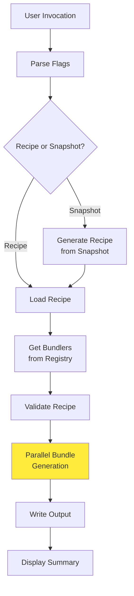

### Usage Examples

```bash
# Generate GPU Operator bundle from recipe
cnsctl bundle --recipe recipe.yaml --output ./bundles

# Generate from snapshot with workload intent
cnsctl bundle --snapshot system.yaml --intent training --output ./bundles

# Specify bundler types explicitly
cnsctl bundle --recipe recipe.yaml --bundler gpu-operator --output ./bundles
```

### Bundler Framework Architecture

#### Component Diagram

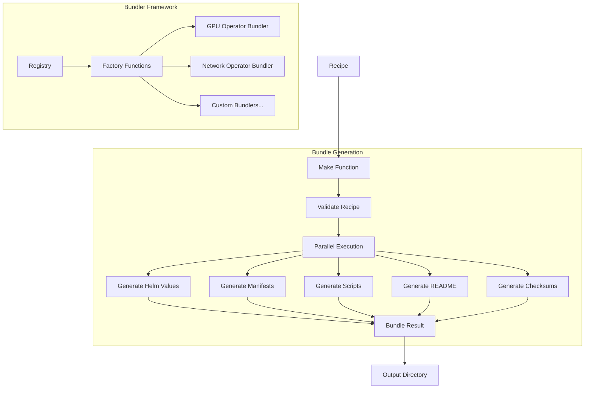

#### Data Flow

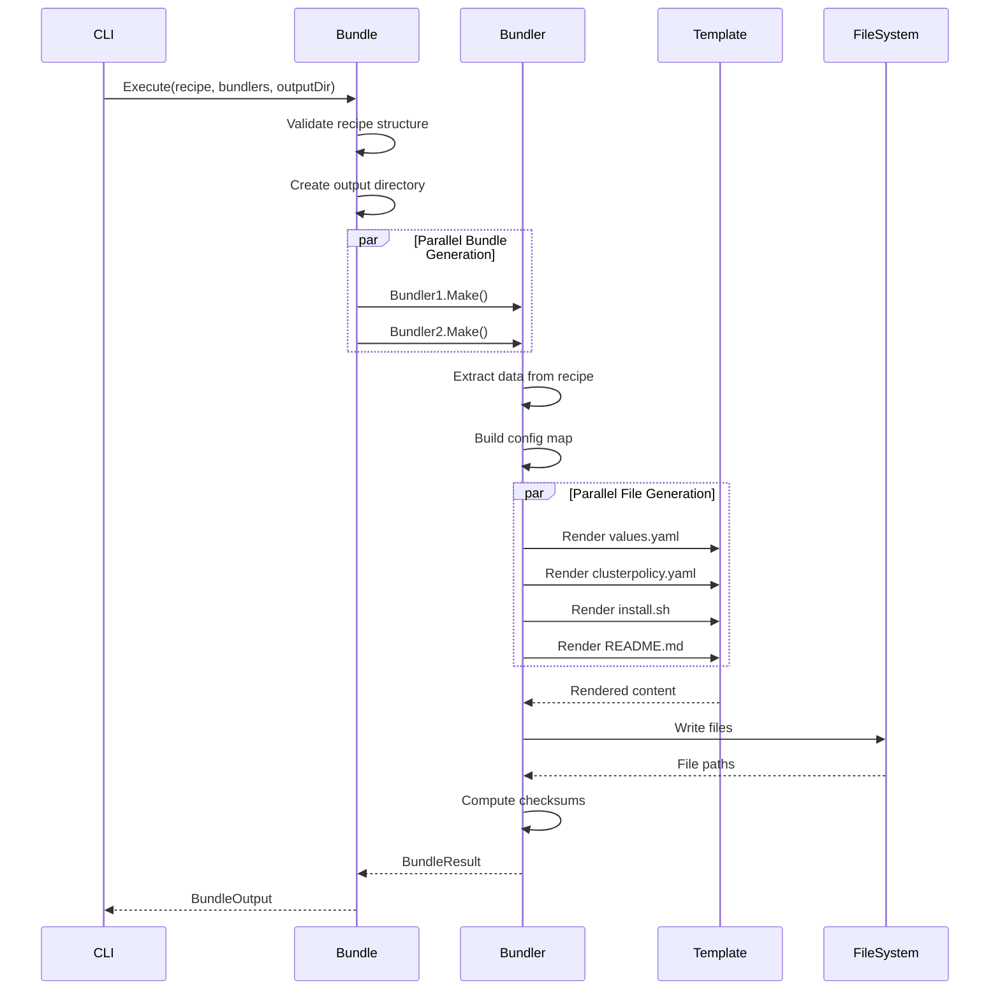

### Design Patterns

#### 1. Registry Pattern

**Problem**: How to support multiple bundler implementations without tight coupling?

**Solution**: Global registry with factory functions for bundler instantiation.

```go
// pkg/bundler/registry.go
var (
    registry = make(map[BundleType]BundlerFactory)
    mu       sync.RWMutex
)

type BundlerFactory func() Bundler

// Register adds a bundler factory to the registry
func Register(bundleType BundleType, factory BundlerFactory) {
    mu.Lock()
    defer mu.Unlock()
    registry[bundleType] = factory
}

// GetBundlers returns bundlers for specified types
func GetBundlers(types ...BundleType) []Bundler {
    mu.RLock()
    defer mu.RUnlock()
    
    var bundlers []Bundler
    for _, t := range types {
        if factory, ok := registry[t]; ok {
            bundlers = append(bundlers, factory())
        }
    }
    return bundlers
}
```

**Benefits**:
- ✅ Decoupled registration - bundlers self-register via init()
- ✅ Runtime extensibility - add bundlers without modifying core
- ✅ Declarative configuration - components defined in `registry.yaml`
- ✅ Thread-safe - RWMutex protects concurrent access

#### 2. Functional Options Pattern

**Problem**: How to configure bundlers without breaking API compatibility?

**Solution**: Variadic option functions for flexible configuration.

```go
// Configuration options
type Option func(*Bundler)

func WithNamespace(ns string) Option {
    return func(b *Bundler) {
        b.config.Namespace = ns
    }
}

func WithFailFast(failFast bool) Option {
    return func(b *Bundler) {
        b.config.FailFast = failFast
    }
}

// Constructor with options
func NewBundler(opts ...Option) *Bundler {
    b := &Bundler{
        config: DefaultBundlerConfig(),
    }
    for _, opt := range opts {
        opt(b)
    }
    return b
}
```

#### 3. Template-Based Generation

**Problem**: How to separate content structure from generation logic?

**Solution**: Embedded text templates with data-driven rendering.

```go
//go:embed templates/*.tmpl
var templatesFS embed.FS

func (b *Bundler) renderTemplate(name string, 
    data map[string]interface{}) (string, error) {
    
    tmpl, err := template.New(name).
        Funcs(templateFuncs()).
        ParseFS(templatesFS, "templates/"+name+".tmpl")
    if err != nil {
        return "", fmt.Errorf("failed to parse template: %w", err)
    }
    
    var buf bytes.Buffer
    if err := tmpl.Execute(&buf, data); err != nil {
        return "", fmt.Errorf("failed to execute template: %w", err)
    }
    
    return buf.String(), nil
}
```

### GPU Operator Bundler

The GPU Operator bundler generates a complete deployment bundle for NVIDIA GPU Operator, extracting configuration from recipe measurements.

#### Recipe Data Extraction

**K8s Measurements** (`measurement.TypeK8s`):

1. **Image Subtype** - Component versions:
   ```yaml
   - subtype: image
     data:
       gpu-operator: v25.3.3
       driver: 580.82.07
       container-toolkit: v1.17.8
       k8s-device-plugin: v0.17.4
       dcgm: 4.3.1-1
       dcgm-exporter: 4.3.1
   ```

2. **Config Subtype** - Boolean flags:
   ```yaml
   - subtype: config
     data:
       cdi: true
       mig: false
       rdma: true
       useOpenKernelModule: true
   ```

**GPU Measurements** (`measurement.TypeGPU`):

```yaml
- subtype: smi
  data:
    driver-version: 580.82.07
    cuda-version: "13.1"
```

#### Generated Bundle Structure

```
gpu-operator/
├── values.yaml                    # Helm chart configuration
├── manifests/
│   └── clusterpolicy.yaml        # ClusterPolicy custom resource
├── scripts/
│   ├── install.sh                # Installation automation
│   └── uninstall.sh              # Cleanup automation
├── README.md                      # Deployment instructions
└── checksums.txt                  # SHA256 verification
```

#### Template Files

**values.yaml.tmpl** - Helm chart values:
```yaml
# Generated: {{ .Timestamp }}
# GPU Operator Helm Values

operator:
  version: {{ .GPUOperatorVersion }}

driver:
  enabled: {{ .EnableDriver }}
  version: {{ .DriverVersion }}
  useOpenKernelModule: {{ .UseOpenKernelModule }}
  repository: {{ .DriverRegistry }}

toolkit:
  version: {{ .NvidiaContainerToolkitVersion }}

devicePlugin:
  version: {{ .DevicePluginVersion }}

dcgm:
  version: {{ .DCGMVersion }}

dcgmExporter:
  version: {{ .DCGMExporterVersion }}

mig:
  strategy: {{ .MIGStrategy }}

gds:
  enabled: {{ .EnableGDS }}
```

**install.sh.tmpl** - Installation script:
```bash
#!/bin/bash
# Generated: {{ .Timestamp }}
# GPU Operator Installation Script

set -euo pipefail

NAMESPACE="{{ .Namespace }}"
HELM_REPO="{{ .HelmRepository }}"
HELM_CHART="{{ .HelmChart }}"

echo "Adding Helm repository..."
helm repo add nvidia "$HELM_REPO"
helm repo update

echo "Installing GPU Operator..."
helm install gpu-operator nvidia/gpu-operator \
  --namespace "$NAMESPACE" \
  --create-namespace \
  --values values.yaml \
  --wait

echo "Applying ClusterPolicy..."
kubectl apply -f manifests/clusterpolicy.yaml

echo "Installation complete!"
```

### Observability

#### Metrics

Prometheus metrics exposed by bundler framework:

```promql
# Duration histogram
bundler_make_duration_seconds{bundler_type="gpu-operator"} 0.245

# Total operations counter
bundler_make_total{bundler_type="gpu-operator",result="success"} 42
bundler_make_total{bundler_type="gpu-operator",result="error"} 3

# Files generated gauge
bundler_files_generated_total{bundler_type="gpu-operator"} 6

# Bytes generated gauge
bundler_bytes_generated_total{bundler_type="gpu-operator"} 15360

# Validation failures counter
bundler_validation_failures_total{bundler_type="gpu-operator"} 2
```

#### Structured Logging

slog integration for structured log output:

```go
// Bundle generation start
slog.Debug("generating bundle",
    "bundler_type", bundlerType,
    "output_dir", outputDir,
)

// Bundle generation complete
slog.Debug("bundle generated successfully",
    "bundler_type", bundlerType,
    "files", len(result.Files),
    "bytes", result.TotalBytes,
    "duration", result.Duration,
)
```

### Adding New Components

Adding a new component requires **no Go code**. Components are configured declaratively:

#### Step-by-Step Guide

1. **Add to Component Registry** (`pkg/recipe/data/registry.yaml`):
   ```yaml
   components:
     - name: my-operator
       displayName: My Operator
       valueOverrideKeys:
         - myoperator
       helm:
         defaultRepository: https://charts.example.com
         defaultChart: example/my-operator
         defaultVersion: v1.0.0
       nodeScheduling:
         system:
           nodeSelectorPaths:
             - operator.nodeSelector
           tolerationPaths:
             - operator.tolerations
   ```

2. **Create Values File** (`pkg/recipe/data/components/my-operator/values.yaml`):
   ```yaml
   # My Operator Helm values
   operator:
     replicas: 1
     image:
       repository: example/my-operator
       tag: v1.0.0
   ```

3. **Add to Recipe Overlay** (`pkg/recipe/data/overlays/<overlay>.yaml`):
   ```yaml
   componentRefs:
     - name: my-operator
       type: Helm
       version: v1.0.0
       source: https://charts.example.com
       valuesFile: components/my-operator/values.yaml
   ```

4. **Test the Component**:
   ```bash
   # Generate recipe with new component
   cnsctl recipe --service eks --accelerator h100 -o recipe.yaml

   # Generate bundle
   cnsctl bundle -r recipe.yaml -o ./bundles

   # Verify output
   cat ./bundles/values.yaml
   ```

See [Bundler Development Guide](component.md) for detailed documentation.

### Best Practices

**Template Design**:
- ✅ Keep templates simple and focused
- ✅ Use descriptive variable names
- ✅ Add comments for complex logic
- ✅ Validate template rendering in tests
- ❌ Don't put business logic in templates

**Error Handling**:
- ✅ Use structured errors with context
- ✅ Wrap errors with meaningful messages
- ✅ Validate early (before starting generation)
- ✅ Clean up resources on error
- ❌ Don't swallow errors silently

**Testing**:
- ✅ Test with realistic recipe data
- ✅ Use table-driven tests for coverage
- ✅ Test error paths explicitly
- ✅ Verify generated file content
- ❌ Don't skip integration tests

**Performance**:
- ✅ Use parallel generation for multiple files
- ✅ Stream large files instead of buffering
- ✅ Reuse template instances when possible
- ✅ Profile bundle generation for bottlenecks
- ❌ Don't generate synchronously without reason

## Deployer Framework: GitOps Integration

The bundle command integrates with GitOps tools through the **Deployer Framework**, which generates deployment-specific artifacts alongside the standard bundle files.

### Overview

**Purpose**: Generate GitOps-ready deployment artifacts that integrate with popular continuous delivery tools.

**Supported Deployers**:
| Type | Description | Output |
|------|-------------|--------|
| `helm` | (Default) Helm umbrella chart with dependencies | `Chart.yaml`, `values.yaml` |
| `argocd` | ArgoCD Application manifests | `app-of-apps.yaml`, `<component>/application.yaml` |

**Key Feature: Deployment Order**

All deployers respect the `deploymentOrder` field from the recipe, ensuring components are installed in the correct sequence:

```yaml
# Recipe excerpt
deploymentOrder:
  - gpu-operator      # First
  - network-operator  # Second
  - nvsentinel        # Third
```

### Deployer Architecture

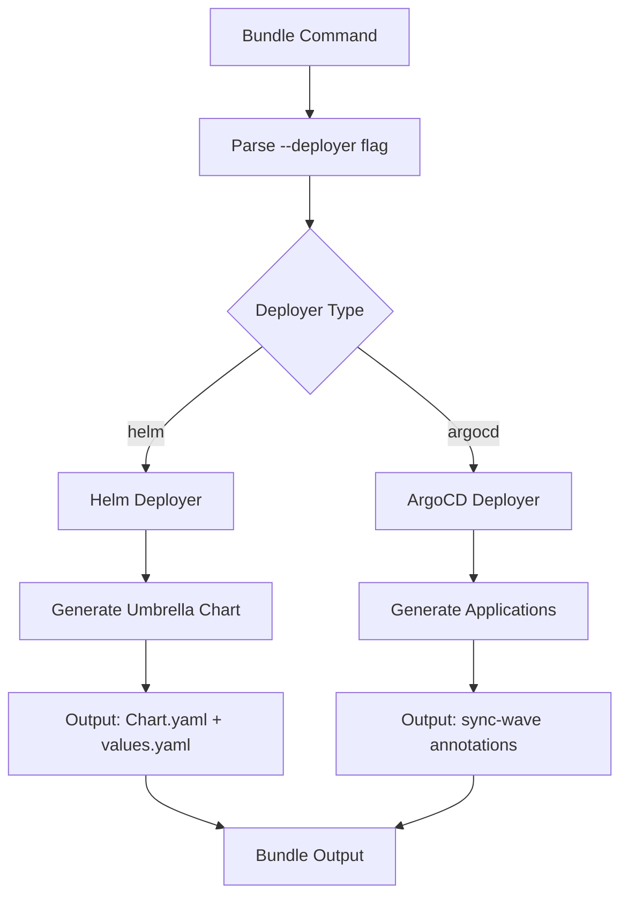

### ArgoCD Deployer

Generates ArgoCD Application manifests with proper sync ordering using multi-source Applications.

**Ordering Mechanism**: Uses `argocd.argoproj.io/sync-wave` annotation.

```yaml
# gpu-operator/argocd/application.yaml (sync-wave: 0 = first)
apiVersion: argoproj.io/v1alpha1
kind: Application
metadata:
  name: gpu-operator
  namespace: argocd
  annotations:
    argocd.argoproj.io/sync-wave: "0"
  finalizers:
    - resources-finalizer.argocd.argoproj.io
spec:
  project: default
  sources:
    # Helm chart from upstream
    - repoURL: https://helm.ngc.nvidia.com/nvidia
      chart: gpu-operator
      targetRevision: v25.3.3
      helm:
        valueFiles:
          - $values/gpu-operator/values.yaml
    # Values from GitOps repo
    - repoURL: <YOUR_GIT_REPO>
      targetRevision: main
      ref: values
    # Additional manifests (if present)
    - repoURL: <YOUR_GIT_REPO>
      targetRevision: main
      path: gpu-operator/manifests
  destination:
    server: https://kubernetes.default.svc
    namespace: gpu-operator
  syncPolicy:
    automated:
      prune: true
      selfHeal: true
    syncOptions:
      - CreateNamespace=true
      - ServerSideApply=true
```

**Output Structure**:
```
bundles/
├── app-of-apps.yaml               # Parent Application (bundle root)
├── recipe.yaml                    # Recipe used to generate bundle
├── gpu-operator/
│   ├── values.yaml
│   ├── manifests/
│   └── argocd/
│       └── application.yaml       # sync-wave: 0
├── network-operator/
│   ├── values.yaml
│   └── argocd/
│       └── application.yaml       # sync-wave: 1
├── nvsentinel/
│   ├── values.yaml
│   └── argocd/
│       └── application.yaml       # sync-wave: 2
└── README.md                      # ArgoCD deployment guide
```

### Helm Deployer (Default)

Generates a Helm umbrella chart with component dependencies.

**Ordering Mechanism**: Dependencies listed in `Chart.yaml` are deployed in order by Helm.

**Output Structure**:
```
bundles/
├── Chart.yaml       # Umbrella chart with dependencies
├── values.yaml      # Combined values for all components
├── README.md        # Deployment instructions
├── recipe.yaml      # Input recipe reference
└── checksums.txt    # SHA256 checksums
```

### Deployer Data Flow

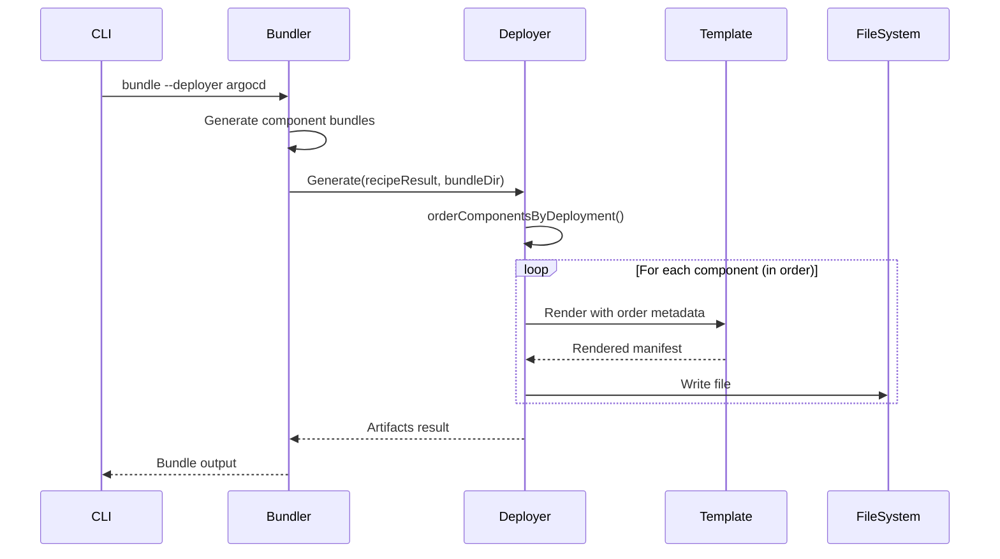

### Usage Examples

```bash
# Default: Helm umbrella chart
cnsctl bundle -r recipe.yaml -o ./bundles

# Generate bundle with ArgoCD Applications
cnsctl bundle -r recipe.yaml --deployer argocd -o ./bundles

# ArgoCD with Git repository URL (sets repoURL in app-of-apps.yaml)
cnsctl bundle -r recipe.yaml --deployer argocd \
  --repo https://github.com/my-org/my-gitops-repo.git \
  -o ./bundles

# Combine with specific bundlers
cnsctl bundle -r recipe.yaml \
  -b gpu-operator \
  -b network-operator \
  --deployer argocd \
  -o ./bundles
```

### Deployment Order Implementation

The `orderComponentsByDeployment` function ensures components are processed in the correct sequence:

```go
// orderComponentsByDeployment sorts components according to deploymentOrder.
// Components not in deploymentOrder are appended at the end in their original order.
func orderComponentsByDeployment(components []recipe.ComponentRef, 
    order []string) []recipe.ComponentRef {
    
    if len(order) == 0 {
        return components
    }
    
    orderMap := make(map[string]int)
    for i, name := range order {
        orderMap[name] = i
    }
    
    // Separate ordered and unordered components
    ordered := make([]recipe.ComponentRef, 0)
    unordered := make([]recipe.ComponentRef, 0)
    
    for _, c := range components {
        if _, exists := orderMap[c.Name]; exists {
            ordered = append(ordered, c)
        } else {
            unordered = append(unordered, c)
        }
    }
    
    // Sort ordered components by their position in deploymentOrder
    sort.SliceStable(ordered, func(i, j int) bool {
        return orderMap[ordered[i].Name] < orderMap[ordered[j].Name]
    })
    
    return append(ordered, unordered...)
}
```

### Testing Deployers

Each deployer has tests verifying deployment order correctness:

```go
func TestDeployer_Generate_DeploymentOrder(t *testing.T) {
    recipeResult := &recipe.RecipeResult{
        DeploymentOrder: []string{"gpu-operator", "network-operator"},
        ComponentRefs: []recipe.ComponentRef{
            {Name: "network-operator", Version: "v25.4.0"},
            {Name: "gpu-operator", Version: "v25.3.3"},
        },
    }
    
    d := NewDeployer()
    artifacts, err := d.Generate(ctx, recipeResult, tmpDir)
    require.NoError(t, err)
    
    // Verify ordering mechanism (sync-wave/dependsOn/README order)
    // ...
}
```

## References

### Official Documentation
- [urfave/cli Framework](https://cli.urfave.org/) - CLI framework used by cnsctl  
- [errgroup Patterns](https://pkg.go.dev/golang.org/x/sync/errgroup) - Concurrent error handling  
- [YAML v3 Library](https://pkg.go.dev/gopkg.in/yaml.v3) - YAML parsing and serialization  
- [Structured Logging (slog)](https://pkg.go.dev/log/slog) - Standard library logging  
- [Context Package](https://pkg.go.dev/context) - Cancellation and deadlines

### Kubernetes Integration
- [client-go Documentation](https://github.com/kubernetes/client-go) - Official K8s client  
- [Dynamic Client](https://pkg.go.dev/k8s.io/client-go/dynamic) - Unstructured resource access  
- [CronJob Best Practices](https://kubernetes.io/docs/concepts/workloads/controllers/cron-jobs/) - Scheduled job patterns  
- [RBAC Authorization](https://kubernetes.io/docs/reference/access-authn-authz/rbac/) - Permission model

### NVIDIA Tools
- [NVIDIA SMI](https://developer.nvidia.com/nvidia-system-management-interface) - GPU management  
- [NVML Library](https://developer.nvidia.com/nvml) - Programmatic GPU access  
- [CUDA Toolkit](https://developer.nvidia.com/cuda-toolkit) - GPU computing platform  
- [GPU Operator](https://docs.nvidia.com/datacenter/cloud-native/gpu-operator/) - K8s GPU automation

### Best Practices
- [Semantic Versioning](https://semver.org/) - Version comparison algorithm  
- [The Twelve-Factor App](https://12factor.net/) - Cloud-native application patterns  
- [Release Engineering Best Practices](https://sre.google/workbook/release-engineering/) - Google SRE  
- [Go Code Review Comments](https://github.com/golang/go/wiki/CodeReviewComments) - Idiomatic Go

### Security
- [OWASP Secure Coding Practices](https://owasp.org/www-project-secure-coding-practices-quick-reference-guide/)  
- [Kubernetes Pod Security Standards](https://kubernetes.io/docs/concepts/security/pod-security-standards/)  
- [NIST 800-190: Container Security](https://csrc.nist.gov/publications/detail/sp/800-190/final)  
- [CIS Benchmarks](https://www.cisecurity.org/cis-benchmarks) - Security configuration baselines
