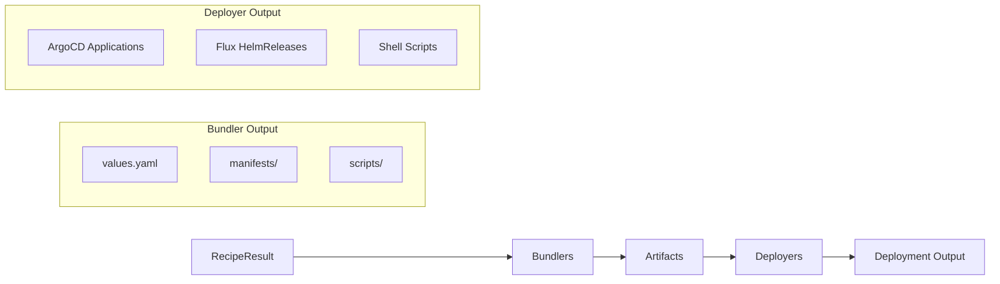

# Bundler Development Guide

Learn how to create new bundlers for Cloud Native Stack.

## Overview

Bundlers convert RecipeInput objects (either Recipe or RecipeResult) into deployment artifacts. Artifacts include Helm values files, Kubernetes manifests, and installation scripts.

**Architecture**: The bundler framework uses a **factory-based registration pattern** with the `registry.Bundler` interface. Bundlers receive a `*config.Config` during instantiation and implement `Make(ctx, input recipe.RecipeInput, dir) (*result.Result, error)`.

**Framework features:**

- **Factory registration**: Bundlers register factory functions via `registry.MustRegister()` in `init()`
- **RecipeInput interface**: Single `Make()` method handles both Recipe and RecipeResult via interface
- **BaseBundler**: Helper struct from `pkg/component/internal` providing common operations
- **Config injection**: Bundlers receive `*config.Config` with value overrides, node selectors, etc.
- **Parallel execution**: Multiple bundlers run concurrently via goroutines with errgroup context cancellation
- **Template system**: Bundlers embed templates individually using `go:embed` directive
- **Value overrides**: CLI `--set` flag allows runtime customization via `common.ApplyMapOverrides()`
- **Structured errors**: Uses `pkg/errors` for error codes and wrapping
- **E2E validation**: `tools/e2e` script tests complete workflow including bundle generation

**Implemented bundlers:**

- **GPU Operator**: Helm values, ClusterPolicy manifest, installation scripts
- **Network Operator**: Helm values, network configuration
- **Cert-Manager**: Helm values for certificate management
- **NVSentinel**: Helm values for NVSentinel deployment
- **Skyhook**: Helm values, node optimization scripts

## Quick Start

### Minimal Bundler Implementation

The bundler framework uses a **factory-based registration pattern**. Bundlers register a factory function that receives a `*config.Config` and returns a `Bundler` instance.

```go
// pkg/component/mybundler/bundler.go
package mybundler

import (
    "context"
    "log/slog"
    "path/filepath"
    "time"
    
    "github.com/NVIDIA/cloud-native-stack/pkg/bundler/config"
    "github.com/NVIDIA/cloud-native-stack/pkg/bundler/result"
    "github.com/NVIDIA/cloud-native-stack/pkg/bundler/types"
    common "github.com/NVIDIA/cloud-native-stack/pkg/component/internal"
    "github.com/NVIDIA/cloud-native-stack/pkg/errors"
    "github.com/NVIDIA/cloud-native-stack/pkg/recipe"
)

const (
    Name = "my-bundler"  // Use constant for component name
)

// Bundler generates deployment bundles from RecipeInput.
type Bundler struct {
    *common.BaseBundler  // Embed helper from internal package
}

// NewBundler creates a new bundler instance.
// Receives config from registry during instantiation.
func NewBundler(conf *config.Config) *Bundler {
    return &Bundler{
        BaseBundler: common.NewBaseBundler(conf, types.BundleTypeMyBundler),
    }
}

// Make generates the bundle based on the provided recipe.
// Implements registry.Bundler interface.
func (b *Bundler) Make(ctx context.Context, input recipe.RecipeInput, dir string) (*result.Result, error) {
    start := time.Now()
    
    slog.Debug("generating bundle",
        "output_dir", dir,
        "component", Name,
    )
    
    // 1. Get component reference from RecipeInput
    componentRef := input.GetComponentRef(Name)
    if componentRef == nil {
        return nil, errors.New(errors.ErrCodeInvalidRequest,
            Name+" component not found in recipe")
    }
    
    // 2. Get values from component reference
    values, err := input.GetValuesForComponent(Name)
    if err != nil {
        return nil, errors.Wrap(errors.ErrCodeInternal,
            "failed to get values for "+Name, err)
    }
    
    // 3. Apply user value overrides from --set flags
    if overrides := b.getValueOverrides(); len(overrides) > 0 {
        if applyErr := common.ApplyMapOverrides(values, overrides); applyErr != nil {
            slog.Warn("failed to apply some value overrides", "error", applyErr)
        }
    }
    
    // 4. Apply node selectors and tolerations if configured
    if nodeSelector := b.Config.SystemNodeSelector(); len(nodeSelector) > 0 {
        common.ApplyNodeSelectorOverrides(values, nodeSelector,
            "operator.nodeSelector",
        )
    }
    
    // 5. Create bundle directory structure
    dirs, err := b.CreateBundleDir(dir, Name)
    if err != nil {
        return b.Result, errors.Wrap(errors.ErrCodeInternal,
            "failed to create bundle directory", err)
    }
    
    // 6. Build config map for metadata
    configMap := b.BuildConfigMapFromInput(input)
    configMap["namespace"] = Name
    configMap["helm_repository"] = componentRef.Source
    configMap["helm_chart_version"] = componentRef.Version
    
    // 7. Serialize values to YAML with header
    header := common.ValuesHeader{
        ComponentName:  "My Bundler",
        Timestamp:      time.Now().Format(time.RFC3339),
        BundlerVersion: configMap["bundler_version"],
        RecipeVersion:  configMap["recipe_version"],
    }
    valuesYAML, err := common.MarshalYAMLWithHeader(values, header)
    if err != nil {
        return b.Result, errors.Wrap(errors.ErrCodeInternal,
            "failed to serialize values to YAML", err)
    }
    
    // 8. Write values.yaml
    valuesPath := filepath.Join(dirs.Root, "values.yaml")
    if err := b.WriteFile(valuesPath, valuesYAML, 0644); err != nil {
        return b.Result, errors.Wrap(errors.ErrCodeInternal,
            "failed to write values file", err)
    }
    
    // 9. Generate ScriptData for install scripts
    scriptData := GenerateScriptDataFromConfig(configMap)
    
    // 10. Generate README
    if b.Config.IncludeReadme() {
        readmeData := map[string]interface{}{
            "Values": values,
            "Script": scriptData,
        }
        readmePath := filepath.Join(dirs.Root, "README.md")
        if err := b.GenerateFileFromTemplate(ctx, GetTemplate, "README.md",
            readmePath, readmeData, 0644); err != nil {
            return b.Result, err
        }
    }
    
    // 11. Generate scripts
    if b.Config.IncludeScripts() {
        installPath := filepath.Join(dirs.Root, "scripts", "install.sh")
        if err := b.GenerateFileFromTemplate(ctx, GetTemplate, "install.sh",
            installPath, scriptData, 0755); err != nil {
            return b.Result, err
        }
    }
    
    // 12. Generate checksums
    if b.Config.IncludeChecksums() {
        if err := b.GenerateChecksums(ctx, dirs.Root); err != nil {
            return b.Result, errors.Wrap(errors.ErrCodeInternal,
                "failed to generate checksums", err)
        }
    }
    
    // 13. Finalize bundle generation
    b.Finalize(start)
    
    return b.Result, nil
}

// getValueOverrides retrieves value overrides for this bundler from config.
func (b *Bundler) getValueOverrides() map[string]string {
    allOverrides := b.Config.ValueOverrides()
    if allOverrides == nil {
        return nil
    }
    if overrides, ok := allOverrides["mybundler"]; ok {
        return overrides
    }
    return nil
}
```

### Registration (register.go)

Bundlers register themselves via `init()` functions using a factory pattern:

```go
// pkg/component/mybundler/register.go
package mybundler

import (
    "github.com/NVIDIA/cloud-native-stack/pkg/bundler/config"
    "github.com/NVIDIA/cloud-native-stack/pkg/bundler/registry"
    "github.com/NVIDIA/cloud-native-stack/pkg/bundler/types"
)

func init() {
    // Register bundler factory in global registry
    registry.MustRegister(types.BundleTypeMyBundler, func(cfg *config.Config) registry.Bundler {
        return NewBundler(cfg)
    })
}
```

### Script Metadata Generation (scripts.go)

Create a separate file for metadata generation:

```go
// pkg/component/mybundler/scripts.go
package mybundler

import (
    "time"
    
    common "github.com/NVIDIA/cloud-native-stack/pkg/component/internal"
)

// ScriptData represents metadata for generating installation scripts.
// This contains information not present in the Helm values map.
type ScriptData struct {
    Timestamp        string
    Namespace        string
    HelmRepository   string
    HelmChart        string
    HelmChartVersion string
    Version          string
    RecipeVersion    string
}

// GenerateScriptDataFromConfig creates script data from config map.
func GenerateScriptDataFromConfig(config map[string]string) *ScriptData {
    return &ScriptData{
        Timestamp:        time.Now().UTC().Format(time.RFC3339),
        Namespace:        common.GetConfigValue(config, "namespace", "my-bundler"),
        HelmRepository:   common.GetConfigValue(config, "helm_repository", "https://helm.ngc.nvidia.com/nvidia"),
        HelmChart:        "nvidia/my-bundler",
        HelmChartVersion: common.GetConfigValue(config, "helm_chart_version", ""),
        Version:          common.GetBundlerVersion(config),
        RecipeVersion:    common.GetRecipeBundlerVersion(config),
    }
}
```

### Templates (templates.go + templates/)

Templates are embedded using `go:embed` and accessed via a `GetTemplate` function:

```go
// pkg/component/mybundler/templates.go
package mybundler

import (
    _ "embed"
)

//go:embed templates/install.sh.tmpl
var installScriptTemplate string

//go:embed templates/uninstall.sh.tmpl
var uninstallScriptTemplate string

//go:embed templates/README.md.tmpl
var readmeTemplate string

// GetTemplate returns the named template content.
func GetTemplate(name string) (string, bool) {
    templates := map[string]string{
        "install.sh":   installScriptTemplate,
        "uninstall.sh": uninstallScriptTemplate,
        "README.md":    readmeTemplate,
    }
    tmpl, ok := templates[name]
    return tmpl, ok
}
```

**Template files** in `templates/` directory:

```bash
# templates/install.sh.tmpl - Receives ScriptData
#!/bin/bash
# Generated: {{ .Timestamp }}
# Bundler Version: {{ .Version }}

set -euo pipefail

NAMESPACE="{{ .Namespace }}"
HELM_CHART="{{ .HelmChart }}"
CHART_VERSION="{{ .HelmChartVersion }}"
REPO="{{ .HelmRepository }}"

helm repo add nvidia "$REPO" --force-update
helm install my-bundler "$HELM_CHART" \
  --version "$CHART_VERSION" \
  --namespace "$NAMESPACE" \
  --create-namespace \
  --values ../values.yaml
```

```markdown
# templates/README.md.tmpl - Receives combined map with Values + Script
# My Bundler Deployment

Generated: {{ .Script.Timestamp }}
Bundler Version: {{ .Script.Version }}
Recipe Version: {{ .Script.RecipeVersion }}

## Prerequisites

- Kubernetes cluster
- Helm 3.x
- kubectl configured

## Installation

\```bash
cd scripts
chmod +x install.sh
./install.sh
\```

## Verification

\```bash
kubectl get pods -n {{ .Script.Namespace }}
\```
```

**Note:** Values are written directly to `values.yaml` using `common.MarshalYAMLWithHeader()`, not via templates. Templates are used for scripts and documentation.

## Step-by-Step Implementation

### Step 1: Create Package Structure

```bash
pkg/component/mybundler/
├── bundler.go          # Main bundler logic with Make() method
├── bundler_test.go     # Tests using RecipeResult
├── doc.go              # Package documentation
├── register.go         # Factory registration via init()
├── scripts.go          # ScriptData generation
├── templates.go        # Template embedding and GetTemplate()
└── templates/
    ├── install.sh.tmpl
    ├── uninstall.sh.tmpl
    └── README.md.tmpl
```

### Step 2: Define Bundle Type

Add your bundle type to `pkg/bundler/types/types.go`:

```go
const (
    BundleTypeMyBundler BundleType = "my-bundler"
)
```

### Step 3: Implement Make Function

The `Make()` function implements `registry.Bundler` interface:

```go
// Bundler interface (from pkg/bundler/registry)
type Bundler interface {
    Make(ctx context.Context, input recipe.RecipeInput, dir string) (*result.Result, error)
}
```

```go
func (b *Bundler) Make(ctx context.Context, input recipe.RecipeInput, dir string) (*result.Result, error) {
    // Implementation - see Quick Start for full example
}
```

**Key signature differences from documentation examples:**
- Input is `recipe.RecipeInput` interface (not `*result.RecipeResult`)
- Returns `*result.Result` (from `pkg/bundler/result`)
- Uses structured errors from `pkg/errors`

### Step 4: Get Component Values

Use `GetComponentRef()` and `GetValuesForComponent()`:

```go
// Get component reference (contains Name, Version, Type, Source)
componentRef := input.GetComponentRef(Name)
if componentRef == nil {
    return nil, errors.New(errors.ErrCodeInvalidRequest,
        Name+" component not found in recipe")
}

// Get values map - returns (map[string]interface{}, error)
values, err := input.GetValuesForComponent(Name)
if err != nil {
    return nil, errors.Wrap(errors.ErrCodeInternal,
        "failed to get values for "+Name, err)
}
```

**Key points**:
- Use `Name` constant (not hardcoded string) for consistency
- `GetValuesForComponent()` returns an error (must be handled)
- Apply value overrides via `common.ApplyMapOverrides()` after getting values
- Use structured errors from `pkg/errors`

### Step 5: Build Config Map and ScriptData

```go
// Build config map for metadata extraction
configMap := b.BuildConfigMapFromInput(input)
configMap["namespace"] = Name
configMap["helm_repository"] = componentRef.Source
configMap["helm_chart_version"] = componentRef.Version

// Generate ScriptData (metadata for scripts, not in values.yaml)
scriptData := GenerateScriptDataFromConfig(configMap)
```

### Step 6: Write Values and Generate Files

```go
// Write values.yaml directly (not via template)
header := common.ValuesHeader{
    ComponentName:  "My Bundler",
    Timestamp:      time.Now().Format(time.RFC3339),
    BundlerVersion: configMap["bundler_version"],
    RecipeVersion:  configMap["recipe_version"],
}
valuesYAML, err := common.MarshalYAMLWithHeader(values, header)
if err != nil {
    return b.Result, errors.Wrap(errors.ErrCodeInternal,
        "failed to serialize values to YAML", err)
}
if err := b.WriteFile(valuesPath, valuesYAML, 0644); err != nil {
    return b.Result, err
}

// For scripts - pass ScriptData to template
if err := b.GenerateFileFromTemplate(ctx, GetTemplate, "install.sh",
    installPath, scriptData, 0755); err != nil {
    return b.Result, err
}

// For README - pass combined map
readmeData := map[string]interface{}{
    "Values": values,
    "Script": scriptData,
}
if err := b.GenerateFileFromTemplate(ctx, GetTemplate, "README.md",
    readmePath, readmeData, 0644); err != nil {
    return b.Result, err
}
```

## Testing with RecipeResult

### Test Structure

Tests use `*recipe.RecipeResult` directly with table-driven tests:

```go
// pkg/component/mybundler/bundler_test.go
package mybundler

import (
    "context"
    "os"
    "path/filepath"
    "testing"
    
    "github.com/NVIDIA/cloud-native-stack/pkg/bundler/config"
    "github.com/NVIDIA/cloud-native-stack/pkg/recipe"
)

func TestNewBundler(t *testing.T) {
    tests := []struct {
        name string
        cfg  *config.Config
    }{
        {name: "with nil config", cfg: nil},
        {name: "with valid config", cfg: config.NewConfig()},
    }
    
    for _, tt := range tests {
        t.Run(tt.name, func(t *testing.T) {
            b := NewBundler(tt.cfg)
            if b == nil {
                t.Fatal("NewBundler() returned nil")
            }
            if b.Config == nil {
                t.Error("Bundler config should not be nil")
            }
        })
    }
}

func TestBundler_Make(t *testing.T) {
    tests := []struct {
        name       string
        recipe     *recipe.RecipeResult
        wantErr    bool
        verifyFunc func(t *testing.T, outputDir string)
    }{
        {
            name:    "valid recipe with component",
            recipe:  createTestRecipeResult(),
            wantErr: false,
            verifyFunc: func(t *testing.T, outputDir string) {
                bundleDir := filepath.Join(outputDir, Name)
                
                // Verify values.yaml exists
                valuesPath := filepath.Join(bundleDir, "values.yaml")
                if _, err := os.Stat(valuesPath); os.IsNotExist(err) {
                    t.Error("Expected values.yaml not found")
                }
                
                // Verify install script
                installPath := filepath.Join(bundleDir, "scripts/install.sh")
                if _, err := os.Stat(installPath); os.IsNotExist(err) {
                    t.Error("Expected scripts/install.sh not found")
                }
                
                // Verify README
                readmePath := filepath.Join(bundleDir, "README.md")
                if _, err := os.Stat(readmePath); os.IsNotExist(err) {
                    t.Error("Expected README.md not found")
                }
                
                // Verify checksums.txt
                checksumPath := filepath.Join(bundleDir, "checksums.txt")
                if _, err := os.Stat(checksumPath); os.IsNotExist(err) {
                    t.Error("Expected checksums.txt not found")
                }
            },
        },
        {
            name:    "missing component reference",
            recipe:  createRecipeResultWithoutComponent(),
            wantErr: true,
        },
    }
    
    for _, tt := range tests {
        t.Run(tt.name, func(t *testing.T) {
            tmpDir := t.TempDir()
            b := NewBundler(nil)
            ctx := context.Background()
            
            result, err := b.Make(ctx, tt.recipe, tmpDir)
            
            if (err != nil) != tt.wantErr {
                t.Errorf("Make() error = %v, wantErr %v", err, tt.wantErr)
                return
            }
            
            if !tt.wantErr {
                if result == nil {
                    t.Error("Make() returned nil result")
                    return
                }
                if len(result.Files) == 0 {
                    t.Error("Make() returned no files")
                }
                
                if tt.verifyFunc != nil {
                    tt.verifyFunc(t, tmpDir)
                }
            }
        })
    }
}

// Helper function to create a test RecipeResult
func createTestRecipeResult() *recipe.RecipeResult {
    return &recipe.RecipeResult{
        Kind:       "recipeResult",
        APIVersion: recipe.FullAPIVersion,
        ComponentRefs: []recipe.ComponentRef{
            {
                Name:    Name,
                Type:    "Helm",
                Source:  "https://helm.ngc.nvidia.com/nvidia",
                Version: "v1.0.0",
                Overrides: map[string]interface{}{
                    "operator": map[string]interface{}{
                        "version": "v1.0.0",
                    },
                },
            },
        },
    }
}

// Helper function to create a RecipeResult without the target component
func createRecipeResultWithoutComponent() *recipe.RecipeResult {
    return &recipe.RecipeResult{
        Kind:       "recipeResult",
        APIVersion: recipe.FullAPIVersion,
        ComponentRefs: []recipe.ComponentRef{
            {
                Name:    "other-component",
                Type:    "Helm",
                Version: "v1.0.0",
            },
        },
    }
}
```

### Template Tests

Verify templates are accessible:

```go
func TestGetTemplate(t *testing.T) {
    expectedTemplates := []string{
        "install.sh",
        "uninstall.sh",
        "README.md",
    }
    
    for _, name := range expectedTemplates {
        t.Run(name, func(t *testing.T) {
            tmpl, ok := GetTemplate(name)
            if !ok {
                t.Errorf("GetTemplate(%s) not found", name)
            }
            if tmpl == "" {
                t.Errorf("GetTemplate(%s) returned empty template", name)
            }
        })
    }
    
    // Test non-existent template
    t.Run("nonexistent", func(t *testing.T) {
        _, ok := GetTemplate("nonexistent")
        if ok {
            t.Error("GetTemplate() should return false for non-existent template")
        }
    })
}
```

## Best Practices

### Implementation

- ✅ Use `Name` constant instead of hardcoded component names
- ✅ Implement `registry.Bundler` interface with correct signature
- ✅ Get values via `input.GetValuesForComponent(Name)` (returns error)
- ✅ Use `common.MarshalYAMLWithHeader()` for values.yaml (not templates)
- ✅ Use `ScriptData` for script metadata (namespace, version, timestamps)
- ✅ Combine values + ScriptData for README templates
- ✅ Use `go:embed` for template portability
- ✅ Use structured errors from `pkg/errors`
- ✅ Apply value overrides via `common.ApplyMapOverrides()`
- ✅ Apply node selectors via `common.ApplyNodeSelectorOverrides()`
- ✅ Call `b.Finalize(start)` at the end of successful generation
- ✅ Check context cancellation for long operations

### Testing

- ✅ Use table-driven tests with `*recipe.RecipeResult`
- ✅ Test with `t.TempDir()` for isolation
- ✅ Test both valid and missing component reference cases
- ✅ Verify file existence with `os.Stat()`
- ✅ Verify file content with `os.ReadFile()` + `strings.Contains()`
- ✅ Test `GetTemplate()` returns expected templates
- ✅ Test `NewBundler()` with nil and valid configs

### Templates

- ✅ Use `GetTemplate(name)` function pattern (returns `(string, bool)`)
- ✅ For scripts, pass `ScriptData` struct to templates
- ✅ For README, pass combined map: `{"Values": values, "Script": scriptData}`
- ✅ Access ScriptData fields directly: `{{ .Timestamp }}`, `{{ .Namespace }}`
- ✅ Access values in README: `{{ index .Values "key" }}`
- ✅ Handle missing values gracefully with `{{- if }}`
- ✅ Validate template rendering in tests

### Documentation

- ✅ Add package doc.go with overview
- ✅ Document exported types and functions
- ✅ Include examples in README.md template
- ✅ Explain prerequisites and deployment steps

## Common Patterns

### Getting Component Values

```go
// Always use Name constant
componentRef := input.GetComponentRef(Name)
if componentRef == nil {
    return nil, errors.New(errors.ErrCodeInvalidRequest,
        Name+" component not found in recipe")
}

// Get values - note: returns (map, error)
values, err := input.GetValuesForComponent(Name)
if err != nil {
    return nil, errors.Wrap(errors.ErrCodeInternal,
        "failed to get values for "+Name, err)
}

// Apply overrides from --set flags
if overrides := b.getValueOverrides(); len(overrides) > 0 {
    if applyErr := common.ApplyMapOverrides(values, overrides); applyErr != nil {
        slog.Warn("failed to apply some value overrides", "error", applyErr)
    }
}
```

### Writing Values.yaml

Values are written directly to YAML with a header comment (not via templates):

```go
header := common.ValuesHeader{
    ComponentName:  "GPU Operator",
    Timestamp:      time.Now().Format(time.RFC3339),
    BundlerVersion: configMap["bundler_version"],
    RecipeVersion:  configMap["recipe_version"],
}
valuesYAML, err := common.MarshalYAMLWithHeader(values, header)
if err != nil {
    return b.Result, errors.Wrap(errors.ErrCodeInternal,
        "failed to serialize values to YAML", err)
}

valuesPath := filepath.Join(dirs.Root, "values.yaml")
if err := b.WriteFile(valuesPath, valuesYAML, 0644); err != nil {
    return b.Result, errors.Wrap(errors.ErrCodeInternal,
        "failed to write values file", err)
}
```

### Accessing Values in Templates

```bash
# install.sh receives ScriptData struct
NAMESPACE="{{ .Namespace }}"
HELM_CHART="{{ .HelmChart }}"
CHART_VERSION="{{ .HelmChartVersion }}"
REPO="{{ .HelmRepository }}"
```

```markdown
# README.md receives combined map: {"Values": ..., "Script": ...}
Generated: {{ .Script.Timestamp }}
Version: {{ .Script.Version }}
Recipe: {{ .Script.RecipeVersion }}
```

### Error Handling

```go
// Use structured errors from pkg/errors
if componentRef == nil {
    return nil, errors.New(errors.ErrCodeInvalidRequest,
        Name+" component not found in recipe")
}

// Wrap errors with context
if err != nil {
    return b.Result, errors.Wrap(errors.ErrCodeInternal,
        "failed to create bundle directory", err)
}

// Return b.Result on errors to preserve partial results
if err := b.WriteFile(path, content, 0644); err != nil {
    return b.Result, errors.Wrap(errors.ErrCodeInternal,
        "failed to write file", err)
}
```

### Node Selector and Toleration Handling

The bundle command supports `--system-node-selector`, `--system-node-toleration`, `--accelerated-node-selector`, and `--accelerated-node-toleration` flags. Bundlers receive these as pre-applied overrides in the values map.

**How it works**:
1. CLI parses node selector/toleration flags
2. Values are applied to bundler-specific paths via `ApplyNodeSelectorOverrides()`
3. Bundler receives values map with selectors/tolerations already set
4. Templates render the values normally

**Bundler-specific paths** (defined in each bundler):

**GPU Operator** (`pkg/component/gpuoperator/bundler.go`):
- System node selector: `operator.nodeSelector`
- System toleration: `operator.tolerations`
- Accelerated node selector: `daemonsets.nodeSelector`
- Accelerated toleration: `daemonsets.tolerations`

**Network Operator** (`pkg/component/networkoperator/bundler.go`):
- System node selector: `operator.nodeSelector`
- Accelerated node selector: `daemonsets.nodeSelector`

**Cert-Manager** (`pkg/component/certmanager/bundler.go`):
- System node selector: `controller.nodeSelector`
- System toleration: `controller.tolerations`

**Implementing in new bundlers**:

Node selectors and tolerations are applied in the `Make()` function, not via registration:

```go
func (b *Bundler) Make(ctx context.Context, input recipe.RecipeInput, dir string) (*result.Result, error) {
    // ... get componentRef and values ...
    
    // Apply system node selector (for operator control plane components)
    if nodeSelector := b.Config.SystemNodeSelector(); len(nodeSelector) > 0 {
        common.ApplyNodeSelectorOverrides(values, nodeSelector,
            "operator.nodeSelector",
            "node-feature-discovery.gc.nodeSelector",
            "node-feature-discovery.master.nodeSelector",
        )
    }
    
    // Apply system node tolerations
    if tolerations := b.Config.SystemNodeTolerations(); len(tolerations) > 0 {
        common.ApplyTolerationsOverrides(values, tolerations,
            "operator.tolerations",
            "node-feature-discovery.gc.tolerations",
        )
    }
    
    // Apply accelerated node selector (for GPU node daemonsets)
    if nodeSelector := b.Config.AcceleratedNodeSelector(); len(nodeSelector) > 0 {
        common.ApplyNodeSelectorOverrides(values, nodeSelector,
            "daemonsets.nodeSelector",
            "node-feature-discovery.worker.nodeSelector",
        )
    }
    
    // Apply accelerated node tolerations
    if tolerations := b.Config.AcceleratedNodeTolerations(); len(tolerations) > 0 {
        common.ApplyTolerationsOverrides(values, tolerations,
            "daemonsets.tolerations",
            "node-feature-discovery.worker.tolerations",
        )
    }
    
    // ... continue with bundle generation ...
}
```

**Note:** Values are written to `values.yaml` directly after overrides are applied. The values map already contains the merged node selectors and tolerations - no special template handling needed.

## Migration from Old Architecture

### What Changed

**Before (dual-path)**:
- Supported both Recipe and RecipeResult inputs
- Had `makeFromRecipe()` and `makeFromRecipeResult()` methods
- Used measurement extraction (ExtractK8sImageSubtype, buildConfigMap)
- Generated HelmValues structs from measurements
- Had separate helm.go, manifests.go files in some components
- Used `bundler.MustRegister(type, instance)` pattern
- `NewBundler()` took no arguments

**After (factory-based registration)**:
- Single `Make()` method implementing `registry.Bundler` interface
- Factory registration: `registry.MustRegister(type, func(cfg) Bundler)`
- `NewBundler(cfg *config.Config)` receives configuration
- Get values via `GetComponentRef()` and `GetValuesForComponent()` (returns error)
- Uses structured errors from `pkg/errors`
- Separate `register.go` file for init() registration
- Values written directly to YAML with `common.MarshalYAMLWithHeader()`

### Code Differences

**Old Pattern**:
```go
func init() {
    bundler.MustRegister(bundlerType, NewBundler())
}

func NewBundler() *Bundler {
    return &Bundler{
        BaseBundler: bundler.NewBaseBundler(bundlerType, templatesFS),
    }
}

func (b *Bundler) Make(ctx context.Context, input interface{}, outputDir string) (*bundler.Result, error) {
    switch v := input.(type) {
    case *recipe.Recipe:
        return b.makeFromRecipe(ctx, v, outputDir)
    case *result.RecipeResult:
        return b.makeFromRecipeResult(ctx, v, outputDir)
    }
}
```

**New Pattern**:
```go
// register.go
func init() {
    registry.MustRegister(types.BundleTypeMyComponent, func(cfg *config.Config) registry.Bundler {
        return NewBundler(cfg)
    })
}

// bundler.go
func NewBundler(conf *config.Config) *Bundler {
    return &Bundler{
        BaseBundler: common.NewBaseBundler(conf, types.BundleTypeMyComponent),
    }
}

func (b *Bundler) Make(ctx context.Context, input recipe.RecipeInput, dir string) (*result.Result, error) {
    componentRef := input.GetComponentRef(Name)
    values, err := input.GetValuesForComponent(Name)
    if err != nil {
        return nil, errors.Wrap(errors.ErrCodeInternal, "failed to get values", err)
    }
    // Build configMap, generate ScriptData, write files...
}
```

## Real-World Example: GPU Operator

See `pkg/component/gpuoperator/` for a complete implementation:

**Key files**:
- `bundler.go` (~280 lines) - Main bundler logic with `Make()` method
- `register.go` (~15 lines) - Factory registration via `init()`
- `scripts.go` (~40 lines) - ScriptData generation from config map
- `templates.go` (~40 lines) - Template embedding with `GetTemplate()`
- `bundler_test.go` (~260 lines) - Table-driven tests with `*recipe.RecipeResult`
- `doc.go` - Package documentation
- `templates/` - Template files (clusterpolicy, install.sh, uninstall.sh, README.md, etc.)

**Structure**:
- `Make()` implements `registry.Bundler` interface
- Uses `Name` constant (`"gpu-operator"`) throughout
- Factory registration via `registry.MustRegister()` in `init()`
- Gets values via `input.GetValuesForComponent(Name)` (returns error)
- Applies value overrides via `common.ApplyMapOverrides()`
- Applies node selectors/tolerations via `common.ApplyNodeSelectorOverrides()`
- Writes `values.yaml` using `common.MarshalYAMLWithHeader()`
- Generates scripts and README via `b.GenerateFileFromTemplate()`
- Generates ClusterPolicy manifest
- Conditionally generates DCGM Exporter ConfigMap and Kernel Module Params
- Uses structured errors from `pkg/errors`
- Calls `b.Finalize(start)` to mark completion and record metrics

**Generated bundle structure**:
```
gpu-operator/
├── values.yaml              # Helm values (written directly, not via template)
├── manifests/
│   ├── clusterpolicy.yaml   # ClusterPolicy CRD
│   ├── dcgm-exporter.yaml   # Optional: DCGM metrics configuration
│   └── kernel-module-params.yaml  # Optional: GB200 kernel params
├── scripts/
│   ├── install.sh           # Installation script
│   └── uninstall.sh         # Cleanup script
├── README.md                # Deployment documentation
└── checksums.txt            # SHA256 checksums for verification
```

## Deployer Integration

After bundlers generate deployment artifacts, deployers transform them into deployment-specific formats. The deployer framework is separate from bundlers but works with their output.

### How Bundlers and Deployers Work Together



### Deployment Order

Deployers respect the `deploymentOrder` field from the recipe to ensure components are deployed in the correct sequence:

| Deployer | Ordering Mechanism |
|----------|-------------------|
| `script` | Components listed in order in README |
| `argocd` | `sync-wave` annotations (0, 1, 2...) |
| `flux` | `dependsOn` fields creating dependency chain |

**Example Recipe with Deployment Order**:
```yaml
componentRefs:
  - name: cert-manager
    version: v1.17.2
  - name: gpu-operator
    version: v25.3.3
  - name: network-operator
    version: v25.4.0
deploymentOrder:
  - cert-manager
  - gpu-operator
  - network-operator
```

### Bundler Output for Deployers

When the `--deployer` flag is set, bundlers generate standard artifacts that deployers then transform:

**For ArgoCD** (`--deployer argocd`):
- Bundler generates `values.yaml` and `manifests/`
- Deployer creates `<component>/argocd/application.yaml` with sync-wave annotations
- Deployer creates `app-of-apps.yaml` at bundle root
- Applications use multi-source to reference values.yaml and manifests from GitOps repo

**For Flux** (`--deployer flux`):
- Bundler generates `values.yaml` and `manifests/`
- Deployer creates `flux/helmrelease.yaml` with dependsOn chains

**For Script** (`--deployer script`, default):
- Bundler generates `values.yaml`, `manifests/`, and `scripts/`
- Deployer creates README with deployment instructions in order

### Using Deployers with Bundlers

The deployer is specified at bundle generation time:

```bash
# Generate bundles with ArgoCD deployer
cnsctl bundle -r recipe.yaml -o ./bundles --deployer argocd

# Generate bundles with Flux deployer
cnsctl bundle -r recipe.yaml -o ./bundles --deployer flux

# Generate bundles with Script deployer (default)
cnsctl bundle -r recipe.yaml -o ./bundles --deployer script
```

See [CLI Architecture](cli.md#deployer-framework-gitops-integration) for detailed deployer documentation.

## See Also

- [Architecture Overview](README.md) - Complete bundler framework architecture
- [CLI Architecture](cli.md) - Deployer framework and GitOps integration
- [CLI Reference](../user-guide/cli-reference.md) - Bundle generation commands
- [API Reference](../integration/api-reference.md) - Programmatic access (recipe generation only)
- GPU Operator implementation (`pkg/component/gpuoperator/`) - Reference example
