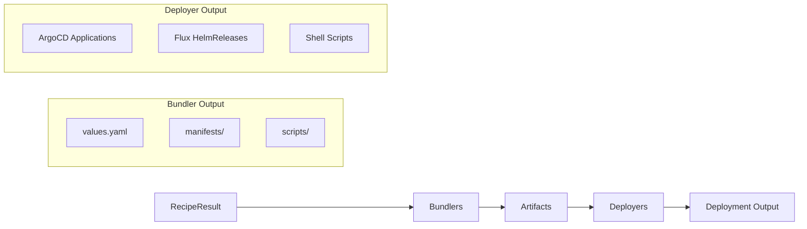

# Bundler Development Guide

Learn how to create new bundlers for Cloud Native Stack.

## Overview

Bundlers convert RecipeInput objects (either Recipe or RecipeResult) into deployment artifacts. Artifacts include Helm values files, Kubernetes manifests, and installation scripts.

**Framework features:**

- **Factory registration**: Bundlers register factory functions via `registry.MustRegister()` in `init()`
- **RecipeInput interface**: Single `Make()` method handles both Recipe and RecipeResult via interface
- **BaseBundler**: Helper struct from `pkg/component/internal` providing common operations
- **Config injection**: Bundlers receive `*config.Config` with value overrides, node selectors, etc.
- **Parallel execution**: Multiple bundlers run concurrently via `goroutines` with `errgroup` context cancellation
- **Template system**: Bundlers embed templates individually using `go:embed` directive
- **Value overrides**: CLI `--set` flag allows users to set final customization at runtime via `common.ApplyMapOverrides()`
- **Structured errors**: Uses `pkg/errors` for error codes and wrapping
- **E2E validation**: `tools/e2e` script tests complete workflow including bundle generation

## Quick Start

### Minimal Bundler Implementation

The bundler framework uses a **factory-based registration pattern**. Bundlers register a factory function that receives a `*config.Config` and returns a `Bundler` instance.

```go
// pkg/component/mybundler/bundler.go
package mybundler

import (
    "context"
    "log/slog"
    "path/filepath"
    "time"
    
    "github.com/NVIDIA/cloud-native-stack/pkg/bundler/config"
    "github.com/NVIDIA/cloud-native-stack/pkg/bundler/result"
    "github.com/NVIDIA/cloud-native-stack/pkg/bundler/types"
    common "github.com/NVIDIA/cloud-native-stack/pkg/component/internal"
    "github.com/NVIDIA/cloud-native-stack/pkg/errors"
    "github.com/NVIDIA/cloud-native-stack/pkg/recipe"
)

const (
    Name = "my-bundler"  // Use constant for component name
)

// Bundler generates deployment bundles from RecipeInput.
type Bundler struct {
    *common.BaseBundler  // Embed helper from internal package
}

// NewBundler creates a new bundler instance.
// Receives config from registry during instantiation.
func NewBundler(conf *config.Config) *Bundler {
    return &Bundler{
        BaseBundler: common.NewBaseBundler(conf, types.BundleTypeMyBundler),
    }
}

// Make generates the bundle based on the provided recipe.
// Implements registry.Bundler interface.
func (b *Bundler) Make(ctx context.Context, input recipe.RecipeInput, dir string) (*result.Result, error) {
    start := time.Now()
    
    slog.Debug("generating bundle",
        "output_dir", dir,
        "component", Name,
    )
    
    // 1. Get component reference from RecipeInput
    componentRef := input.GetComponentRef(Name)
    if componentRef == nil {
        return nil, errors.New(errors.ErrCodeInvalidRequest,
            Name+" component not found in recipe")
    }
    
    // 2. Get values from component reference
    values, err := input.GetValuesForComponent(Name)
    if err != nil {
        return nil, errors.Wrap(errors.ErrCodeInternal,
            "failed to get values for "+Name, err)
    }
    
    // 3. Apply user value overrides from --set flags
    if overrides := b.getValueOverrides(); len(overrides) > 0 {
        if applyErr := common.ApplyMapOverrides(values, overrides); applyErr != nil {
            slog.Warn("failed to apply some value overrides", "error", applyErr)
        }
    }
    
    // 4. Apply node selectors and tolerations if configured
    if nodeSelector := b.Config.SystemNodeSelector(); len(nodeSelector) > 0 {
        common.ApplyNodeSelectorOverrides(values, nodeSelector,
            "operator.nodeSelector",
        )
    }
    
    // 5. Create bundle directory structure
    dirs, err := b.CreateBundleDir(dir, Name)
    if err != nil {
        return b.Result, errors.Wrap(errors.ErrCodeInternal,
            "failed to create bundle directory", err)
    }
    
    // 6. Build config map for metadata
    configMap := b.BuildConfigMapFromInput(input)
    configMap["namespace"] = Name
    configMap["helm_repository"] = componentRef.Source
    configMap["helm_chart_version"] = componentRef.Version
    
    // 7. Serialize values to YAML with header
    header := common.ValuesHeader{
        ComponentName:  "My Bundler",
        Timestamp:      time.Now().Format(time.RFC3339),
        BundlerVersion: configMap["bundler_version"],
        RecipeVersion:  configMap["recipe_version"],
    }
    valuesYAML, err := common.MarshalYAMLWithHeader(values, header)
    if err != nil {
        return b.Result, errors.Wrap(errors.ErrCodeInternal,
            "failed to serialize values to YAML", err)
    }
    
    // 8. Write values.yaml
    valuesPath := filepath.Join(dirs.Root, "values.yaml")
    if err := b.WriteFile(valuesPath, valuesYAML, 0644); err != nil {
        return b.Result, errors.Wrap(errors.ErrCodeInternal,
            "failed to write values file", err)
    }
    
    // 9. Generate bundle metadata for README
    metadata := GenerateBundleMetadata(configMap)
    
    // 10. Generate README
    if b.Config.IncludeReadme() {
        // The "Script" key is preserved for template compatibility
        readmeData := map[string]interface{}{
            "Values": values,
            "Script": metadata, // "Script" key preserved for template compatibility
        }
        readmePath := filepath.Join(dirs.Root, "README.md")
        if err := b.GenerateFileFromTemplate(ctx, GetTemplate, "README.md",
            readmePath, readmeData, 0644); err != nil {
            return b.Result, err
        }
    }
    
    // 11. Generate checksums
    if b.Config.IncludeChecksums() {
        if err := b.GenerateChecksums(ctx, dirs.Root); err != nil {
            return b.Result, errors.Wrap(errors.ErrCodeInternal,
                "failed to generate checksums", err)
        }
    }
    
    // 12. Finalize bundle generation
    b.Finalize(start)
    
    return b.Result, nil
}
```

### Registration (register.go)

Bundlers register themselves via `init()` functions using a factory pattern:

```go
// pkg/component/mybundler/register.go
package mybundler

import (
    "github.com/NVIDIA/cloud-native-stack/pkg/bundler/config"
    "github.com/NVIDIA/cloud-native-stack/pkg/bundler/registry"
    "github.com/NVIDIA/cloud-native-stack/pkg/bundler/types"
)

func init() {
    // Register bundler factory in global registry
    registry.MustRegister(types.BundleTypeMyBundler, func(cfg *config.Config) registry.Bundler {
        return NewBundler(cfg)
    })
}
```

### Bundle Metadata Generation (scripts.go)

Create a separate file for metadata generation:

```go
// pkg/component/mybundler/scripts.go
package mybundler

import (
    common "github.com/NVIDIA/cloud-native-stack/pkg/component/internal"
)

// BundleMetadata represents metadata for bundle generation (README, manifests).
// This struct provides deployment metadata used in README templates and manifest generation.
// Note: Named "scripts.go" for historical reasons but no longer generates shell scripts.
type BundleMetadata struct {
    Namespace        string
    HelmRepository   string
    HelmChart        string
    HelmChartVersion string
    Version          string
    RecipeVersion    string
}

// GenerateBundleMetadata creates bundle metadata from config map.
func GenerateBundleMetadata(config map[string]string) *BundleMetadata {
    return &BundleMetadata{
        Namespace:        common.GetConfigValue(config, "namespace", "my-bundler"),
        HelmRepository:   common.GetConfigValue(config, "helm_repository", "https://helm.ngc.nvidia.com/nvidia"),
        HelmChart:        "nvidia/my-bundler",
        HelmChartVersion: common.GetConfigValue(config, "helm_chart_version", ""),
        Version:          common.GetBundlerVersion(config),
        RecipeVersion:    common.GetRecipeBundlerVersion(config),
    }
}
```

### Templates (templates.go + templates/)

Templates are embedded using `go:embed` and accessed via a `GetTemplate` function:

```go
// pkg/component/mybundler/templates.go
package mybundler

import (
    _ "embed"
)

//go:embed templates/README.md.tmpl
var readmeTemplate string

// GetTemplate returns the named template content.
func GetTemplate(name string) (string, bool) {
    templates := map[string]string{
        "README.md": readmeTemplate,
    }
    tmpl, ok := templates[name]
    return tmpl, ok
}
```

**Template files** in `templates/` directory:

```markdown
# templates/README.md.tmpl - Receives combined map with Values + Script (metadata)
# My Bundler Deployment

Bundler Version: {{ .Script.Version }}
Recipe Version: {{ .Script.RecipeVersion }}

## Prerequisites

- Kubernetes cluster
- Helm 3.x
- kubectl configured

## Installation

\```bash
chmod +x install.sh
./install.sh
\```

## Verification

\```bash
kubectl get pods -n {{ .Script.Namespace }}
\```
```

**Note:** Values are written directly to `values.yaml` using `common.MarshalYAMLWithHeader()`, not via templates. Templates are used for README documentation.

## Best Practices

### Implementation

- ✅ Use `Name` constant instead of hardcoded component names
- ✅ Implement `registry.Bundler` interface with correct signature
- ✅ Get values via `input.GetValuesForComponent(Name)` (returns error)
- ✅ Use `common.MarshalYAMLWithHeader()` for values.yaml (not templates)
- ✅ Use `BundleMetadata` for metadata (namespace, version, helm info)
- ✅ Combine values + BundleMetadata for README templates
- ✅ Use `go:embed` for template portability
- ✅ Use structured errors from `pkg/errors`
- ✅ Apply value overrides via `common.ApplyMapOverrides()`
- ✅ Apply node selectors via `common.ApplyNodeSelectorOverrides()`
- ✅ Call `b.Finalize(start)` at the end of successful generation
- ✅ Check context cancellation for long operations

### Testing

- ✅ Use table-driven tests with `*recipe.RecipeResult`
- ✅ Test with `t.TempDir()` for isolation
- ✅ Test both valid and missing component reference cases
- ✅ Verify file existence with `os.Stat()`
- ✅ Verify file content with `os.ReadFile()` + `strings.Contains()`
- ✅ Test `GetTemplate()` returns expected templates
- ✅ Test `NewBundler()` with nil and valid configs

### Templates

- ✅ Use `GetTemplate(name)` function pattern (returns `(string, bool)`)
- ✅ For README, pass combined map: `{"Values": values, "Script": metadata}`
- ✅ The "Script" key is preserved for template compatibility
- ✅ Access BundleMetadata fields directly: `{{ .Script.Namespace }}`, `{{ .Script.Version }}`
- ✅ Access values in README: `{{ index .Values "key" }}`
- ✅ Handle missing values gracefully with `{{- if }}`
- ✅ Validate template rendering in tests

### Documentation

- ✅ Add package doc.go with overview
- ✅ Document exported types and functions
- ✅ Include examples in README.md template
- ✅ Explain prerequisites and deployment steps

## Common Patterns

### Getting Component Values

```go
// Always use Name constant
componentRef := input.GetComponentRef(Name)
if componentRef == nil {
    return nil, errors.New(errors.ErrCodeInvalidRequest,
        Name+" component not found in recipe")
}

// Get values - note: returns (map, error)
values, err := input.GetValuesForComponent(Name)
if err != nil {
    return nil, errors.Wrap(errors.ErrCodeInternal,
        "failed to get values for "+Name, err)
}

// Apply overrides from --set flags
if overrides := b.getValueOverrides(); len(overrides) > 0 {
    if applyErr := common.ApplyMapOverrides(values, overrides); applyErr != nil {
        slog.Warn("failed to apply some value overrides", "error", applyErr)
    }
}
```

### Writing Values.yaml

Values are written directly to YAML with a header comment (not via templates):

```go
header := common.ValuesHeader{
    ComponentName:  "GPU Operator",
    Timestamp:      time.Now().Format(time.RFC3339),
    BundlerVersion: configMap["bundler_version"],
    RecipeVersion:  configMap["recipe_version"],
}
valuesYAML, err := common.MarshalYAMLWithHeader(values, header)
if err != nil {
    return b.Result, errors.Wrap(errors.ErrCodeInternal,
        "failed to serialize values to YAML", err)
}

valuesPath := filepath.Join(dirs.Root, "values.yaml")
if err := b.WriteFile(valuesPath, valuesYAML, 0644); err != nil {
    return b.Result, errors.Wrap(errors.ErrCodeInternal,
        "failed to write values file", err)
}
```

### Accessing Values in Templates

```markdown
# README.md receives combined map: {"Values": ..., "Script": ...}
# Note: "Script" key preserved for template compatibility
Version: {{ .Script.Version }}
Recipe: {{ .Script.RecipeVersion }}
Namespace: {{ .Script.Namespace }}
```

### Error Handling

```go
// Use structured errors from pkg/errors
if componentRef == nil {
    return nil, errors.New(errors.ErrCodeInvalidRequest,
        Name+" component not found in recipe")
}

// Wrap errors with context
if err != nil {
    return b.Result, errors.Wrap(errors.ErrCodeInternal,
        "failed to create bundle directory", err)
}

// Return b.Result on errors to preserve partial results
if err := b.WriteFile(path, content, 0644); err != nil {
    return b.Result, errors.Wrap(errors.ErrCodeInternal,
        "failed to write file", err)
}
```

### Node Selector and Toleration Handling

The bundle command supports `--system-node-selector`, `--system-node-toleration`, `--accelerated-node-selector`, and `--accelerated-node-toleration` flags. Bundlers receive these as pre-applied overrides in the values map.

**How it works**:
1. CLI parses node selector/toleration flags
2. Values are applied to bundler-specific paths via `ApplyNodeSelectorOverrides()`
3. Bundler receives values map with selectors/tolerations already set
4. Templates render the values normally

**Bundler-specific paths** (defined in each bundler):

**GPU Operator** (`pkg/component/gpuoperator/bundler.go`):
- System node selector: `operator.nodeSelector`
- System toleration: `operator.tolerations`
- Accelerated node selector: `daemonsets.nodeSelector`
- Accelerated toleration: `daemonsets.tolerations`

**Network Operator** (`pkg/component/networkoperator/bundler.go`):
- System node selector: `operator.nodeSelector`
- Accelerated node selector: `daemonsets.nodeSelector`

**Cert-Manager** (`pkg/component/certmanager/bundler.go`):
- System node selector: `controller.nodeSelector`
- System toleration: `controller.tolerations`

## Deployer Integration

After bundlers generate deployment artifacts, deployers transform them into deployment-specific formats. The deployer framework is separate from bundlers but works with their output.

### How Bundlers and Deployers Work Together



### Deployment Order

Deployers respect the `deploymentOrder` field from the recipe to ensure components are deployed in the correct sequence:

| Deployer | Ordering Mechanism |
|----------|-------------------|
| `script` | Components listed in order in README |
| `argocd` | `sync-wave` annotations (0, 1, 2...) |
| `flux` | `dependsOn` fields creating dependency chain |

**Example Recipe with Deployment Order**:
```yaml
componentRefs:
  - name: cert-manager
    version: v1.17.2
  - name: gpu-operator
    version: v25.3.3
  - name: network-operator
    version: v25.4.0
deploymentOrder:
  - cert-manager
  - gpu-operator
  - network-operator
```

### Bundler Output for Deployers

When the `--deployer` flag is set, bundlers generate standard artifacts that deployers then transform:

**For Helm** (`--deployer helm`, default):
- Generates Helm umbrella chart with Chart.yaml and values.yaml
- Creates combined values with all component configurations
- Includes dependency references to component charts

**For ArgoCD** (`--deployer argocd`):
- Bundler generates `values.yaml` and `manifests/`
- Deployer creates `<component>/argocd/application.yaml` with sync-wave annotations
- Deployer creates `app-of-apps.yaml` at bundle root
- Applications use multi-source to reference values.yaml and manifests from GitOps repo

### Using Deployers with Bundlers

The deployer is specified at bundle generation time:

```bash
# Default: Helm umbrella chart
cnsctl bundle -r recipe.yaml -o ./bundles

# Generate bundles with ArgoCD deployer (use --repo to set Git repository URL)
cnsctl bundle -r recipe.yaml -o ./bundles --deployer argocd \
  --repo https://github.com/my-org/my-gitops-repo.git
```

See [CLI Architecture](cli.md#deployer-framework-gitops-integration) for detailed deployer documentation.

## See Also

- [Architecture Overview](README.md) - Complete bundler framework architecture
- [CLI Architecture](cli.md) - Deployer framework and GitOps integration
- [CLI Reference](../user-guide/cli-reference.md) - Bundle generation commands
- [API Reference](../integration/api-reference.md) - Programmatic access (recipe generation only)
- [GPU Operator implementation](../../pkg/component/gpuoperator) - Reference example
