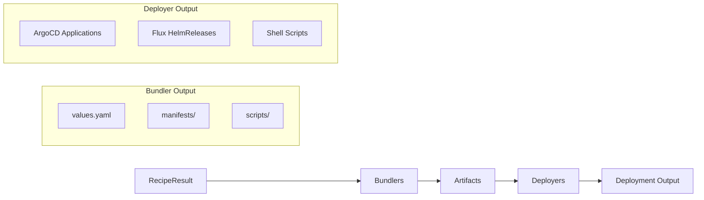

# Bundler Development Guide

Learn how to create new bundlers for Cloud Native Stack.

## Overview

Bundlers convert RecipeResult objects (with component references) into deployment artifacts. Artifacts include Helm values files, Kubernetes manifests, and installation scripts.

**Architecture Change**: The bundler framework now uses a **simplified RecipeResult-only architecture**. Previously, bundlers supported dual paths (Recipe with measurements + RecipeResult with component refs). Now there's a single path: RecipeResult with component references.

**Framework features:**

- **RecipeResult-only**: Single code path using `GetComponentRef()` and `GetValuesForComponent()`
- **Component references**: Values come from RecipeResult ComponentRef, not Recipe measurements
- **BaseBundler**: Helper struct providing common operations (directory creation, file writing, template rendering, checksum generation)
- **Self-registration**: Bundlers register themselves via `init()` function using `bundler.MustRegister()`
- **Parallel execution**: Multiple bundlers run concurrently via goroutines with errgroup context cancellation
- **Template system**: Bundlers embed templates using `go:embed` directive
- **Value overrides**: CLI `--set` flag allows runtime customization (applied before bundlers receive values)
- **Test infrastructure**: `TestHarness` struct standardizes bundler testing with RecipeResult
- **E2E validation**: `tools/e2e` script tests complete workflow including bundle generation

**Implemented bundlers:**

- **GPU Operator**: Helm values, installation scripts (bundler.go, scripts.go, bundler_test.go)
- **Network Operator**: Helm values, network configuration (bundler.go, scripts.go, bundler_test.go)
- **Cert-Manager**: Helm values for certificate management (bundler.go, scripts.go, bundler_test.go)
- **NVSentinel**: Helm values for NVSentinel deployment (bundler.go, scripts.go, bundler_test.go)
- **Skyhook**: Helm values, node optimization scripts (bundler.go, scripts.go, bundler_test.go)

## Quick Start

### Minimal Bundler Implementation

```go
// pkg/component/mybundler/bundler.go
package mybundler

import (
    "context"
    "embed"
    "fmt"
    "os"
    "path/filepath"
    
    "github.com/NVIDIA/cloud-native-stack/pkg/bundler"
    "github.com/NVIDIA/cloud-native-stack/pkg/bundler/result"
)

//go:embed templates/*.tmpl
var templatesFS embed.FS

const (
    bundlerType = bundler.BundleType("my-bundler")
    Name        = "my-bundler"  // Use constant for component name
)

func init() {
    // Self-register (panics on duplicates)
    bundler.MustRegister(bundlerType, NewBundler())
}

// Bundler generates deployment bundles from RecipeResult.
type Bundler struct {
    *bundler.BaseBundler  // Embed helper
}

// NewBundler creates a new bundler instance.
func NewBundler() *Bundler {
    return &Bundler{
        BaseBundler: bundler.NewBaseBundler(bundlerType, templatesFS),
    }
}

// Make generates the bundle (delegates to makeFromRecipeResult).
func (b *Bundler) Make(ctx context.Context, input *result.RecipeResult, 
    outputDir string) (*bundler.Result, error) {
    return b.makeFromRecipeResult(ctx, input, outputDir)
}

// makeFromRecipeResult generates bundle from RecipeResult with component references.
func (b *Bundler) makeFromRecipeResult(ctx context.Context, input *result.RecipeResult, 
    outputDir string) (*bundler.Result, error) {
    
    // 1. Get component reference from RecipeResult
    component := input.GetComponentRef(Name)
    if component == nil {
        return nil, fmt.Errorf(Name + " component not found in recipe result")
    }
    
    // 2. Get values map (with overrides already applied)
    values := input.GetValuesForComponent(Name)
    
    // 3. Create bundle directory structure
    if err := b.CreateBundleDir(outputDir, "scripts"); err != nil {
        return nil, err
    }
    
    // 4. Generate script metadata
    scriptData := generateScriptData(component, values)
    
    // 5. Combine values and metadata for README
    readmeData := map[string]interface{}{
        "Values": values,
        "Script": scriptData,
    }
    
    // 6. Generate files from templates
    files := []struct {
        path     string
        template string
        data     interface{}
        perm     os.FileMode
    }{
        {filepath.Join(outputDir, "values.yaml"), "values.yaml", values, 0644},
        {filepath.Join(outputDir, "scripts/install.sh"), "install.sh", scriptData, 0755},
        {filepath.Join(outputDir, "README.md"), "README.md", readmeData, 0644},
    }
    
    var generatedFiles []string
    for _, f := range files {
        if err := b.GenerateFileFromTemplate(ctx, GetTemplate, f.template, 
            f.path, f.data, f.perm); err != nil {
            return nil, err
        }
        generatedFiles = append(generatedFiles, f.path)
    }
    
    // 7. Generate checksums and return result
    return b.GenerateResult(outputDir, generatedFiles)
}
```

### Script Metadata Generation

Create a separate file for metadata generation:

```go
// pkg/component/mybundler/scripts.go
package mybundler

import (
    "time"
    
    "github.com/NVIDIA/cloud-native-stack/pkg/bundler/result"
)

// ScriptData contains metadata for shell scripts and README.
type ScriptData struct {
    Timestamp     string
    Namespace     string
    Version       string
    Repository    string
    ComponentName string
}

// generateScriptData creates metadata from component reference.
func generateScriptData(component *result.ComponentRef, values map[string]interface{}) *ScriptData {
    namespace := "default"
    if ns, ok := values["namespace"].(string); ok {
        namespace = ns
    }
    
    repository := "https://helm.ngc.nvidia.com/my-charts"
    if repo, ok := values["repository"].(string); ok {
        repository = repo
    }
    
    return &ScriptData{
        Timestamp:     time.Now().Format(time.RFC3339),
        Namespace:     namespace,
        Version:       component.Version,
        Repository:    repository,
        ComponentName: component.Name,
    }
}
```

### Template Files

Create templates that receive values map directly:

```yaml
# templates/values.yaml.tmpl - Receives values map
# My Bundler Helm Values
# Generated: {{ .Script.Timestamp }}

# Direct access to values map
version: {{ index . "version" }}
namespace: {{ index . "namespace" }}
enabled: {{ index . "enabled" }}

config:
  feature1: {{ index . "feature1" }}
  feature2: {{ index . "feature2" }}
```

```bash
# templates/install.sh.tmpl - Receives ScriptData
#!/bin/bash
# Generated: {{ .Timestamp }}
# Component: {{ .ComponentName }}

NAMESPACE="{{ .Namespace }}"
VERSION="{{ .Version }}"
REPO="{{ .Repository }}"

helm install my-bundler $REPO/my-bundler \
  --version $VERSION \
  --namespace $NAMESPACE \
  --create-namespace \
  --values values.yaml
```

```markdown
# templates/README.md.tmpl - Receives combined map with Values + Script
# My Bundler Deployment

Generated: {{ .Script.Timestamp }}
Version: {{ .Script.Version }}

## Configuration

\```yaml
version: {{ index .Values "version" }}
namespace: {{ index .Values "namespace" }}
\```

## Installation

\```bash
cd scripts
chmod +x install.sh
./install.sh
\```
```

## Step-by-Step Implementation

### Step 1: Create Package Structure

```bash
pkg/component/mybundler/
├── bundler.go          # Main bundler logic
├── scripts.go          # Metadata generation
├── bundler_test.go     # Tests using RecipeResult
├── doc.go              # Package documentation
└── templates/
    ├── values.yaml.tmpl
    ├── install.sh.tmpl
    └── README.md.tmpl
```

### Step 2: Implement Make Function

The `Make()` function now receives `*result.RecipeResult` instead of `*recipe.Recipe`:

```go
func (b *Bundler) Make(ctx context.Context, input *result.RecipeResult, 
    outputDir string) (*bundler.Result, error) {
    return b.makeFromRecipeResult(ctx, input, outputDir)
}
```

### Step 3: Get Component Values

Use `GetComponentRef()` and `GetValuesForComponent()`:

```go
// Get component reference (contains Name, Version, Type, Source)
component := input.GetComponentRef(Name)
if component == nil {
    return nil, fmt.Errorf(Name + " component not found in recipe result")
}

// Get values map (overrides already applied by bundle generator)
values := input.GetValuesForComponent(Name)
```

**Key points**:
- Use `Name` constant (not hardcoded string) for consistency
- Values map already has CLI `--set` overrides applied
- ComponentRef provides version, name, source info
- No measurement extraction needed

### Step 4: Generate Metadata

Create `ScriptData` with component info:

```go
scriptData := generateScriptData(component, values)
```

### Step 5: Render Templates

Pass values map and metadata to templates:

```go
// For values.yaml - pass values map directly
b.GenerateFileFromTemplate(ctx, GetTemplate, "values.yaml", 
    path, values, 0644)

// For scripts - pass ScriptData
b.GenerateFileFromTemplate(ctx, GetTemplate, "install.sh", 
    path, scriptData, 0755)

// For README - pass combined map
readmeData := map[string]interface{}{
    "Values": values,
    "Script": scriptData,
}
b.GenerateFileFromTemplate(ctx, GetTemplate, "README.md", 
    path, readmeData, 0644)
```

## Testing with RecipeResult

### Test Structure

Use TestHarness with RecipeResult pattern:

```go
// pkg/component/mybundler/bundler_test.go
package mybundler

import (
    "testing"
    
    "github.com/NVIDIA/cloud-native-stack/pkg/bundler/result"
    "github.com/NVIDIA/cloud-native-stack/pkg/component/internal"
)

func TestBundler_Make(t *testing.T) {
    harness := internal.NewTestHarness(t, NewBundler())
    
    tests := []struct {
        name    string
        input   *result.RecipeResult
        wantErr bool
        verify  func(t *testing.T, outputDir string)
    }{
        {
            name:    "valid component reference",
            input:   createTestRecipeResult(),
            wantErr: false,
            verify: func(t *testing.T, outputDir string) {
                harness.AssertFileContains(outputDir, "values.yaml", 
                    "version:", "namespace:")
                harness.AssertFileContains(outputDir, "scripts/install.sh",
                    "#!/bin/bash")
            },
        },
        {
            name:    "missing component reference",
            input:   &result.RecipeResult{},
            wantErr: true,
        },
    }
    
    for _, tt := range tests {
        t.Run(tt.name, func(t *testing.T) {
            result := harness.RunTest(tt.input, tt.wantErr)
            if !tt.wantErr && tt.verify != nil {
                tt.verify(t, result.OutputDir)
            }
        })
    }
}

func createTestRecipeResult() *result.RecipeResult {
    return &result.RecipeResult{
        Components: map[string]*result.ComponentRef{
            Name: {
                Name:    Name,
                Version: "v1.0.0",
                Type:    "helm",
                Source:  "recipe",
                Values: map[string]interface{}{
                    "version":   "v1.0.0",
                    "namespace": "default",
                    "enabled":   true,
                    "feature1":  "value1",
                    "feature2":  "value2",
                },
            },
        },
    }
}
```

### TestHarness Methods

The harness provides automatic validation:

- `RunTest(input, wantErr)` – Executes bundler and validates basic requirements
- `AssertFileContains(dir, file, patterns...)` – Verifies file content
- `AssertFileExists(dir, file)` – Checks file existence
- Automatic checksum validation
- Automatic directory structure verification

## Best Practices

### Implementation

- ✅ Use `Name` constant instead of hardcoded component names
- ✅ Single `makeFromRecipeResult()` method - no dual paths
- ✅ Get values via `input.GetValuesForComponent(Name)`
- ✅ Pass values map directly to templates
- ✅ Use `ScriptData` for metadata (namespace, version, timestamps)
- ✅ Combine values + metadata for README templates
- ✅ Use `go:embed` for template portability
- ✅ Check context cancellation for long operations

### Testing

- ✅ Use `TestHarness` for consistent test structure
- ✅ Create RecipeResult with ComponentRef in tests
- ✅ Test with realistic values maps
- ✅ Verify file content with `AssertFileContains()`
- ✅ Test error cases (missing component reference)
- ✅ Validate checksums are generated correctly

### Templates

- ✅ Access values map with `index` function: `{{ index . "key" }}`
- ✅ For README, use nested access: `{{ index .Values "key" }}`
- ✅ Use clear template variable names
- ✅ Add comments explaining data types
- ✅ Handle missing values gracefully with `{{- if }}`
- ✅ Validate template rendering in tests

### Documentation

- ✅ Add package doc.go with overview
- ✅ Document exported types and functions
- ✅ Include examples in README.md template
- ✅ Explain prerequisites and deployment steps

## Common Patterns

### Getting Component Values

```go
// Always use Name constant
component := input.GetComponentRef(Name)
if component == nil {
    return nil, fmt.Errorf(Name + " component not found in recipe result")
}

// Get values with overrides already applied
values := input.GetValuesForComponent(Name)
```

### Accessing Values in Templates

```yaml
# values.yaml.tmpl receives values map
version: {{ index . "version" }}
namespace: {{ index . "namespace" }}

nested:
  field: {{ index . "nested.field" }}
```

```bash
# install.sh receives ScriptData struct
VERSION="{{ .Version }}"
NAMESPACE="{{ .Namespace }}"
```

```markdown
# README.md receives combined map
Version: {{ .Script.Version }}
Config: {{ index .Values "key" }}
```

### Error Handling

```go
// Check for component existence
if component := input.GetComponentRef(Name); component == nil {
    return nil, fmt.Errorf(Name + " component not found")
}

// Template generation errors are already wrapped
if err := b.GenerateFileFromTemplate(...); err != nil {
    return nil, err  // Already has context
}
```

### Node Selector and Toleration Handling

The bundle command supports `--system-node-selector`, `--system-node-toleration`, `--accelerated-node-selector`, and `--accelerated-node-toleration` flags. Bundlers receive these as pre-applied overrides in the values map.

**How it works**:
1. CLI parses node selector/toleration flags
2. Values are applied to bundler-specific paths via `ApplyNodeSelectorOverrides()`
3. Bundler receives values map with selectors/tolerations already set
4. Templates render the values normally

**Bundler-specific paths** (defined in each bundler):

**GPU Operator** (`pkg/component/gpuoperator/bundler.go`):
- System node selector: `operator.nodeSelector`
- System toleration: `operator.tolerations`
- Accelerated node selector: `daemonsets.nodeSelector`
- Accelerated toleration: `daemonsets.tolerations`

**Network Operator** (`pkg/component/networkoperator/bundler.go`):
- System node selector: `operator.nodeSelector`
- Accelerated node selector: `daemonsets.nodeSelector`

**Cert-Manager** (`pkg/component/certmanager/bundler.go`):
- System node selector: `controller.nodeSelector`
- System toleration: `controller.tolerations`

**Implementing in new bundlers**:
```go
// Define paths for your component
func GetNodeSelectorPaths() bundler.NodeSelectorPaths {
    return bundler.NodeSelectorPaths{
        SystemNodeSelector:      "operator.nodeSelector",
        SystemToleration:        "operator.tolerations",
        AcceleratedNodeSelector: "daemonsets.nodeSelector",
        AcceleratedToleration:   "daemonsets.tolerations",
    }
}

// Register with bundler framework
func init() {
    bundler.MustRegister(bundlerType, NewBundler())
    bundler.RegisterNodeSelectorPaths(bundlerType, GetNodeSelectorPaths())
}
```

**Template access** (values are pre-applied):
```yaml
# values.yaml.tmpl
operator:
  nodeSelector:
    {{- range $key, $value := index . "operator.nodeSelector" }}
    {{ $key }}: {{ $value }}
    {{- end }}
  tolerations:
    {{- range $tol := index . "operator.tolerations" }}
    - key: {{ $tol.key }}
      operator: {{ $tol.operator }}
      value: {{ $tol.value }}
      effect: {{ $tol.effect }}
    {{- end }}
```

## Migration from Old Architecture

### What Changed

**Before (dual-path)**:
- Supported both Recipe and RecipeResult inputs
- Had `makeFromRecipe()` and `makeFromRecipeResult()` methods
- Used measurement extraction (ExtractK8sImageSubtype, buildConfigMap)
- Generated HelmValues structs from measurements
- Had separate helm.go, manifests.go files in some components

**After (RecipeResult-only)**:
- Single `makeFromRecipeResult()` method
- Get values via `GetComponentRef()` and `GetValuesForComponent()`
- No measurement extraction needed
- Pass values map directly to templates
- Single bundler.go + scripts.go file structure

### Code Differences

**Old Pattern**:
```go
func (b *Bundler) Make(ctx context.Context, input interface{}, outputDir string) (*bundler.Result, error) {
    switch v := input.(type) {
    case *recipe.Recipe:
        return b.makeFromRecipe(ctx, v, outputDir)
    case *result.RecipeResult:
        return b.makeFromRecipeResult(ctx, v, outputDir)
    }
}

func (b *Bundler) makeFromRecipe(ctx context.Context, r *recipe.Recipe, outputDir string) (*bundler.Result, error) {
    imageSubtype := internal.ExtractK8sImageSubtype(r)
    configMap := buildConfigMap(r)
    helmValues := GenerateHelmValues(r, configMap)
    // ...
}
```

**New Pattern**:
```go
func (b *Bundler) Make(ctx context.Context, input *result.RecipeResult, outputDir string) (*bundler.Result, error) {
    return b.makeFromRecipeResult(ctx, input, outputDir)
}

func (b *Bundler) makeFromRecipeResult(ctx context.Context, input *result.RecipeResult, outputDir string) (*bundler.Result, error) {
    component := input.GetComponentRef(Name)
    values := input.GetValuesForComponent(Name)
    scriptData := generateScriptData(component, values)
    // ...
}
```

## Real-World Example: GPU Operator

See `pkg/component/gpuoperator/bundler.go` for a complete implementation:

**Key files**:
- `bundler.go` (188 lines) - Main bundler logic with makeFromRecipeResult()
- `scripts.go` (79 lines) - ScriptData generation
- `bundler_test.go` (194 lines) - Tests using RecipeResult with ComponentRef
- `templates/*.tmpl` - Templates receiving values map + ScriptData

**Structure**:
- Single makeFromRecipeResult() method
- Uses Name constant throughout
- Generates values.yaml, install.sh, uninstall.sh, README.md
- All templates receive values map or ScriptData directly
- No HelmValues struct generation
- No measurement extraction

## Deployer Integration

After bundlers generate deployment artifacts, deployers transform them into deployment-specific formats. The deployer framework is separate from bundlers but works with their output.

### How Bundlers and Deployers Work Together



### Deployment Order

Deployers respect the `deploymentOrder` field from the recipe to ensure components are deployed in the correct sequence:

| Deployer | Ordering Mechanism |
|----------|-------------------|
| `script` | Components listed in order in README |
| `argocd` | `sync-wave` annotations (0, 1, 2...) |
| `flux` | `dependsOn` fields creating dependency chain |

**Example Recipe with Deployment Order**:
```yaml
componentRefs:
  - name: cert-manager
    version: v1.17.2
  - name: gpu-operator
    version: v25.3.3
  - name: network-operator
    version: v25.4.0
deploymentOrder:
  - cert-manager
  - gpu-operator
  - network-operator
```

### Bundler Output for Deployers

When the `--deployer` flag is set, bundlers generate standard artifacts that deployers then transform:

**For ArgoCD** (`--deployer argocd`):
- Bundler generates `values.yaml` and `manifests/`
- Deployer creates `<component>/argocd/application.yaml` with sync-wave annotations
- Deployer creates `app-of-apps.yaml` at bundle root
- Applications use multi-source to reference values.yaml and manifests from GitOps repo

**For Flux** (`--deployer flux`):
- Bundler generates `values.yaml` and `manifests/`
- Deployer creates `flux/helmrelease.yaml` with dependsOn chains

**For Script** (`--deployer script`, default):
- Bundler generates `values.yaml`, `manifests/`, and `scripts/`
- Deployer creates README with deployment instructions in order

### Using Deployers with Bundlers

The deployer is specified at bundle generation time:

```bash
# Generate bundles with ArgoCD deployer
cnsctl bundle -r recipe.yaml -o ./bundles --deployer argocd

# Generate bundles with Flux deployer
cnsctl bundle -r recipe.yaml -o ./bundles --deployer flux

# Generate bundles with Script deployer (default)
cnsctl bundle -r recipe.yaml -o ./bundles --deployer script
```

See [CLI Architecture](cli.md#deployer-framework-gitops-integration) for detailed deployer documentation.

## See Also

- [Architecture Overview](README.md) - Complete bundler framework architecture
- [CLI Architecture](cli.md) - Deployer framework and GitOps integration
- [CLI Reference](../user-guide/cli-reference.md) - Bundle generation commands
- [API Reference](../integration/api-reference.md) - Programmatic access (recipe generation only)
- GPU Operator implementation (`pkg/component/gpuoperator/`) - Reference example
