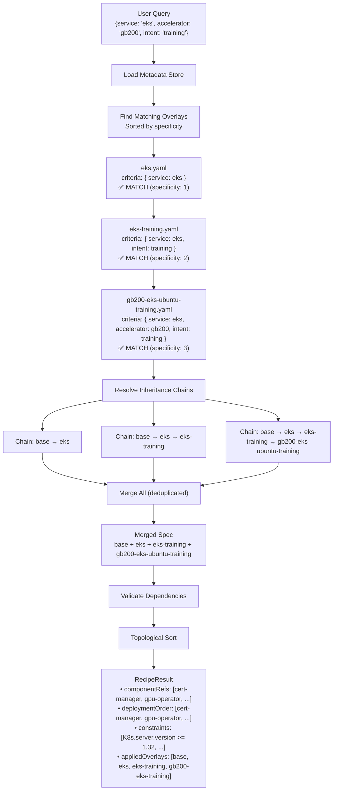

# Data Architecture

This document describes the recipe metadata system used by the CLI and API to generate optimized system configuration recommendations (i.e. recipes) based on environment parameters.

## Table of Contents

- [Overview](#overview)
- [Data Structure](#data-structure)
- [Multi-Level Inheritance](#multi-level-inheritance)
- [Component Configuration](#component-configuration)
- [Criteria Matching Algorithm](#criteria-matching-algorithm)
- [Recipe Generation Process](#recipe-generation-process)
- [Usage Examples](#usage-examples)
- [Maintenance Guide](#maintenance-guide)
- [Automated Validation](#automated-validation)

## Overview

The recipe system is a rule-based configuration engine that generates tailored system configurations by:

1. **Starting with a base recipe** - Universal component definitions and constraints applicable to every recipe
2. **Matching environment-specific overlays** - Targeted configurations based on query criteria (service, accelerator, OS, intent)
3. **Resolving inheritance chains** - Overlays can inherit from intermediate recipes to reduce duplication
4. **Merging configurations** - Components, constraints, and values are merged with overlay precedence
5. **Computing deployment order** - Topological sort of components based on dependency references

The recipe data is organized in [`pkg/recipe/data/`](../../pkg/recipe/data/) as multiple YAML files:

```
pkg/recipe/data/
├── base.yaml                      # Root recipe - all recipes inherit from this
├── eks.yaml                       # EKS-specific settings
├── eks-training.yaml              # EKS + training workloads (inherits from eks)
├── gb200-eks-ubuntu-training.yaml # GB200/EKS/Ubuntu/training (inherits from eks-training)
├── h100-eks-ubuntu-training.yaml  # H100/EKS/Ubuntu/training (inherits from eks-training)
├── h100-ubuntu-inference.yaml     # H100/Ubuntu/inference
└── components/                    # Component values files
    ├── cert-manager/
    │   └── values.yaml
    ├── gpu-operator/
    │   ├── values.yaml            # Base GPU Operator values
    │   └── values-eks-training.yaml # EKS training-optimized values
    ├── network-operator/
    │   └── values.yaml
    ├── nvsentinel/
    │   └── values.yaml
    └── skyhook/
        └── values.yaml
```

> Note: These files are embedded into both the CLI binary and API server at compile time, making the system fully self-contained with no external dependencies.

**Recipe Usage Patterns:**

1. **CLI Query Mode** - Direct recipe generation from criteria parameters:
   ```bash
   cnsctl recipe --os ubuntu --accelerator h100 --service eks --intent training
   ```

2. **CLI Snapshot Mode** - Analyze captured system state to infer criteria:
   ```bash
   cnsctl snapshot --output system.yaml
   cnsctl recipe --snapshot system.yaml --intent training
   ```

3. **API Server** - HTTP endpoint (query mode only):
   ```bash
   curl "https://cns.dgxc.io/v1/recipe?os=ubuntu&accelerator=h100&service=eks&intent=training"
   ```

## Data Structure

### Recipe Metadata Format

Each recipe file follows this structure:

```yaml
kind: recipeMetadata
apiVersion: cns.nvidia.com/v1alpha1
metadata:
  name: <recipe-name>  # Unique identifier (e.g., "eks-training", "gb200-eks-ubuntu-training")

spec:
  base: <parent-recipe>  # Optional - inherits from another recipe
  
  criteria:              # When this recipe/overlay applies
    service: eks         # Kubernetes platform
    accelerator: gb200   # GPU type
    os: ubuntu           # Operating system
    intent: training     # Workload purpose
  
  constraints:           # Deployment requirements
    - name: K8s.server.version
      value: ">= 1.32"
  
  componentRefs:         # Components to deploy
    - name: gpu-operator
      type: Helm
      source: https://helm.ngc.nvidia.com/nvidia
      version: v25.3.3
      valuesFile: components/gpu-operator/values.yaml
      dependencyRefs:
        - cert-manager
```

### Top-Level Fields

| Field | Description |
|-------|-------------|
| `kind` | Always `recipeMetadata` |
| `apiVersion` | Always `cns.nvidia.com/v1alpha1` |
| `metadata.name` | Unique recipe identifier |
| `spec.base` | Parent recipe to inherit from (empty = inherits from `base.yaml`) |
| `spec.criteria` | Query parameters that select this recipe |
| `spec.constraints` | Pre-flight validation rules |
| `spec.componentRefs` | List of components to deploy |

### Criteria Fields

Criteria define when a recipe matches a user query:

| Field | Type | Description | Example Values |
|-------|------|-------------|----------------|
| `service` | String | Kubernetes platform | `eks`, `gke`, `aks`, `oke` |
| `accelerator` | String | GPU hardware type | `h100`, `gb200`, `a100`, `l40` |
| `os` | String | Operating system | `ubuntu`, `rhel`, `cos`, `amazonlinux` |
| `intent` | String | Workload purpose | `training`, `inference` |
| `nodes` | Integer | Node count (0 = any) | `8`, `16` |

**All fields are optional.** Unpopulated fields act as wildcards (match any value).

### Constraint Format

Constraints use fully qualified measurement paths:

```yaml
constraints:
  - name: K8s.server.version    # {type}.{subtype}.{key}
    value: ">= 1.32"            # Expression or exact value
  
  - name: OS.release.ID
    value: ubuntu               # Exact match
  
  - name: OS.release.VERSION_ID
    value: "24.04"
  
  - name: OS.sysctl./proc/sys/kernel/osrelease
    value: ">= 6.8"
```

**Constraint Path Format:** `{MeasurementType}.{Subtype}.{Key}`

| Measurement Type | Common Subtypes |
|------------------|-----------------|
| `K8s` | `server`, `image`, `config` |
| `OS` | `release`, `sysctl`, `kmod`, `grub` |
| `GPU` | `smi`, `driver`, `device` |
| `SystemD` | `containerd.service`, `kubelet.service` |

**Supported Operators:** `>=`, `<=`, `>`, `<`, `==`, `!=`, or exact match (no operator)

### Component Reference Structure

Each component in `componentRefs` defines a deployable unit:

```yaml
componentRefs:
  - name: gpu-operator           # Component identifier (must match bundler name)
    type: Helm                   # Deployment type: Helm or Kustomize
    source: https://helm.ngc.nvidia.com/nvidia  # Repository URL or OCI reference
    version: v25.3.3             # Chart/component version
    valuesFile: components/gpu-operator/values.yaml  # Path to values file
    overrides:                   # Inline value overrides
      driver:
        version: 580.82.07
      cdi:
        enabled: true
    dependencyRefs:              # Components this depends on
      - cert-manager
```

**Component Fields:**

| Field | Required | Description |
|-------|----------|-------------|
| `name` | Yes | Unique component identifier (matches bundler name) |
| `type` | Yes | `Helm` or `Kustomize` |
| `source` | Yes | Repository URL or OCI reference |
| `version` | No | Chart version (for Helm) |
| `tag` | No | Resource tag (for Kustomize) |
| `valuesFile` | No | Path to values file (relative to data directory) |
| `overrides` | No | Inline values that override valuesFile |
| `dependencyRefs` | No | List of component names this depends on |

## Multi-Level Inheritance

Recipe files support **multi-level inheritance** through the `spec.base` field. This enables building inheritance chains where intermediate recipes capture shared configurations, reducing duplication and improving maintainability.

### Inheritance Mechanism

Each recipe can specify a parent recipe via `spec.base`:

```yaml
kind: recipeMetadata
apiVersion: cns.nvidia.com/v1alpha1
metadata:
  name: h100-eks-ubuntu-training

spec:
  base: eks-training  # Inherits from eks-training recipe
  
  criteria:
    service: eks
    accelerator: h100
    os: ubuntu
    intent: training
    
  # Only H100-specific overrides here
  componentRefs:
    - name: gpu-operator
      version: v25.3.3
      overrides:
        driver:
          version: 570.133.20
```

### Inheritance Chain Example

The system supports inheritance chains of arbitrary depth:

```
base.yaml
    │
    ├── eks.yaml (spec.base: empty → inherits from base)
    │       │
    │       └── eks-training.yaml (spec.base: eks)
    │               │
    │               ├── h100-eks-ubuntu-training.yaml (spec.base: eks-training)
    │               │
    │               └── gb200-eks-ubuntu-training.yaml (spec.base: eks-training)
    │
    └── h100-ubuntu-inference.yaml (spec.base: empty → inherits from base)
```

**Resolution Order:** When resolving `h100-eks-ubuntu-training`:
1. Start with `base.yaml` (root)
2. Merge `eks.yaml` (EKS-specific settings)
3. Merge `eks-training.yaml` (training optimizations)
4. Merge `h100-eks-ubuntu-training.yaml` (H100-specific overrides)

### Inheritance Rules

**1. Base Resolution**
- `spec.base: ""` or omitted → Inherits directly from `base.yaml`
- `spec.base: "eks"` → Inherits from the recipe named "eks"
- The root `base.yaml` has no parent (it's the foundation)

**2. Merge Precedence**
Later recipes in the chain override earlier ones:
```
base → eks → eks-training → h100-eks-training
(lowest)                      (highest priority)
```

**3. Field Merging**
- **Constraints**: Same-named constraints are overridden; new constraints are added
- **ComponentRefs**: Same-named components are merged field-by-field; new components are added
- **Criteria**: Each recipe defines its own criteria (not inherited)

### Intermediate vs Leaf Recipes

**Intermediate Recipes** (e.g., `eks.yaml`, `eks-training.yaml`):
- Have **partial criteria** (not all fields specified)
- Capture shared configurations for a category
- Can be matched by user queries (but typically less specific)

**Leaf Recipes** (e.g., `h100-eks-ubuntu-training.yaml`):
- Have **complete criteria** (all required fields)
- Matched by specific user queries
- Contain final, hardware-specific overrides

### Example: Inheritance Chain

```yaml
# base.yaml - Foundation for all recipes
kind: recipeMetadata
apiVersion: cns.nvidia.com/v1alpha1
metadata:
  name: base

spec:
  constraints:
    - name: K8s.server.version
      value: ">= 1.25"

  componentRefs:
    - name: cert-manager
      type: Helm
      source: https://charts.jetstack.io
      version: v1.17.2
      valuesFile: components/cert-manager/values.yaml

    - name: gpu-operator
      type: Helm
      source: https://helm.ngc.nvidia.com/nvidia
      version: v25.10.1
      valuesFile: components/gpu-operator/values.yaml
      dependencyRefs:
        - cert-manager
```

```yaml
# eks.yaml - EKS-specific settings
kind: recipeMetadata
apiVersion: cns.nvidia.com/v1alpha1
metadata:
  name: eks

spec:
  # Implicit base (inherits from base.yaml)
  
  criteria:
    service: eks  # Only service specified (partial criteria)

  constraints:
    - name: K8s.server.version
      value: ">= 1.28"  # EKS minimum version
```

```yaml
# eks-training.yaml - EKS training workloads
kind: recipeMetadata
apiVersion: cns.nvidia.com/v1alpha1
metadata:
  name: eks-training

spec:
  base: eks  # Inherits EKS settings
  
  criteria:
    service: eks
    intent: training  # Added training intent (still partial)

  constraints:
    - name: K8s.server.version
      value: ">= 1.30"  # Training requires newer K8s

  componentRefs:
    # Training workloads use training-optimized values
    - name: gpu-operator
      valuesFile: components/gpu-operator/values-eks-training.yaml
```

### Benefits of Multi-Level Inheritance

| Benefit | Description |
|---------|-------------|
| **Reduced Duplication** | Shared settings defined once in intermediate recipes |
| **Easier Maintenance** | Update EKS settings in one place, all EKS recipes inherit |
| **Clear Organization** | Hierarchy reflects logical relationships |
| **Flexible Extension** | Add new leaf recipes without duplicating parent configs |
| **Testable** | Each level can be validated independently |

### Cycle Detection

The system detects circular inheritance to prevent infinite loops:

```yaml
# INVALID: Would create cycle
# a.yaml: spec.base: b
# b.yaml: spec.base: c
# c.yaml: spec.base: a  ← Cycle detected!
```

Tests in `pkg/recipe/yaml_test.go` automatically validate:
- All `spec.base` references point to existing recipes
- No circular inheritance chains exist
- Inheritance depth is reasonable (max 10 levels)

## Component Configuration

Components are configured through a three-tier system with clear precedence.

### Configuration Patterns

**Pattern 1: ValuesFile Only**
Traditional approach - all values in a separate file:
```yaml
componentRefs:
  - name: gpu-operator
    valuesFile: components/gpu-operator/values.yaml
```

**Pattern 2: Overrides Only**
Fully self-contained recipe with inline values:
```yaml
componentRefs:
  - name: gpu-operator
    overrides:
      driver:
        version: 580.82.07
      cdi:
        enabled: true
```

**Pattern 3: ValuesFile + Overrides (Hybrid)**
Reusable base with recipe-specific tweaks:
```yaml
componentRefs:
  - name: gpu-operator
    valuesFile: components/gpu-operator/values.yaml  # Base configuration
    overrides:                                        # Recipe-specific tweaks
      driver:
        version: 580.82.07
```

### Value Merge Precedence

When values are resolved, merge order is:

```
Base ValuesFile → Overlay ValuesFile → Overlay Overrides → CLI --set flags
     (lowest)                                                   (highest)
```

1. **Base ValuesFile**: Values from inherited recipes
2. **Overlay ValuesFile**: Values file specified in the matching overlay
3. **Overlay Overrides**: Inline `overrides` in the overlay's componentRef
4. **CLI --set flags**: Runtime overrides from `cnsctl bundle --set`

### Component Values Files

Values files are stored in `pkg/recipe/data/components/{component}/`:

```yaml
# components/gpu-operator/values.yaml
operator:
  upgradeCRD: true
  resources:
    limits:
      cpu: 500m
      memory: 700Mi

driver:
  version: 580.105.08
  enabled: true
  useOpenKernelModules: true
  rdma:
    enabled: true

devicePlugin:
  enabled: true
```

### Dependency Management

Components can declare dependencies via `dependencyRefs`:

```yaml
componentRefs:
  - name: cert-manager
    type: Helm
    version: v1.17.2

  - name: gpu-operator
    type: Helm
    version: v25.10.1
    dependencyRefs:
      - cert-manager  # Deploy cert-manager first
```

The system performs **topological sort** to compute deployment order, ensuring dependencies are deployed before dependents. The resulting order is exposed in `RecipeResult.DeploymentOrder`.

## Criteria Matching Algorithm

The recipe system uses an **asymmetric rule matching algorithm** where recipe criteria (rules) match against user queries (candidates).

### Matching Rules

A recipe's criteria matches a user query when **every non-"any" field in the criteria is satisfied by the query**:

1. **Empty/unpopulated fields in criteria** = Wildcard (matches any value)
2. **Populated fields must match exactly** (case-insensitive)
3. **Matching is asymmetric**: More specific recipes match more specific queries

### Matching Logic

```go
// A criteria matches if all non-"any" fields match
func (c *Criteria) Matches(other *Criteria) bool {
    // "any" matches everything
    if c.Service != "any" && other.Service != "any" && c.Service != other.Service {
        return false
    }
    if c.Accelerator != "any" && other.Accelerator != "any" && c.Accelerator != other.Accelerator {
        return false
    }
    // ... same for intent, os, nodes
    return true
}
```

### Specificity Scoring

When multiple recipes match, they are sorted by **specificity** (number of non-"any" fields). More specific recipes are applied later, giving them higher precedence:

```go
func (c *Criteria) Specificity() int {
    score := 0
    if c.Service != "any" { score++ }
    if c.Accelerator != "any" { score++ }
    if c.Intent != "any" { score++ }
    if c.OS != "any" { score++ }
    if c.Nodes != 0 { score++ }
    return score
}
```

### Matching Examples

**Example 1: Broad Recipe**
```yaml
Recipe Criteria: { service: "eks" }
User Query:      { service: "eks", os: "ubuntu", accelerator: "h100" }
Result:          ✅ MATCH - Recipe only requires service=eks, other fields are wildcards
Specificity:     1
```

**Example 2: Specific Recipe**
```yaml
Recipe Criteria: { service: "eks", accelerator: "gb200", intent: "training" }
User Query:      { service: "eks", os: "ubuntu", accelerator: "h100" }
Result:          ❌ NO MATCH - Accelerator doesn't match (gb200 ≠ h100)
```

**Example 3: Multiple Matches**
```yaml
User Query: { service: "eks", os: "ubuntu", accelerator: "gb200", intent: "training" }

Matching Recipes (sorted by specificity):
  1. eks.yaml               { service: eks }                                    Specificity: 1
  2. eks-training.yaml      { service: eks, intent: training }                  Specificity: 2
  3. gb200-eks-ubuntu-training.yaml { service: eks, accelerator: gb200, os: ubuntu, intent: training }  Specificity: 4

Result: All matching recipes are applied in order of specificity
```

## Recipe Generation Process

The recipe builder (`pkg/recipe/metadata_store.go`) generates recipes through the following steps:

### Step 1: Load Metadata Store

```go
store, err := loadMetadataStore(ctx)
```

- Embedded YAML files are parsed into Go structs
- Cached in memory on first access (singleton pattern with `sync.Once`)
- Contains base recipe, all overlays, and component values files

### Step 2: Find Matching Overlays

```go
overlays := store.FindMatchingOverlays(criteria)
```

- Iterate all overlay recipes
- Check if each overlay's criteria matches the user query
- Sort matches by specificity (least specific first)

### Step 3: Resolve Inheritance Chains

For each matching overlay:

```go
chain, err := store.resolveInheritanceChain(overlay.Metadata.Name)
```

- Build the chain from root (base) to the target overlay
- Detect cycles to prevent infinite loops
- Example: `["base", "eks", "eks-training", "gb200-eks-ubuntu-training"]`

### Step 4: Merge Specifications

```go
for _, recipe := range chain {
    mergedSpec.Merge(&recipe.Spec)
}
```

**Merge Algorithm:**
- **Constraints**: Same-named constraints are overridden; new constraints are added
- **ComponentRefs**: Same-named components are merged field-by-field using `mergeComponentRef()`

```go
func mergeComponentRef(base, overlay ComponentRef) ComponentRef {
    result := base
    if overlay.Type != "" { result.Type = overlay.Type }
    if overlay.Source != "" { result.Source = overlay.Source }
    if overlay.Version != "" { result.Version = overlay.Version }
    if overlay.ValuesFile != "" { result.ValuesFile = overlay.ValuesFile }
    // Merge overrides maps
    if overlay.Overrides != nil {
        result.Overrides = deepMerge(base.Overrides, overlay.Overrides)
    }
    // Merge dependency refs
    if len(overlay.DependencyRefs) > 0 {
        result.DependencyRefs = mergeDependencyRefs(base.DependencyRefs, overlay.DependencyRefs)
    }
    return result
}
```

### Step 5: Validate Dependencies

```go
if err := mergedSpec.ValidateDependencies(); err != nil {
    return nil, err
}
```

- Verify all `dependencyRefs` reference existing components
- Detect circular dependencies

### Step 6: Compute Deployment Order

```go
deployOrder, err := mergedSpec.TopologicalSort()
```

- Topologically sort components based on `dependencyRefs`
- Ensures dependencies are deployed before dependents

### Step 7: Build RecipeResult

```go
return &RecipeResult{
    Kind:            "recipeResult",
    APIVersion:      "cns.nvidia.com/v1alpha1",
    Metadata:        metadata,
    Criteria:        criteria,
    Constraints:     mergedSpec.Constraints,
    ComponentRefs:   mergedSpec.ComponentRefs,
    DeploymentOrder: deployOrder,
}, nil
```

### Complete Flow Diagram



## Usage Examples

### CLI Usage

**Basic recipe generation (query mode):**
```bash
cnsctl recipe --os ubuntu --service eks --accelerator h100 --intent training
```

**Full specification:**
```bash
cnsctl recipe \
  --os ubuntu \
  --service eks \
  --accelerator gb200 \
  --intent training \
  --nodes 8 \
  --format yaml \
  --output recipe.yaml
```

**From snapshot (snapshot mode):**
```bash
cnsctl snapshot --output snapshot.yaml
cnsctl recipe --snapshot snapshot.yaml --intent training --output recipe.yaml
```

### API Usage

**Basic query:**
```bash
curl "https://cns.dgxc.io/v1/recipe?os=ubuntu&service=eks&accelerator=h100"
```

**Full specification:**
```bash
curl "https://cns.dgxc.io/v1/recipe?os=ubuntu&service=eks&accelerator=gb200&intent=training&nodes=8"
```

### Example Response (RecipeResult)

```json
{
  "kind": "recipeResult",
  "apiVersion": "cns.nvidia.com/v1alpha1",
  "metadata": {
    "generatedAt": "2026-01-15T10:30:00Z",
    "version": "v0.8.0",
    "appliedOverlays": [
      "base",
      "eks",
      "eks-training",
      "gb200-eks-ubuntu-training"
    ]
  },
  "criteria": {
    "service": "eks",
    "accelerator": "gb200",
    "os": "ubuntu",
    "intent": "training"
  },
  "constraints": [
    {
      "name": "K8s.server.version",
      "value": ">= 1.32.4"
    },
    {
      "name": "OS.release.ID",
      "value": "ubuntu"
    },
    {
      "name": "OS.release.VERSION_ID",
      "value": "24.04"
    }
  ],
  "componentRefs": [
    {
      "name": "cert-manager",
      "type": "Helm",
      "source": "https://charts.jetstack.io",
      "version": "v1.17.2",
      "valuesFile": "components/cert-manager/values.yaml"
    },
    {
      "name": "gpu-operator",
      "type": "Helm",
      "source": "https://helm.ngc.nvidia.com/nvidia",
      "version": "v25.3.3",
      "valuesFile": "components/gpu-operator/values-eks-training.yaml",
      "overrides": {
        "driver": {
          "version": "580.82.07"
        },
        "cdi": {
          "enabled": true
        }
      },
      "dependencyRefs": ["cert-manager"]
    },
    {
      "name": "nvsentinel",
      "type": "Helm",
      "source": "oci://ghcr.io/nvidia/nvsentinel",
      "version": "v0.6.0",
      "valuesFile": "components/nvsentinel/values.yaml",
      "dependencyRefs": ["cert-manager"]
    },
    {
      "name": "skyhook",
      "type": "Helm",
      "source": "oci://ghcr.io/nvidia/skyhook",
      "version": "v0.4.0",
      "valuesFile": "components/skyhook/values.yaml",
      "overrides": {
        "customization": "ubuntu"
      }
    }
  ],
  "deploymentOrder": [
    "cert-manager",
    "gpu-operator",
    "nvsentinel",
    "skyhook"
  ]
}
```

## Maintenance Guide

### Adding a New Recipe

1. **Create the recipe file** in `pkg/recipe/data/`:
   ```yaml
   kind: recipeMetadata
   apiVersion: cns.nvidia.com/v1alpha1
   metadata:
     name: l40-gke-ubuntu-inference  # Unique name
   
   spec:
     base: gke-inference  # Inherit from appropriate parent
     
     criteria:
       service: gke
       accelerator: l40
       os: ubuntu
       intent: inference
     
     constraints:
       - name: K8s.server.version
         value: ">= 1.29"
     
     componentRefs:
       - name: gpu-operator
         version: v25.3.3
         overrides:
           driver:
             version: 560.35.03
   ```

2. **Create intermediate recipes** if needed (e.g., `gke.yaml`, `gke-inference.yaml`)

3. **Add component values files** if using new configurations:
   ```yaml
   # components/gpu-operator/values-gke-inference.yaml
   driver:
     enabled: true
     version: 560.35.03
   ```

4. **Run tests** to validate:
   ```bash
   go test -v ./pkg/recipe/... -run TestAllMetadataFilesParseCorrectly
   ```

### Modifying Existing Recipes

1. **Update constraints** - Change version requirements:
   ```yaml
   constraints:
     - name: K8s.server.version
       value: ">= 1.33"  # Updated from 1.32
   ```

2. **Update component versions** - Bump chart versions:
   ```yaml
   componentRefs:
     - name: gpu-operator
       version: v25.4.0  # Updated from v25.3.3
   ```

3. **Add inline overrides** - Recipe-specific tweaks:
   ```yaml
   componentRefs:
     - name: gpu-operator
       overrides:
         newFeature:
           enabled: true
   ```

### Updating Component Values

1. **Modify values file** in `pkg/recipe/data/components/{component}/values.yaml`

2. **Create variant values file** for specific environments:
   - `values.yaml` - Base configuration
   - `values-eks-training.yaml` - EKS training optimization
   - `values-gke-inference.yaml` - GKE inference optimization

3. **Reference in recipe**:
   ```yaml
   componentRefs:
     - name: gpu-operator
       valuesFile: components/gpu-operator/values-gke-inference.yaml
   ```

---

## Automated Validation

The recipe data system includes comprehensive automated tests to ensure data integrity. These tests run automatically as part of `make test` and validate all recipe metadata files and component values.

### Test Suite Overview

The test suite is organized in `pkg/recipe/`:

| File | Responsibility |
|------|----------------|
| `yaml_test.go` | Static YAML file validation (parsing, references, enums, inheritance) |
| `metadata_test.go` | Runtime behavior tests (Merge, TopologicalSort, inheritance resolution) |
| `recipe_test.go` | Recipe struct validation (Validate, ValidateStructure) |

### Test Categories

| Test Category | What It Validates |
|---------------|-------------------|
| Schema Conformance | All YAML files parse correctly with expected structure |
| Criteria Validation | Valid enum values for service, accelerator, intent, OS |
| Reference Validation | valuesFile paths exist, dependencyRefs resolve, component names valid |
| Constraint Syntax | Measurement paths use valid types, operators are valid |
| Dependency Cycles | No circular dependencies in componentRefs |
| Inheritance Chains | Base references valid, no circular inheritance, reasonable depth |
| Values Files | Component values files parse as valid YAML |

### Inheritance-Specific Tests

| Test | What It Validates |
|------|-------------------|
| `TestAllBaseReferencesPointToExistingRecipes` | All `spec.base` references resolve to existing recipes |
| `TestNoCircularBaseReferences` | No circular inheritance chains (a→b→c→a) |
| `TestInheritanceChainDepthReasonable` | Inheritance depth ≤ 10 levels |

### Running Tests

```bash
# Run all recipe data tests
make test

# Run only recipe package tests
go test -v ./pkg/recipe/... -count=1

# Run specific test patterns
go test -v ./pkg/recipe/... -run TestAllMetadataFilesParseCorrectly
go test -v ./pkg/recipe/... -run TestAllBaseReferencesPointToExistingRecipes
go test -v ./pkg/recipe/... -run TestAllOverlayCriteriaUseValidEnums
```

### CI/CD Integration

Tests run automatically on:
- **Pull Requests**: All tests must pass before merge
- **Push to main**: Validates no regressions
- **Release builds**: Ensures data integrity in released binaries

```yaml
# GitHub Actions workflow snippet
jobs:
  validate:
    runs-on: ubuntu-latest
    steps:
      - uses: actions/checkout@v5
      - uses: ./.github/actions/go-ci
        with:
          go_version: '1.25'
          golangci_lint_version: 'v2.6'
```

### Adding New Tests

When adding new recipe metadata or component configurations:

1. **Create the new file** in `pkg/recipe/data/`
2. **Run tests** to verify the file is valid:
   ```bash
   go test -v ./pkg/recipe/... -run TestAllMetadataFilesParseCorrectly
   ```
3. **Check for conflicts** with existing recipes:
   ```bash
   go test -v ./pkg/recipe/... -run TestNoDuplicateCriteria
   ```
4. **Verify references** if using valuesFile or dependencyRefs:
   ```bash
   go test -v ./pkg/recipe/... -run TestValuesFileReferencesExist
   go test -v ./pkg/recipe/... -run TestDependencyRefsResolve
   ```

---

## See Also

- [Recipe Development Guide](../integration/recipe-development.md) - Adding and modifying recipe data
- [CLI Architecture](cli.md) - How the CLI uses recipe data
- [API Server Architecture](api-server.md) - How the API serves recipes
- [OpenAPI Specification](../../api/cns/v1/server.yaml) - Recipe API contract
- [Recipe Package Documentation](../../pkg/recipe/) - Go implementation details
