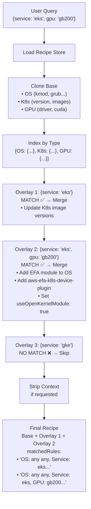

# Data Architecture

This document describes the data system used by the cnsctl CLI and API to generate optimized system configuration recommendations (i.e. recipes) based on environment parameters.

## Table of Contents

- [Overview](#overview)
- [Data Structure](#data-structure)
- [Base Measurements](#base-measurements)
- [Overlay System](#overlay-system)
- [Query Matching Algorithm](#query-matching-algorithm)
- [Recipe Generation Process](#recipe-generation-process)
- [Usage Examples](#usage-examples)
- [Maintenance Guide](#maintenance-guide)
- [Automated Validation](#automated-validation)

## Overview

The recipe system is a rule-based configuration engine that generates tailored system configurations by:

1. **Starting with base measurements** - Universal settings applicable to all environments
2. **Layering environment-specific overlays** - Targeted configurations that match query parameters
3. **Merging configurations intelligently** - Overlays augment or override base values
4. **Delivering optimized recipes** - Complete configuration recommendations

The entire recipe data is defined in a single YAML file: [`pkg/recipe/data/data-v1.yaml`](../../pkg/recipe/data/data-v1.yaml)

> Note: This file is embedded into both the CLI binary and API server at compile time, making the system fully self-contained with no external dependencies.

**Recipe Usage Patterns:**

1. **CLI Query Mode** - Direct recipe generation from parameters:
   ```bash
   cnsctl recipe --os ubuntu --gpu h100 --intent training
   ```

2. **CLI Snapshot Mode** - Analyze captured system state:
   ```bash
   cnsctl snapshot --output system.yaml
   cnsctl recipe --snapshot system.yaml --intent training
   ```

3. **ConfigMap Integration** - Kubernetes-native storage:
   ```bash
   # Agent writes snapshot to ConfigMap
   cnsctl snapshot --output cm://gpu-operator/cns-snapshot
   
   # CLI reads from ConfigMap to generate recipe
   cnsctl recipe --snapshot cm://gpu-operator/cns-snapshot --intent training
   ```

4. **API Server** - HTTP endpoint (query mode only):
   ```bash
   curl "https://cns.dgxc.io/v1/recipe?os=ubuntu&gpu=h100&intent=training"
   ```

## Data Structure

The recipe data follows this top-level structure:

```yaml
base:
  - type: OS
    subtypes: [...]
  - type: SystemD
    subtypes: [...]
  - type: K8s
    subtypes: [...]
  - type: GPU
    subtypes: [...]
  - type: ...
    subtypes: [...]

overlays:
  - key:
      service: eks
      os: ubuntu
    types: [...]
  - key:
      service: eks
      gpu: gb200
    types: [...]
```

### Top-Level Fields

- **`base`** - Array of measurements that apply universally to all queries
- **`overlays`** - Array of conditional measurement sets that match specific query parameters

### Measurement Structure

Each measurement (in both `base` and overlay `types`) follows this format:

```yaml
- type: <MeasurementType>        # OS, SystemD, K8s, or GPU
  subtypes:
    - subtype: <SubtypeName>     # Specific configuration category
      data:                       # Key-value configuration settings
        <key>: <value>
      context:                    # Optional human-readable explanations
        <key>: <explanation>
```

**Measurement Types:**
- `OS` - Operating system configuration (kernel modules, grub parameters, sysctl settings, OS release)
- `SystemD` - SystemD service configurations (containerd, kubelet, etc.)
- `K8s` - Kubernetes cluster settings (versions, images, registry, feature flags)
- `GPU` - GPU hardware and driver configurations (CUDA version, driver version, MIG settings)

**Common Subtypes:**

| Type | Subtype | Description |
|------|---------|-------------|
| OS | `kmod` | Kernel modules to load |
| OS | `grub` | Boot parameters |
| OS | `sysctl` | Kernel runtime parameters |
| OS | `release` | OS identification |
| SystemD | `containerd.service` | Container runtime configuration |
| SystemD | `kubelet.service` | Kubernetes node agent configuration |
| K8s | `server` | Kubernetes version |
| K8s | `image` | Container image versions |
| K8s | `registry` | Container registry configuration |
| K8s | `config` | Feature flags (MIG, CDI, RDMA) |
| GPU | `smi` | GPU hardware state |
| GPU | `driver` | Driver configuration |
| GPU | `device` | Device-specific settings |

### Context Metadata

The `context` field provides human-readable explanations for each configuration setting. This metadata:

- Explains **why** a setting is configured
- Describes the **impact** on GPU workloads
- Used internally for recipe data organization
- Should be updated whenever data values change

Example:
```yaml
data:
  numa_balancing: disable
context:
  numa_balancing: Disable auto-migration for predictable GPU memory locality
```

### Why Separate Data and Context Maps?

The recipe system intentionally maintains **separate `data` and `context` maps** rather than embedding context directly with each value. This architectural decision balances multiple engineering concerns:

#### Design Rationale

**1. Separation of Concerns**
- **Data** represents *what* should be configured (the actual values)
- **Context** represents *why* it should be configured (human-readable explanations)
- This philosophical separation mirrors the distinction between code and comments in software

**2. Internal Data Organization**
- Context maps are used internally for recipe data management
- The bundler framework uses context for generating documentation
- Separating context allows cleaner data structures for template rendering

**3. Type Safety**
- The `data` map uses the `Reading` interface with generic `Scalar[T]` types for compile-time type safety
- Values preserve their native types (int, string, bool, float64) through type-safe wrappers
- Context is always a string - keeping it separate avoids type system complexity

**4. Production Stability**
- Current architecture is validated by 51 passing recipe tests and 8 bundler test packages
- No bugs reported related to data/context synchronization
- Refactoring would require ~2000 lines of code changes with breaking API changes

**5. YAML Maintainability**
- Clear visual separation in YAML makes recipe data easier to audit and update
- Context can be added or removed independently without touching configuration values
- Key alignment between maps is validated at test time

#### Implementation Details

The separate-maps pattern is implemented throughout the stack:

**Storage (pkg/recipe/data/data-v1.yaml):**
```yaml
data:
  iommu.passthrough: "1"
  init_on_alloc: "0"
context:
  iommu.passthrough: "Bypass IOMMU translation for direct GPU memory access"
  init_on_alloc: "Disabled for faster GPU memory allocation"
```

**Type System (pkg/measurement/types.go):**
```go
type Subtype struct {
    Name    string                 `json:"subtype" yaml:"subtype"`
    Data    map[string]Reading     `json:"data" yaml:"data"`
    Context map[string]string      `json:"context,omitempty" yaml:"context,omitempty"`
}
```

**Context Extraction (pkg/bundler/internal/subtype.go):**
```go
// Bundlers extract context to match data keys with explanations
func GetFieldContext(contextMap map[string]string, fieldName, fallback string) string {
    if ctx, exists := contextMap[fieldName]; exists {
        return ctx
    }
    return fallback
}
```

**API Response Control (pkg/recipe/builder.go):**
```go
// Context stripped in one pass if not requested
if !query.IncludeContext {
    stripContext(recipe.Measurements)
}
```

#### Trade-offs Considered

**Alternative: Embedded Context**
```yaml
# Hypothetical embedded approach
data:
  iommu.passthrough:
    value: "1"
    context: "Bypass IOMMU translation..."
```

**Why not chosen:**
- Would require ~2000 lines of code changes (YAML migration, type system, bundlers, tests)
- Breaks existing API contracts and client integrations
- Complicates type system (Reading interface, Scalar[T] generics)
- Harder to filter context (recursive iteration vs single map deletion)
- Increases memory overhead (context stored even when not needed)

**When embedded context might make sense:**
- If context becomes **required** for all API responses (not optional)
- If type system is redesigned (abandoning Reading interface and generics)
- If client library needs guaranteed atomic value+context pairs

#### Key Synchronization

The primary maintenance burden of separate maps is **keeping keys synchronized** between `data` and `context`. Mitigations:

1. **Test validation** - Recipe tests verify data/context key alignment
2. **Code review** - PRs require both maps updated together
3. **Documentation** - Maintenance guide emphasizes synchronized updates
4. **Bundler helpers** - `GetFieldContext()` provides fallback for missing context

This is a manageable trade-off for the benefits of conditional context inclusion, type safety, and production stability.

## Base Measurements

Base measurements represent the **universal configuration foundation** that applies to all environments regardless of specific hardware, cloud provider, or Kubernetes version.

### Characteristics

- **Always included** in every generated recipe
- **Broadly applicable** across different environments
- **Conservative defaults** that work in most scenarios
- **Foundation for overlays** which build upon these settings

### What Goes in Base

Base measurements should include:

✅ **Core kernel modules** required for GPU operations (nvidia, nvidia_uvm, rdma_cm)  
✅ **Essential sysctl parameters** for GPU workloads (numa_balancing, hugepages)  
✅ **Standard containerd settings** for container runtime  
✅ **Default Kubernetes versions** and images  
✅ **Common GPU driver settings** (persistence mode, CUDA version)

❌ **Avoid putting in base:**
- Cloud provider-specific settings (EKS/GKE-specific modules)
- Hardware-specific configurations (GB200 vs H100 differences)
- Workload-specific tuning (training vs inference optimizations)
- Experimental features not broadly adopted

### Example Base Configuration

```yaml
base:
  - type: OS
    subtypes:
      - subtype: kmod
        data:
          nvidia: true              # Core driver
          nvidia_uvm: true          # Unified memory
          rdma_cm: true             # RDMA support
        context:
          nvidia: Core NVIDIA GPU driver
          nvidia_uvm: Unified Virtual Memory for CPU-GPU shared memory
          rdma_cm: RDMA connection manager for efficient GPU communication

  - type: K8s
    subtypes:
      - subtype: server
        data:
          version: v1.33.5        # Current stable version
        context:
          version: Kubernetes version for GPU orchestration
```

## Overlay System

Overlays are **conditional configuration sets** that apply only when query parameters match specific criteria. They enable environment-specific optimizations without cluttering the base configuration.

### Overlay Structure

Each overlay consists of two parts:

```yaml
- key:                    # Query selector - defines when this overlay applies
    service: eks          # Cloud provider/platform
    os: ubuntu            # Operating system
    gpu: gb200            # GPU hardware type
    intent: training      # Workload intent
  types:                  # Measurements to merge when key matches
    - type: OS
      subtypes: [...]
    - type: K8s
      subtypes: [...]
```

### Query Key Fields

Overlay keys use the same fields as user queries:

| Field | Type | Description | Example Values |
|-------|------|-------------|----------------|
| `os` | String | Operating system family | `ubuntu`, `cos`, `rhel` |
| `osv` | Version | OS version | `24.04`, `22.04` |
| `kernel` | Version | Kernel version (with vendor suffixes) | `6.8.0-1028-aws`, `5.15` |
| `service` | String | Kubernetes platform | `eks`, `gke`, `aks`, `self-managed` |
| `k8s` | Version | Kubernetes version (with vendor formats) | `v1.33.5-eks-3025e55`, `1.32` |
| `gpu` | String | GPU hardware type | `h100`, `gb200`, `a100` |
| `intent` | String | Workload purpose | `training`, `inference` |

**All fields are optional.** Unpopulated fields act as wildcards (match any value).

### What Goes in Overlays

Overlays should contain:

✅ **Platform-specific settings**
   - AWS EKS: EFA kernel modules, EKS-specific Kubernetes versions
   - Google GKE: GKE networking configurations
   - Azure AKS: AKS-specific storage settings

✅ **Hardware-specific optimizations**
   - GB200: DRA features, open kernel modules, EFA support
   - H100: MIG configurations, NVSwitch settings
   - A100: PCIe vs SXM differences

✅ **Workload-specific tuning**
   - Training: Large batch size settings, checkpoint configurations
   - Inference: Low-latency networking, smaller memory allocations

✅ **Version-specific features**
   - Kubernetes 1.33+: Dynamic Resource Allocation (DRA) support
   - Driver 570+: Open kernel module support
   - CUDA 12+: New memory management features

### Overlay Examples

**Example 1: AWS EKS + Ubuntu (Platform-specific)**
```yaml
- key:
    service: eks
    os: ubuntu
  types:
    - type: OS
      subtypes:
        - subtype: grub
          data:
            BOOT_IMAGE: /boot/vmlinuz-6.8.0-1028-aws  # AWS-optimized kernel
          context:
            BOOT_IMAGE: AWS-optimized kernel image version
```

**Example 2: AWS EKS + GB200 (Hardware + Platform)**
```yaml
- key:
    service: eks
    gpu: gb200
  types:
    - type: K8s
      subtypes:
        - subtype: server
          data:
            version: v1.33                # Minimum version for GB200 DRA support
          context:
            version: Minimum AWS EKS Kubernetes version to support DRA for GB200 GPUs
        - subtype: image
          data:
            aws-efa-k8s-device-plugin: v0.5.3
          context:
            aws-efa-k8s-device-plugin: EFA device plugin for high-speed GPU-to-GPU networking
        - subtype: config
          data:
            useOpenKernelModule: true
          context:
            useOpenKernelModule: Use open-source kernel module for GB200 compatibility
    - type: OS
      subtypes:
        - subtype: kmod
          data:
            efa: true                     # AWS Elastic Fabric Adapter
          context:
            efa: AWS EFA support for GPU clusters
```

**Example 3: Training Workload (Intent-specific)**
```yaml
- key:
    intent: training
  types:
    - type: OS
      subtypes:
        - subtype: sysctl
          data:
            /proc/sys/vm/nr_hugepages: "20000"     # More hugepages for training
          context:
            /proc/sys/vm/nr_hugepages: Increased hugepages for large training batches
```

## Query Matching Algorithm

The recipe system uses an **asymmetric rule matching algorithm** where overlay keys (rules) match against user queries (candidates).

### Matching Rules

An overlay key matches a user query when **every populated field in the overlay key is satisfied by the query**:

1. **Empty/unpopulated fields in overlay key** = Wildcard (matches any value)
2. **Populated fields must match exactly** (case-insensitive for enums)
3. **Version matching** uses semantic version comparison (Major.Minor.Patch)
4. **Matching is asymmetric**: `overlayKey.IsMatch(userQuery)` ≠ `userQuery.IsMatch(overlayKey)`

### Matching Logic by Field Type

**Enum Fields** (os, service, gpu, intent):
- Overlay field empty OR `"any"` → Matches any query value
- Overlay field populated → Must match query value exactly

**Version Fields** (osv, kernel, k8s):
- Overlay field nil/invalid → Matches any query value
- Overlay field populated → Major.Minor.Patch must match (ignoring vendor suffixes)

### Matching Examples

**Example 1: Broad Overlay**
```yaml
Overlay Key:  { service: "eks" }
User Query:   { service: "eks", os: "ubuntu", gpu: "h100" }
Result:       ✅ MATCH - Overlay only requires service=eks, other fields are wildcards
```

**Example 2: Specific Overlay**
```yaml
Overlay Key:  { service: "eks", gpu: "gb200" }
User Query:   { service: "eks", os: "ubuntu", gpu: "h100" }
Result:       ❌ NO MATCH - GPU doesn't match (gb200 ≠ h100)
```

**Example 3: Multiple Matches**
```yaml
User Query: { service: "eks", os: "ubuntu", gpu: "gb200" }

Overlays:
  1. { service: "eks" }                    → ✅ MATCH
  2. { service: "eks", os: "ubuntu" }      → ✅ MATCH  
  3. { service: "eks", gpu: "gb200" }      → ✅ MATCH
  4. { service: "gke" }                    → ❌ NO MATCH

Result: All matching overlays (1, 2, 3) are applied in sequence
```

**Example 4: Version Matching**
```yaml
Overlay Key:  { k8s: "1.33" }
User Query:   { k8s: "v1.33.5-eks-3025e55" }
Result:       ✅ MATCH - Versions match 1.33, vendor suffix ignored
```

### Asymmetric Matching

The matching algorithm is **directional** - rules match candidates, not vice versa:

```go
// Rule (overlay key) matches candidate (user query)
rule := Query{Os: "ubuntu"}
candidate := Query{Os: "ubuntu", GPU: "h100"}

rule.IsMatch(candidate)      // true  - rule is satisfied by candidate
candidate.IsMatch(rule)      // false - candidate is too specific for rule
```

**Why Asymmetric?**
- **Overlays act as selectors** - They define conditions for when they should apply
- **User queries are concrete** - They describe actual environments
- **Enables flexible matching** - Broad overlays apply to many specific queries

## Recipe Generation Process

The recipe builder (`pkg/recipe/builder.go`) generates recipes through the following steps:

### Step 1: Load Recipe Store

```go
store, err := loadStore(ctx)
```

- Embedded YAML data is unmarshaled into Go structs
- Cached in memory on first access (singleton pattern)
- Contains base measurements and all overlay definitions

### Step 2: Clone Base Measurements

```go
merged := cloneMeasurements(store.Base)
```

- **Deep copy** of all base measurements to prevent mutation
- Each measurement, subtype, data map, and context map is cloned
- Ensures thread-safety and immutability of the store

### Step 3: Index by Type

```go
index := indexMeasurementsByType(merged)
```

- Create `map[MeasurementType]*Measurement` for O(1) lookups
- Enables efficient merging of overlays by type
- Example: `index["K8s"]` → pointer to Kubernetes measurement

### Step 4: Iterate Overlays

```go
for _, overlay := range store.Overlays {
    if overlay.Key.IsMatch(query) {
        merged, index = mergeOverlayMeasurements(merged, index, overlay.Types)
        matchedRules = append(matchedRules, overlay.Key.String())
    }
}
```

For each overlay:
1. Check if overlay key matches user query
2. If match, merge overlay measurements into result
3. Track matched overlay keys for debugging

### Step 5: Merge Overlay Measurements

```go
func mergeOverlayMeasurements(base, overlays) {
    for overlay in overlays:
        if overlay.Type exists in base:
            mergeMeasurementSubtypes(base[overlay.Type], overlay)
        else:
            append overlay to base
}
```

**Merging Logic:**
- If measurement type exists → Merge subtypes
- If measurement type new → Append entire measurement

### Step 6: Merge Subtypes

```go
func mergeMeasurementSubtypes(target, overlay) {
    for overlaySubtype in overlay.Subtypes:
        targetSubtype = target.FindSubtype(overlaySubtype.Name)
        if targetSubtype exists:
            merge overlaySubtype.Data into targetSubtype.Data
            merge overlaySubtype.Context into targetSubtype.Context
        else:
            append overlaySubtype to target.Subtypes
}
```

**Subtype Merging:**
- Existing subtypes → Data and context are merged (overlay values override base)
- New subtypes → Appended to measurement
- **Data merging**: `overlayValue` overwrites `baseValue` for same key
- **Context merging**: `overlayContext` overwrites `baseContext` for same key

### Step 7: Build Response

```go
return &Recipe{
    APIVersion: "cns.nvidia.com/v1alpha1",
    Kind: "Recipe",
    Metadata: metadata,
    Criteria: criteria,
    ComponentRefs: componentRefs,
    Constraints: constraints,
}
```

- Build response with criteria, componentRefs, and constraints
- Context metadata used internally for bundler documentation generation
- API returns simplified recipe structure without internal measurement details

### Complete Flow Diagram



## Usage Examples

### CLI Usage

**Basic recipe generation:**
```bash
# Query mode - Direct parameters
cnsctl recipe --os ubuntu --service eks --gpu h100

# Snapshot mode - From captured system state
cnsctl snapshot --output snapshot.yaml
cnsctl recipe --snapshot snapshot.yaml --intent training
```

**Full specification:**
```bash
cnsctl recipe \
  --os ubuntu \
  --service eks \
  --accelerator gb200 \
  --intent training \
  --nodes 8 \
  --format yaml \
  --output recipe.yaml
```

### API Usage

**Basic query:**
```bash
curl "https://cns.dgxc.io/v1/recipe?os=ubuntu&service=eks&accelerator=h100"
```

**Full specification:**
```bash
curl "https://cns.dgxc.io/v1/recipe?os=ubuntu&service=eks&accelerator=gb200&intent=training&nodes=8"
```

### Example Response

```json
{
  "apiVersion": "cns.nvidia.com/v1alpha1",
  "kind": "Recipe",
  "metadata": {
    "version": "v1.0.0",
    "created": "2025-01-15T10:30:00Z",
    "appliedOverlays": [
      "service=eks, accelerator=gb200, intent=training"
    ]
  },
  "criteria": {
    "service": "eks",
    "accelerator": "gb200",
    "intent": "training",
    "os": "ubuntu",
    "nodes": 8
  },
  "componentRefs": [
    {
      "name": "gpu-operator",
      "version": "v25.3.3",
      "order": 1,
      "repository": "https://helm.ngc.nvidia.com/nvidia"
    },
    {
      "name": "network-operator",
      "version": "v25.4.0",
      "order": 2,
      "repository": "https://helm.ngc.nvidia.com/nvidia"
    }
  ],
  "constraints": {
    "driver": {
      "version": "580.82.07",
      "cudaVersion": "13.1"
    }
  }
}
```

## Recipe Development

For detailed guidance on adding or modifying recipe data, see the **[Recipe Development Guide](../integration/recipe-development.md)**, which covers:

- **Component Value Configuration** – Three patterns (ValuesFile, Overrides, Hybrid) with examples
- **Value Merge Precedence** – How Base → ValuesFile → Overrides → CLI flags combine
- **Adding New Recipes** – Step-by-step workflow with checklist
- **Modifying Existing Recipes** – Updating criteria, constraints, and versions
- **Best Practices** – File naming, documentation, testing guidelines
- **Troubleshooting** – Common issues and debugging techniques

---

## Automated Validation

The recipe data system includes comprehensive automated tests to ensure data integrity. These tests run automatically as part of `make test` and validate all recipe metadata files and component values.

### Test Suite Overview

The test suite is located in [`pkg/recipe/data_test.go`](../../pkg/recipe/data_test.go) and covers:

| Test Category | What It Validates |
|---------------|-------------------|
| Schema Conformance | All YAML files parse correctly with expected structure |
| Criteria Validation | Valid enum values for service, accelerator, intent, OS |
| Reference Validation | valuesFile paths exist, dependencyRefs resolve, component names valid |
| Constraint Syntax | Measurement paths use valid types, operators are valid |
| Uniqueness | No duplicate criteria combinations across overlays |
| Merge Consistency | Base + overlay merges without data loss |
| Dependency Cycles | No circular dependencies in componentRefs |
| Component Types | All bundler types are registered and available |
| Values Files | Component values files parse as valid YAML |

### Running Tests

```bash
# Run all recipe data tests
make test

# Run only recipe package tests
go test -v ./pkg/recipe/... -count=1

# Run specific test
go test -v ./pkg/recipe/... -run TestAllMetadataFilesConformToSchema
```

### Test Descriptions

#### Schema Tests

**`TestAllMetadataFilesConformToSchema`**  
Verifies all YAML files in `pkg/recipe/data/` parse correctly and contain valid `RecipeMetadata` structures with required fields (apiVersion, kind, metadata, spec).

**`TestAllComponentValuesFilesAreValidYAML`**  
Ensures all component values files in `pkg/recipe/data/components/` are valid YAML syntax.

#### Criteria Tests

**`TestCriteriaContainValidEnumValues`**  
Validates that all criteria fields use only allowed enum values:
- Service: `eks`, `gke`, `aks`, `oke`
- Accelerator: `h100`, `gb200`, `a100`, `l40`
- Intent: `training`, `inference`
- OS: `ubuntu`, `rhel`, `cos`, `amazonlinux`

#### Reference Tests

**`TestValuesFileReferencesExist`**  
Checks that all `valuesFile` paths in componentRefs point to existing files.

**`TestDependencyRefsResolve`**  
Verifies that all `dependencyRefs` in componentRefs reference valid component names within the same recipe.

**`TestComponentNamesMatchRegisteredBundlers`**  
Ensures component names correspond to registered bundler types (gpu-operator, network-operator, cert-manager, nvsentinel, skyhook).

#### Constraint Tests

**`TestConstraintPathsUseValidMeasurementTypes`**  
Validates constraint paths use valid measurement type prefixes (`K8s.`, `OS.`, `GPU.`, `SystemD.`).

**`TestConstraintValuesHaveValidOperators`**  
Checks that constraint values use valid comparison operators (`>=`, `<=`, `>`, `<`, `==`, `!=`) or exact match format.

#### Integrity Tests

**`TestNoDuplicateCriteriaAcrossOverlays`**  
Ensures no two overlay files have identical criteria combinations (prevents ambiguous matching).

**`TestBaseAndOverlaysMergeWithoutConflict`**  
Verifies that merging base.yaml with each overlay produces valid merged results without data corruption.

**`TestMergedRecipesHaveNoCycles`**  
Detects circular dependencies in componentRefs that would cause deployment ordering issues.

### CI/CD Integration

Tests run automatically on:
- **Pull Requests**: All tests must pass before merge
- **Push to main**: Validates no regressions
- **Release builds**: Ensures data integrity in released binaries

```yaml
# GitHub Actions workflow snippet
jobs:
  validate:
    runs-on: ubuntu-latest
    steps:
      - uses: actions/checkout@v5
      - uses: ./.github/actions/go-ci
        with:
          go_version: '1.25'
          golangci_lint_version: 'v2.6'
```

### Adding New Tests

When adding new recipe metadata or component configurations:

1. **Create the new file** in `pkg/recipe/data/`
2. **Run tests** to verify the file is valid:
   ```bash
   go test -v ./pkg/recipe/... -run TestAllMetadataFilesConformToSchema
   ```
3. **Check for conflicts** with existing overlays:
   ```bash
   go test -v ./pkg/recipe/... -run TestNoDuplicateCriteriaAcrossOverlays
   ```
4. **Verify references** if using valuesFile or dependencyRefs:
   ```bash
   go test -v ./pkg/recipe/... -run TestValuesFileReferencesExist
   go test -v ./pkg/recipe/... -run TestDependencyRefsResolve
   ```

### Test File Structure

The test file uses Go's `embed` directive to load recipe data at compile time:

```go
//go:embed data/base.yaml data/*.yaml data/components/**/*.yaml
var testDataFS embed.FS
```

This ensures tests validate the same embedded data that ships in the CLI and API binaries.

---

## See Also

- [Recipe Development Guide](../integration/recipe-development.md) - Adding and modifying recipe data
- [CLI Architecture](cli.md) - How the CLI uses recipe data
- [API Server Architecture](api-server.md) - How the API serves recipes
- [OpenAPI Specification](../../api/cns/v1/server.yaml) - Recipe API contract
- [Recipe Package Documentation](../../pkg/recipe/) - Go implementation details
